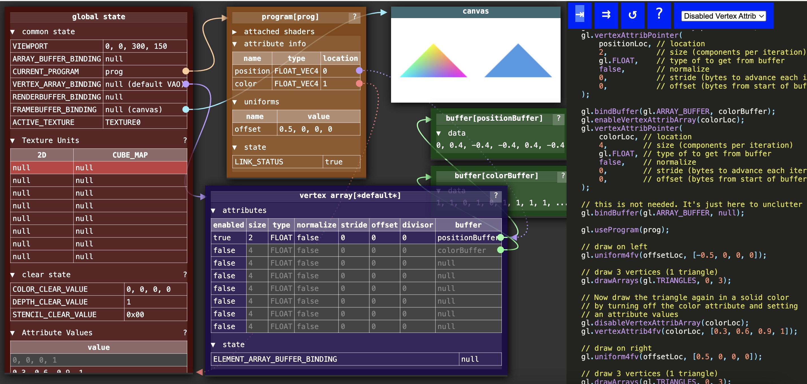

## WebGL在GPU上做了什么？
WebGL在GPU上的工作基本上分为两部分，第一部分是将顶点（或数据流）转换到裁剪空间坐标， 第二部分是基于第一部分的结果绘制像素点。


假设你正在画三角形，顶点着色器每完成三次顶点处理，WebGL就会用这三个顶点画一个三角形。 它计算出这三个顶点对应的像素后，就会光栅化这个三角形，“光栅化”其实就是“用像素画出来” 的花哨叫法。对于每一个像素，它会调用你的片段着色器询问你使用什么颜色。 你通过给片段着色器的一个特殊变量gl_FragColor设置一个颜色值，实现自定义像素颜色

>每个program支持的最大顶点属性可以通过gl.getParameter(gl.MAX_VERTEX_ATTRIBS)查看


>貌似没有gl.getVaryingLocation(program, "v_color")方法


## 顶点着色器
一个顶点着色器的工作是生成裁剪空间坐标值。每个顶点调用一次（顶点）着色器，每次调用都需要设置一个特殊的全局变量gl_Position， 该变量的值就是裁减空间坐标值。

顶点着色器需要的数据，可以通过以下三种方式获得。

- Attributes 属性 (从缓冲中获取的数据)
- Uniforms 全局变量 (在一次绘制中对所有顶点保持一致值)
- Textures 纹理 (从像素或纹理元素中获取的数据)


### uniforms全局变量
全局变量在一次绘制过程中传递给着色器的值都一样

要注意的是全局变量属于单个着色程序，如果多个着色程序有同名全局变量，需要找到每个全局变量并设置自己的值。 我们调用gl.uniform???的时候只是设置了当前程序的全局变量，当前程序是传递给gl.useProgram 的最后一个程序


## 片段着色器
一个片段着色器的工作是为当前光栅化的像素提供颜色值

每个像素都将调用一次片段着色器，每次调用需要从你设置的特殊全局变量gl_FragColor中获取颜色信息。

片段着色器所需的数据，可以通过以下三种方式获取
- Uniforms 全局变量 (values that stay the same for every pixel of a single draw call)
- Textures 纹理 (data from pixels/texels)
- Varyings 可变量 (data passed from the vertex shader and interpolated)

### Varyings可变量
可变量是一种顶点着色器给片段着色器传值的方式。为了使用可变量，要在两个着色器中定义同名的可变量。 给顶点着色器中可变量设置的值，会作为参考值进行内插，在绘制像素时传给片段着色器的可变量。

## gl.vertexAttribPointer
一个隐藏信息是gl.vertexAttribPointer是将属性绑定到当前的ARRAY_BUFFER。 换句话说就是属性绑定到了positionBuffer上。这也意味着现在利用绑定点随意将 
ARRAY_BUFFER绑定到其它数据上后，该属性依然从positionBuffer上读取数据。
```javascript
gl.vertexAttribPointer(
    positionAttributeLocation, size, type, normalize, stride, offset)
```


## attributes
在整个webgl中，顶点着色器的属性都是存在全局的vertex array中，这个数组能存放的属性数量可以通过`gl.getParameter(gl.MAX_VERTEX_ATTRIBS)`获取。


