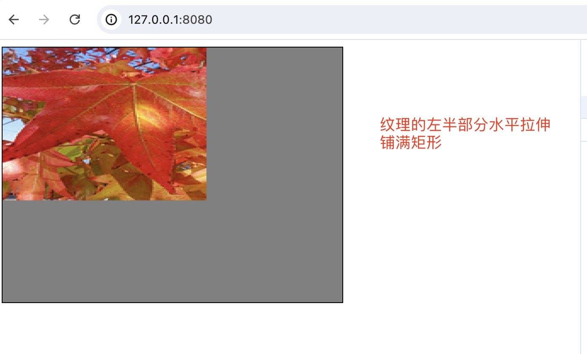
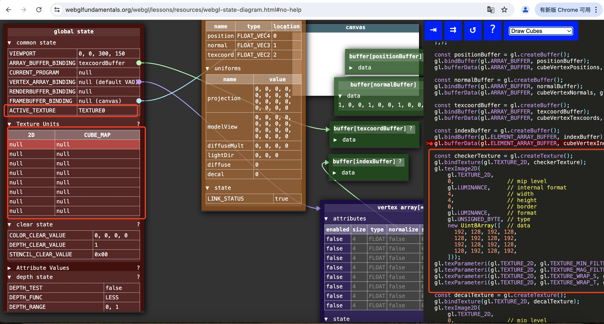
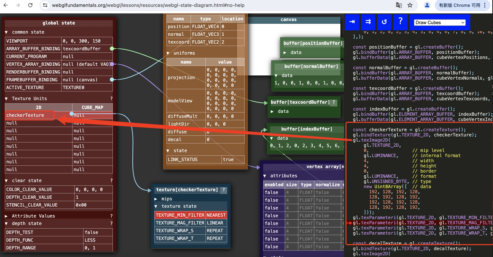
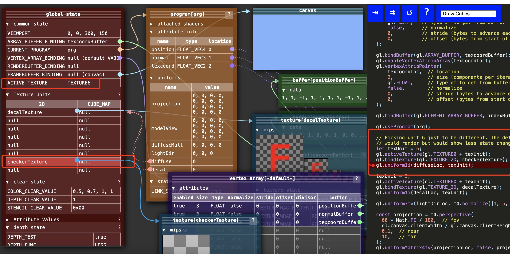

## WebGL图像处理
在WebGL中绘制图片需要使用纹理。和WebGL渲染时需要裁剪空间坐标相似， 渲染纹理时需要纹理坐标，而不是像素坐标。无论纹理是什么尺寸，纹理坐标范围始终是 0.0 到 1.0 


因为我们只用画一个矩形（其实是两个三角形），所以需要告诉WebGL矩形中每个顶点对应的纹理坐标。 我们将使用`varying`变量将纹理坐标从顶点着色器传到片段着色器，它叫做“可变量” 是因为它的值有很多个，WebGL会用顶点着色器中值的进行插值，然后传给对应像素执行的片段着色器。

## 纹理坐标
无论纹理是什么尺寸，纹理坐标范围始终是 0.0 到 1.0。假设我们有下面的一张图


大小是 240 * 180。我们想要用webgl绘制这张图。那么在webgl上需要绘制一个240*180的矩形。然后将图片（纹理）贴上去。如果纹理坐标是这样：
```javascript
var texcoordBuffer = gl.createBuffer();
gl.bindBuffer(gl.ARRAY_BUFFER, texcoordBuffer);
gl.bufferData(gl.ARRAY_BUFFER, new Float32Array([
    0.0, 0.0,
    1.0, 0.0,
    0.0, 1.0,
    0.0, 1.0,
    1.0, 0.0,
    1.0, 1.0,
]), gl.STATIC_DRAW);
```
那么显示效果如下，图片没有被拉伸


如果纹理坐标如下：

```javascript
var texcoordBuffer = gl.createBuffer();
gl.bindBuffer(gl.ARRAY_BUFFER, texcoordBuffer);

gl.bufferData(gl.ARRAY_BUFFER, new Float32Array([
    0.0, 0.0,
    0.5, 0.0,
    0.0, 1.0,
    0.0, 1.0,
    0.5, 0.0,
    0.5, 1.0,
]), gl.STATIC_DRAW);
```

这就相当于用图片的左半部分贴在矩形上，图片水平拉伸铺满矩形，如下图所示：



## 纹理单元
所有支持WebGL的环境，在片段着色器中至少有8个纹理单元，顶点着色器中可以是0个。所以如果你使用超过8个纹理单元就应该调用`gl.getParameter(gl.MAX_TEXTURE_IMAGE_UNITS)`查看单元个数，或者调用`gl.getParameter(gl.MAX_VERTEX_TEXTURE_IMAGE_UNITS)`查看顶点着色器中可以用几个纹理单元。超过 99% 的机器在顶点着色器中至少有4个纹理单元。


纹理单元 0 默认为当前活跃纹理，所以调用 bindTexture 会将纹理绑定到单元 0 。WebGL有一个纹理单元队列，每个sampler全局变量的值对应着一个纹理单元， 它会从对应的单元寻找纹理数据，你可以将纹理设置到你想用的纹理单元


如下图所示，默认情况下，`ACTIVE_TEXTURE`等于`TEXTURE0`（即纹理单元0）。`gl.TEXTURE_2D`指向的就是`ACTIVE_TEXTURE`



因此，当我们调用`gl.bindTexture(gl.TEXTURE_2D, checkerTexture)`，其实就是将纹理`checkerTexture`绑定到纹理单元0


下图所示的代码就是将纹理绑定到不同的纹理单元。然后调用`gl.uniform1i(diffuseLoc, texUnit);`将纹理单元的值传给片元着色器


在片元着色器中，就可以通过纹理单元拿到纹理。`texture2D`就会到指定的纹理单元中读取纹理。
```javascript
let fragmentSource = `
  // 片段着色器没有默认精度，所以我们需要设置一个精度
  // mediump是一个不错的默认值，代表“medium precision”（中等精度）
  precision mediump float;
  // 纹理
  uniform sampler2D diffuse;
  // 从顶点着色器传入的纹理坐标
  varying vec2 v_texCoord;
  void main() {
    // 在纹理上寻找对应颜色值
    gl_FragColor = texture2D(diffuse, v_texCoord);
    // gl_FragColor = texture2D(diffuse, v_texCoord).bgra;
  }
`;
```

这里有个点需要注意， uniform sampler2D 变量默认为0。因此，如果我们的纹理刚好绑定在纹理单元0，此时就不需要通过js往片段着色器传递`diffuse`的值


## 如何获取其他像素的颜色值？
如果我们需要将每个像素的值设置为与左右像素的均值，应该怎么做？由于WebGL的纹理坐标范围是 0.0 到 1.0 ， 那我们可以简单计算出移动一个像素对应的距离， onePixel = 1.0 / textureSize。


还是以下面的图为例，这张图片尺寸240 * 180。即水平方向有240个像素，但纹理坐标的范围是0.0到1.0。所以一个像素的刻度为1/240。

对于水平方向的每个像素来说，假设它当前的纹理坐标是x，那么它左边像素的纹理坐标就应该是x - 1/240。它又变像素的纹理坐标就应该是x + 1/240。


因此，我们的片段着色器应该这么写：

```javascript
precision mediump float;
 
// 纹理
uniform sampler2D u_image;
uniform vec2 u_textureSize;
 
// 从顶点着色器传入的像素坐标
varying vec2 v_texCoord;
 
void main() {
   // 计算1像素对应的纹理坐标
   vec2 onePixel = vec2(1.0, 1.0) / u_textureSize;
 
   // 对左中右像素求均值
   gl_FragColor = (
       texture2D(u_image, v_texCoord) +
       texture2D(u_image, v_texCoord + vec2(onePixel.x, 0.0)) +
       texture2D(u_image, v_texCoord + vec2(-onePixel.x, 0.0))) / 3.0;
}
```

我们需要在JavaScript中传入纹理的大小。

```javascript
...
 
var textureSizeLocation = gl.getUniformLocation(program, "u_textureSize");
 
...
 
// 设置图像的大小
gl.uniform2f(textureSizeLocation, image.width, image.height);
 
...
```

## 卷积内核
图片处理经常会使用到卷积内核。卷积内核就是一个 3×3 的矩阵， 矩阵中的每一项代表当前处理的像素和周围8个像素的乘法因子， 相乘后将结果加起来除以内核权重（内核中所有值的和或 1.0 ，取二者中较大者）


##  如何同时施加多种效果
一个更灵活的方式是使用2个或以上的纹理，然后交替渲染它们， 像乒乓球一样每次渲染一种效果，传给另一个渲染下一个效果

这个操作需要使用`帧缓冲`来实现。在WebGL和OpenGL中，帧缓冲是一个事实上是一个糟糕的名字。 WebGL/OpenGL 中的帧缓冲只是一系列状态（一列附加物）不是任何形式的缓冲。 但是当我们给帧缓冲绑定一个纹理后， 可以将渲染结果写入那个纹理。


调用 gl.bindFramebuffer 设置为 null是告诉WebGL 你想在画布上绘制，而不是在帧缓冲上


为了让这个例子简单化，我只用了一个GLSL实现了多种渲染效果。 如果专做图像处理可能需要多个GLSL程序，一个调节色彩,饱和度和明度， 一个调节亮度和对比度，一个做反色，一个做色彩平衡，等等。 你需要用代码更换GLSL程序，并更新程序对应的参数。我想过写一个类似的例子， 但最好留给读者自己实现，因为多个GLSL程序和参数需要良好的重构， 不然代码会一团糟，所以它是一个很好的练习机会。