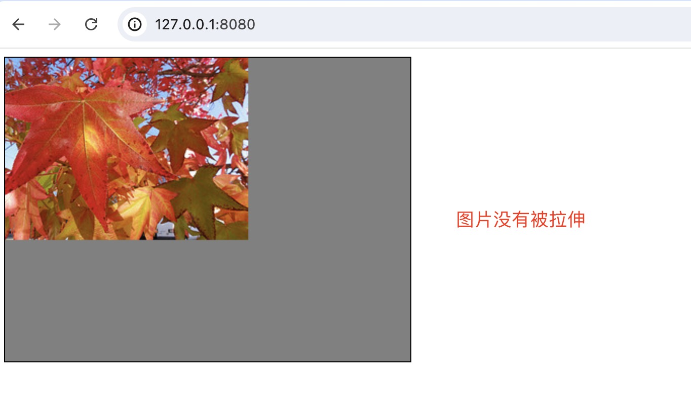

## WebGL图像处理
在WebGL中绘制图片需要使用纹理。和WebGL渲染时需要裁剪空间坐标相似， 渲染纹理时需要纹理坐标，而不是像素坐标。无论纹理是什么尺寸，纹理坐标范围始终是 0.0 到 1.0 


因为我们只用画一个矩形（其实是两个三角形），所以需要告诉WebGL矩形中每个顶点对应的纹理坐标。 我们将使用`varying`变量将纹理坐标从顶点着色器传到片段着色器，它叫做“可变量” 是因为它的值有很多个，WebGL会用顶点着色器中值的进行插值，然后传给对应像素执行的片段着色器。

## 纹理坐标
无论纹理是什么尺寸，纹理坐标范围始终是 0.0 到 1.0。假设我们有下面的一张图


大小是 240 * 180。我们想要用webgl绘制这张图。那么在webgl上需要绘制一个240*180的矩形。然后将图片（纹理）贴上去。如果纹理坐标是这样：
```javascript
var texcoordBuffer = gl.createBuffer();
gl.bindBuffer(gl.ARRAY_BUFFER, texcoordBuffer);
gl.bufferData(gl.ARRAY_BUFFER, new Float32Array([
    0.0, 0.0,
    1.0, 0.0,
    0.0, 1.0,
    0.0, 1.0,
    1.0, 0.0,
    1.0, 1.0,
]), gl.STATIC_DRAW);
```
那么显示效果如下，图片没有被拉伸



如果纹理坐标如下：

```javascript
var texcoordBuffer = gl.createBuffer();
gl.bindBuffer(gl.ARRAY_BUFFER, texcoordBuffer);

gl.bufferData(gl.ARRAY_BUFFER, new Float32Array([
    0.0, 0.0,
    0.5, 0.0,
    0.0, 1.0,
    0.0, 1.0,
    0.5, 0.0,
    0.5, 1.0,
]), gl.STATIC_DRAW);
```

这就相当于用图片的左半部分贴在矩形上，图片水平拉伸铺满矩形，如下图所示：


## 纹理单元
所有支持WebGL的环境，在片段着色器中至少有8个纹理单元，顶点着色器中可以是0个。所以如果你使用超过8个纹理单元就应该调用`gl.getParameter(gl.MAX_TEXTURE_IMAGE_UNITS)`查看单元个数，或者调用`gl.getParameter(gl.MAX_VERTEX_TEXTURE_IMAGE_UNITS)`查看顶点着色器中可以用几个纹理单元。超过 99% 的机器在顶点着色器中至少有4个纹理单元。


纹理单元 0 默认为当前活跃纹理，所以调用 bindTexture 会将纹理绑定到单元 0 。WebGL有一个纹理单元队列，每个sampler全局变量的值对应着一个纹理单元， 它会从对应的单元寻找纹理数据，你可以将纹理设置到你想用的纹理单元


如下图所示，默认情况下，`ACTIVE_TEXTURE`等于`TEXTURE0`（即纹理单元0）。`gl.TEXTURE_2D`指向的就是`ACTIVE_TEXTURE`


因此，当我们调用`gl.bindTexture(gl.TEXTURE_2D, checkerTexture)`，其实就是将纹理`checkerTexture`绑定到纹理单元0


下图所示的代码就是将纹理绑定到不同的纹理单元。然后调用`gl.uniform1i(diffuseLoc, texUnit);`将纹理单元的值传给片元着色器


在片元着色器中，就可以通过纹理单元拿到纹理。`texture2D`就会到指定的纹理单元中读取纹理。
```javascript
let fragmentSource = `
  // 片段着色器没有默认精度，所以我们需要设置一个精度
  // mediump是一个不错的默认值，代表“medium precision”（中等精度）
  precision mediump float;
  // 纹理
  uniform sampler2D diffuse;
  // 从顶点着色器传入的纹理坐标
  varying vec2 v_texCoord;
  void main() {
    // 在纹理上寻找对应颜色值
    gl_FragColor = texture2D(diffuse, v_texCoord);
    // gl_FragColor = texture2D(diffuse, v_texCoord).bgra;
  }
`;
```

这里有个点需要注意， uniform sampler2D 变量默认为0。因此，如果我们的纹理刚好绑定在纹理单元0，此时就不需要通过js往片段着色器传递`diffuse`的值