## 前言

uniform全局变量在着色程序运行前赋值，在运行过程中全局有效。在一次绘制中对所有顶点保持一致值。本篇文章详解uniform全局变量

## 默认值

全局变量属于单个着色程序（注意这句话，后面会详解）。当我们调用gl.linkProgram()将编译过的顶点着色器和片段着色器链接成一个完整的着色器程序后，着色程序的全局变量都被初始化为0。

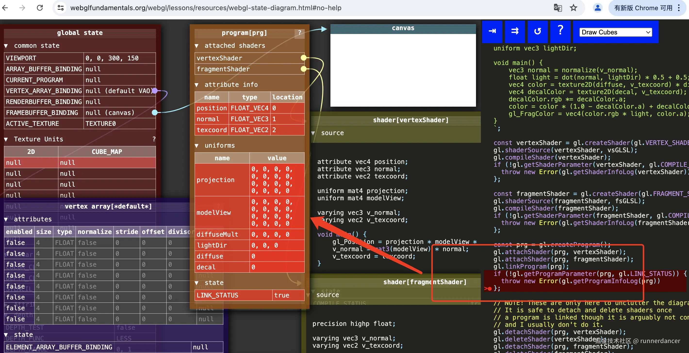

下面的代码可以验证：

```js
import initShaders from "./initShaders.js";

const main = () => {
  const canvas = document.getElementById('webgl')
  const gl = canvas.getContext('webgl2')
  const vertexShaderSource1 = `
    uniform vec4 u_offset;
    void main(){
        gl_PointSize = 10.0;
        gl_Position = vec4(0.0, 0.0, 0.0, 1.0) + u_offset;
    }
  `
  const fragmentShaderSource1 = `
    precision mediump float;
    void main(){
        gl_FragColor = vec4(1.0, 0.0, 0.0, 1.0);
    }
  `
  const program1 = initShaders(gl, vertexShaderSource1, fragmentShaderSource1)
  const offsetLoc = gl.getUniformLocation(program1, 'u_offset')
  console.log('offsetLoc...', offsetLoc)

  
  gl.clearColor(0, 0, 0, 0)
  gl.clear(gl.COLOR_BUFFER_BIT);

  gl.useProgram(program1)
  // 告诉webgl绘制1个点
  gl.drawArrays(gl.POINTS, 0, 1)

}

main();


```

结果如下，我们没有显示给offsetLoc设置值，但是webgl依然正常绘制，同时顶点并没有发生偏移。

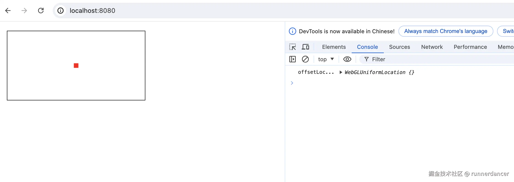

我们可以通过调用`gl.uniform[1234][fi][v]()`方法修改全局变量的值。

```js
import initShaders from "./initShaders.js";

const main = () => {
  const canvas = document.getElementById('webgl')
  const gl = canvas.getContext('webgl2')
  const vertexShaderSource1 = `
    uniform vec4 u_offset;
    void main(){
        gl_PointSize = 10.0;
        gl_Position = vec4(0.0, 0.0, 0.0, 1.0) + u_offset;
    }
  `
  const fragmentShaderSource1 = `
    precision mediump float;
    void main(){
        gl_FragColor = vec4(1.0, 0.0, 0.0, 1.0);
    }
  `
  const program1 = initShaders(gl, vertexShaderSource1, fragmentShaderSource1)
  const offsetLoc = gl.getUniformLocation(program1, 'u_offset')
  console.log('offsetLoc...', offsetLoc)
  gl.clearColor(0, 0, 0, 0)
  gl.clear(gl.COLOR_BUFFER_BIT);

  gl.useProgram(program1)

  gl.uniform4f(offsetLoc, 0.5, 0.5, 0.0, 0.0)

  // 在(0.5, 0.5)位置处绘制一个点
  gl.drawArrays(gl.POINTS, 0, 1)


}

main();
```

上面的代码将offset设置成(0.5, 0.5, 0.0, 0.0)，意味着顶点将向右和上偏移0.5，即：

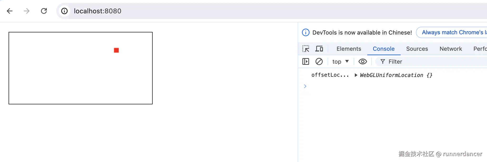


offset的值(0.5, 0.5, 0.0, 0.0)将会一直保留，除非又调用gl.uniform方法修改，或者调用gl.linkProgram重新链接着色程序，比如：

```js
import initShaders from "./initShaders.js";

const main = () => {
  const canvas = document.getElementById('webgl')
  const gl = canvas.getContext('webgl2')
  const vertexShaderSource1 = `
    uniform vec4 u_offset;
    void main(){
        gl_PointSize = 10.0;
        gl_Position = vec4(0.0, 0.0, 0.0, 1.0) + u_offset;
    }
  `
  const fragmentShaderSource1 = `
    precision mediump float;
    void main(){
        gl_FragColor = vec4(1.0, 0.0, 0.0, 1.0);
    }
  `
  const program1 = initShaders(gl, vertexShaderSource1, fragmentShaderSource1)
  const offsetLoc = gl.getUniformLocation(program1, 'u_offset')
  console.log('offsetLoc...', offsetLoc)

  
  gl.clearColor(0, 0, 0, 0)
  gl.clear(gl.COLOR_BUFFER_BIT);

  gl.useProgram(program1)

  // 修改了全局变量offset的值，顶点将向右和上偏移0.5
  gl.uniform4f(offsetLoc, 0.5, 0.5, 0.0, 0.0)

  // 先在(0.5, 0.5)位置处绘制一个点
  gl.drawArrays(gl.POINTS, 0, 1)


  // 重新link后，再次将program1程序的全局变量初始化为 0 时
  gl.linkProgram(program1);

  // 然后再绘制一个点，此时的全局变量offset初始化为0，所以顶点不会发生偏移
  gl.drawArrays(gl.POINTS, 0, 1)

}

main();

```

这里我们先调用gl.uniform4f修改全局变量offset的值，然后调用gl.drawArrays绘制。接着调用gl.linkProgram重新连接着色程序，着色程序所有的全局变量又会被初始化成0，包括offset变量。最终的绘制结果如下：

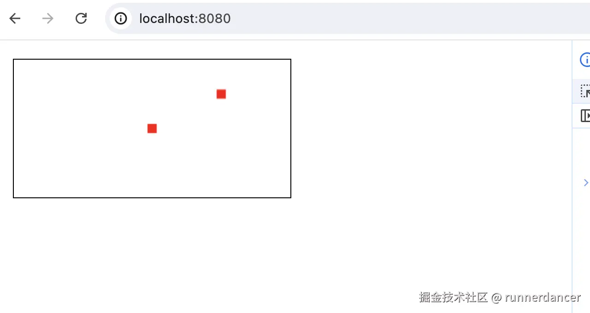

## 修改uniform值注意事项

### 必须在调用gl.useProgram之后

由于uniform全局变量属于单个程序，因此在调用`gl.uniform[1234][fi][v]()`修改全局变量时，需要先确保调用gl.useProgram设置了正确的着色程序。

webgl内部维护了一个全局变量，类似`CURRENT_PROGRAM`，当我们调用gl.drawArrays，gl.drawElements以及gl.uniformxxx方法时，使用的都是CURRENT\_PROGRAM所指向的程序。

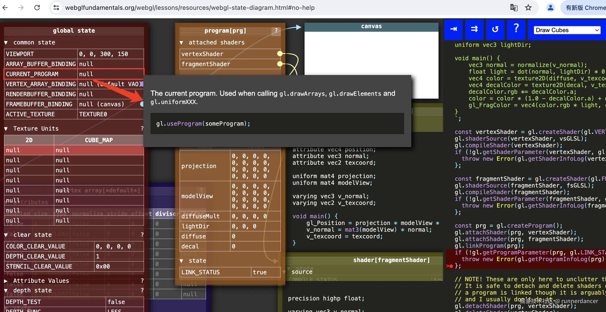

可以将gl.useProgram用javascript实现如下：

```js
// 伪代码：
gl.useProgram = (program) => {
    gl.CURRENT_PROGRAM = program
}
```

因此，执行完gl.useProgram时，webgl内部状态如下：

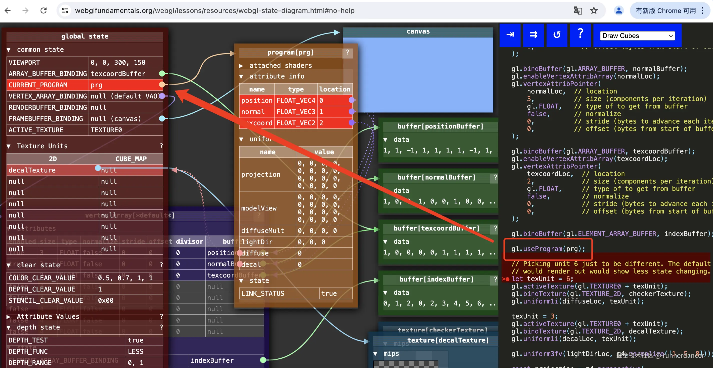

可以将gl.uniform4f用javascript实现如下：

```js
gl.uniform4f = (location, v1, v2, v3, v4) => {
    gl.CURRENT_PROGRAM.uniform.[location] = vec4(v1, v2, v3, v4)
}
```

因此，调用gl.uniformXXX前，请确保先调用gl.useProgram设置了正确的着色程序

### 必须和声明的变量长度一致

调用gl.uniformXXX方法时，参数的长度必须和声明变量时的分量长度一致。比如我们声明`uniform vec4 u_offset`，offset是4个分量，那么我们只能调用`gl.uniform4f[v]`修改变量的值，需要严格一致。

```js
import initShaders from "./initShaders.js";

const main = () => {
  const canvas = document.getElementById('webgl')
  const gl = canvas.getContext('webgl2')
  const vertexShaderSource1 = `
    uniform vec4 u_offset;
    void main(){
        gl_PointSize = 10.0;
        gl_Position = vec4(0.0, 0.0, 0.0, 1.0) + u_offset;
    }
  `
  const fragmentShaderSource1 = `
    precision mediump float;
    void main(){
        gl_FragColor = vec4(1.0, 0.0, 0.0, 1.0);
    }
  `
  const program1 = initShaders(gl, vertexShaderSource1, fragmentShaderSource1)
  const offsetLoc = gl.getUniformLocation(program1, 'u_offset')
  console.log('offsetLoc...', offsetLoc)

  
  gl.clearColor(0, 0, 0, 0)
  gl.clear(gl.COLOR_BUFFER_BIT);

  gl.useProgram(program1)

  // offset预期的是4个分量，因此这里不符合预期，会报错
  gl.uniform3f(offsetLoc, 0.5, 0.5, 0.0)

  
  gl.drawArrays(gl.POINTS, 0, 1)

}

main();

```

控制台报错，绘制的顶点位置出错，没有在预期的(0.5,0.5)位置绘制

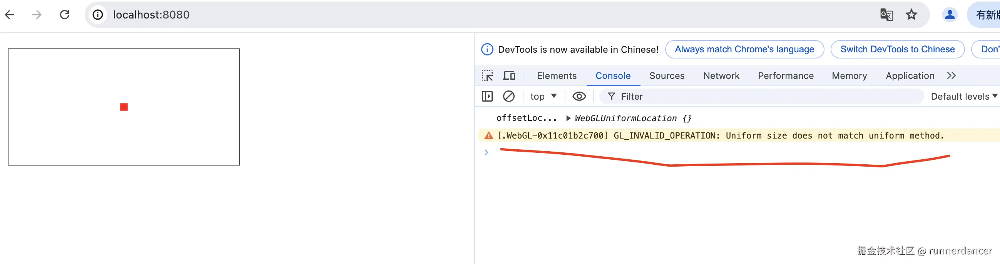

### 顶点着色器和片段着色器不能定义同名的uniform变量

由于uniform全局变量属于单个着色程序，因此顶点着色器和片段着色器不能定义同名的变量，即使长度不同也不行，比如vec3 u\_offset和vec4 u\_offset会冲突。

```js
import initShaders from "./initShaders.js";


const main = () => {
  const canvas = document.getElementById('webgl')
  const gl = canvas.getContext('webgl2')
  const vertexShaderSource1 = `
    attribute vec3 a_position;
    uniform vec4 u_offset;
    void main(){
        gl_PointSize = 10.0;
        gl_Position = vec4(a_position, 1.0) + u_offset;
    }
  `
  const fragmentShaderSource1 = `
    precision mediump float;
    uniform vec4 u_offset;
    void main(){
        gl_FragColor = vec4(0.1, 0.0, 0.0, 0.1) + u_offset;
    }
  `
  const program1 = initShaders(gl, vertexShaderSource1, fragmentShaderSource1)
  const positionLocation1 = gl.getAttribLocation(program1, 'a_position')
  const offsetLoc = gl.getUniformLocation(program1, 'u_offset')

  console.log('offsetLoc...', offsetLoc)

  let verticesInfo = [
    0.5, 0.0,
    0.0, 0.5,
    -0.5, 0.0
  ]
  verticesInfo = new Float32Array(verticesInfo)

  const vertexBuffer = gl.createBuffer();
  gl.bindBuffer(gl.ARRAY_BUFFER, vertexBuffer)
  gl.bufferData(gl.ARRAY_BUFFER, verticesInfo, gl.STATIC_DRAW)


  gl.vertexAttribPointer(
    positionLocation1,
    2,
    gl.FLOAT,
    false,
    8,
    0
  );


  gl.enableVertexAttribArray(positionLocation1);

  gl.clearColor(0, 0, 0, 0)
  gl.clear(gl.COLOR_BUFFER_BIT);

  gl.useProgram(program1)
  // 由于声明u_offset的是vec4，需要4个分量，因此下面的代码调用gl.uniform3f会报错。
  // gl.uniform3f(offsetLoc, 0.3, 0.3, 0.3)
  gl.uniform4f(offsetLoc, 0.3, 0.3, 0.3, 0.0)

  // 告诉webgl绘制3个点
  gl.drawArrays(gl.POINTS, 0, 3)

}

main();

```

结果如下：

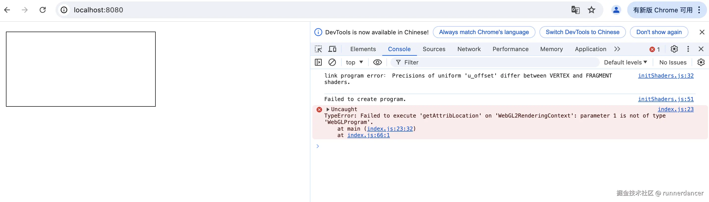

因此需要避免在同个着色器中定义同名的变量。如果一定要用，可以将顶点着色器的精度设置成和片段着色器一样，因此我们可以在顶点着色器添加precision mediump float;如下代码所示：

```js
import initShaders from "./initShaders.js";


const main = () => {
  const canvas = document.getElementById('webgl')
  const gl = canvas.getContext('webgl2')
  const vertexShaderSource1 = `
    precision mediump float;
    attribute vec3 a_position;
    uniform vec4 u_offset;
    void main(){
        gl_PointSize = 10.0;
        gl_Position = vec4(a_position, 0.1) + u_offset;
    }
  `
  const fragmentShaderSource1 = `
    precision mediump float;
    uniform vec4 u_offset;
    void main(){
        gl_FragColor = vec4(0.1, 0.0, 0.0, 0.1) + u_offset;
    }
  `
  const program1 = initShaders(gl, vertexShaderSource1, fragmentShaderSource1)
  const positionLocation1 = gl.getAttribLocation(program1, 'a_position')
  const offsetLoc = gl.getUniformLocation(program1, 'u_offset')

  console.log('offsetLoc...', offsetLoc)

  let verticesInfo = [
    0.5, 0.0,
    0.0, 0.5,
    -0.5, 0.0
  ]
  verticesInfo = new Float32Array(verticesInfo)

  const vertexBuffer = gl.createBuffer();
  gl.bindBuffer(gl.ARRAY_BUFFER, vertexBuffer)
  gl.bufferData(gl.ARRAY_BUFFER, verticesInfo, gl.STATIC_DRAW)


  gl.vertexAttribPointer(
    positionLocation1,
    2,
    gl.FLOAT,
    false,
    8,
    0
  );


  gl.enableVertexAttribArray(positionLocation1);

  gl.clearColor(0, 0, 0, 0)
  gl.clear(gl.COLOR_BUFFER_BIT);

  gl.useProgram(program1)
  // 由于声明u_offset的是vec4，需要4个分量，因此下面的代码调用gl.uniform3f会报错。
  // gl.uniform3f(offsetLoc, 0.3, 0.3, 0.3)
  gl.uniform4f(offsetLoc, 0.4, 0.0, 0.0, 0.9)

  // 告诉webgl绘制3个点
  gl.drawArrays(gl.POINTS, 0, 3)

}

main();

```

结果如下：

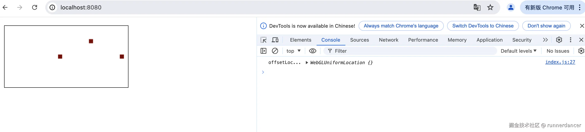

**可以看到，顶点着色器和片段着色器定义的相同的u\_offset，在给u\_offset赋值后，同时作用于顶点着色器和片段着色器**

## 全局变量属于单个着色程序

我们在上一篇文章中[【WebGL】深入理解属性和缓冲](https://juejin.cn/user/387441915346606/posts)了解到顶点数组是全局状态，不属于某个着色程序。

和顶点数组不同，全局变量属于单个着色程序，如果多个着色程序有同名全局变量，需要找到每个全局变量并设置自己的值。

```js
import initShaders from "./initShaders.js";


const main = () => {
  const canvas = document.getElementById('webgl')
  const gl = canvas.getContext('webgl2')
  const vertexShaderSource1 = `
    uniform vec4 u_offset;
    void main(){
        gl_PointSize = 10.0;
        gl_Position = vec4(0.0, 0.0, 0.0, 1.0) + u_offset;
    }
  `
  const fragmentShaderSource1 = `
    precision mediump float;
    void main(){
        gl_FragColor = vec4(1.0, 0.0, 0.0, 1.0);
    }
  `

  const vertexShaderSource2 = `
  uniform vec4 u_offset;
  void main(){
      gl_PointSize = 10.0;
      gl_Position = vec4(0.0, 0.0, 0.0, 1.0) + u_offset;
  }
`
  const fragmentShaderSource2 = `
  precision mediump float;
  void main(){
      gl_FragColor = vec4(0.0, 1.0, 0.0, 1.0);
  }
`
  const program1 = initShaders(gl, vertexShaderSource1, fragmentShaderSource1)
  const program2 = initShaders(gl, vertexShaderSource2, fragmentShaderSource2)

  const offsetLoc = gl.getUniformLocation(program1, 'u_offset')
  console.log('offsetLoc...', offsetLoc)


  gl.clearColor(0, 0, 0, 0)
  gl.clear(gl.COLOR_BUFFER_BIT);

  gl.useProgram(program1)

  gl.uniform4f(offsetLoc, 0.5, 0.5, 0.0, 0.0)
  // 在(0.5, 0.5)位置处绘制一个点
  gl.drawArrays(gl.POINTS, 0, 1)


  gl.useProgram(program2)
  gl.drawArrays(gl.POINTS, 0, 1)

}

main();

```

上面的代码使用了两个着色程序，这两个着色程序都使用了相同的全局变量名u\_offset，这两个变量是独立的，我们只修改了program1的offset，因此当我们使用program1绘制时，顶点坐标在(0.5,0.5)。但我们没有修改program2的offset，因此当我们使用program2绘制时，offset默认为0，因此顶点没有偏移，位置在(0.0,0.0)

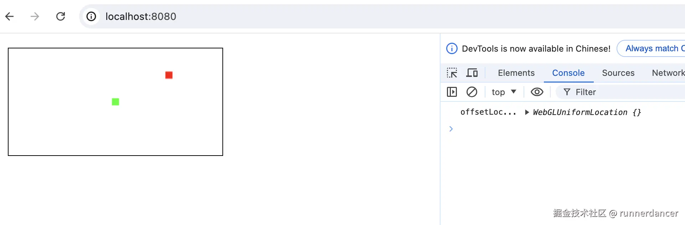

全局变量在运行过程中全局有效，在一次绘制过程中传递给着色器的值都一样。下面的代码在一次绘制中对所有顶点保持一致值。三个顶点在x轴都偏移了0.5

```js
import initShaders from "./initShaders.js";


// 本Demo演示uniform变量的默认值：
// 默认情况下，uniform变量各个分量的默认值都是0，比如下面的代码，u_offset没有显示赋值，
// 因此u_offset各个分量的值都是0
const main = () => {
  const canvas = document.getElementById('webgl')
  const gl = canvas.getContext('webgl2')
  const vertexShaderSource1 = `
    attribute vec3 a_position;
    uniform vec4 u_offset;
    void main(){
        gl_PointSize = 10.0;
        gl_Position = vec4(a_position, 1.0) + u_offset;
    }
  `
  const fragmentShaderSource1 = `
    precision mediump float;
    void main(){
        gl_FragColor = vec4(1.0, 0.0, 0.0, 1.0);
    }
  `
  const program1 = initShaders(gl, vertexShaderSource1, fragmentShaderSource1)
  const positionLocation1 = gl.getAttribLocation(program1, 'a_position')
  const offsetLoc = gl.getUniformLocation(program1, 'u_offset')
  console.log('offsetLoc...', offsetLoc)
  let verticesInfo = [
    0.5, 0.0,
    0.0, 0.5,
    -0.5, 0.0
  ]
  verticesInfo = new Float32Array(verticesInfo)

  const vertexBuffer = gl.createBuffer();
  gl.bindBuffer(gl.ARRAY_BUFFER, vertexBuffer)
  gl.bufferData(gl.ARRAY_BUFFER, verticesInfo, gl.STATIC_DRAW)


  gl.vertexAttribPointer(
    positionLocation1,
    2,
    gl.FLOAT,
    false,
    8,
    0
  );


  gl.enableVertexAttribArray(positionLocation1);

  gl.clearColor(0, 0, 0, 0)
  gl.clear(gl.COLOR_BUFFER_BIT);

  gl.useProgram(program1)
  gl.uniform4f(offsetLoc, 0.5, 0.0, 0.0, 0.0)
  // 告诉webgl绘制3个点
  gl.drawArrays(gl.POINTS, 0, 3)

}

main();

```

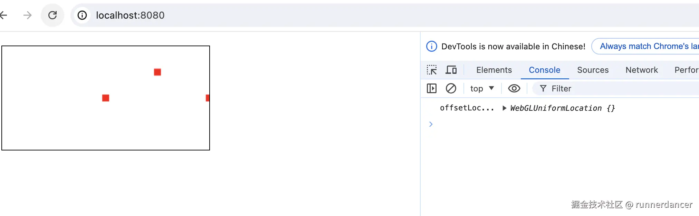
