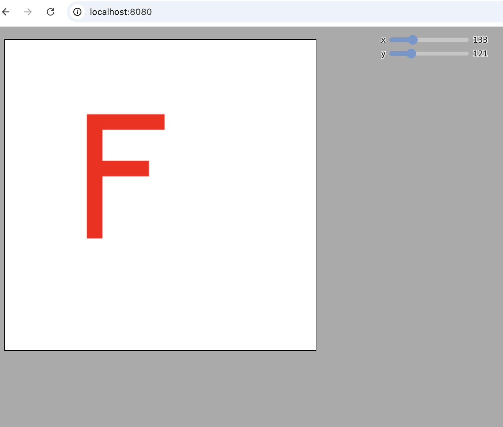

## 平移

```html
<!DOCTYPE html>
<html lang="en">

<head>
  <meta charset="utf-8" />
  <meta name="viewport" content="width=device-width, initial-scale=1" />
  <meta name="theme-color" content="#000000" />
  <meta name="description" content="WebGL" />
  <title>WebGL</title>
  <style>
    @import url("./webgl-tutorials.css");

    body {
      margin: 20px;
    }

    #webgl {
      width: 500px;
      height: 500px;
    }

    .container {
      font-size: 0;
      display: inline-block;
      /* border: 1px solid black; */
    }

    #ui {
      width: 200px;
    }
  </style>
</head>

<body>
  <div id="uiContainer">
    <div id="ui">
      <div id="x"></div>
      <div id="y"></div>
    </div>
  </div>
  <div class="container">
    <canvas width="500" height="500" id="webgl">你的浏览器不支持canvas</canvas>
  </div>
  <script src="../easy-webgl/webgl-lessons-ui.js"></script>

  <script src="./initShaders.js"></script>
  <script>
    const main = (image) => {
      const canvas = document.getElementById("webgl");

      const gl = canvas.getContext("webgl");
      const vertexShaderSource1 = `
        attribute vec2 a_position;
        uniform vec2 u_translation;
        void main(){
            gl_PointSize = 10.0;
            vec2 position = a_position + u_translation;
            gl_Position = vec4(position, 0.0, 1.0);
        }
      `;
      const fragmentShaderSource1 = `
        precision mediump float;
        void main(){
          gl_FragColor = vec4(1.0, 0.0, 0.0, 1.0);
        }
      `;
      const program1 = initShaders(
        gl,
        vertexShaderSource1,
        fragmentShaderSource1
      );
      const positionLocation1 = gl.getAttribLocation(program1, "a_position");
      const translationLocation = gl.getUniformLocation(
        program1,
        "u_translation"
      );
      const rectX = -1,
        rectY = 1,
        rectWidth = 0.5,
        rectHeight = 0.8,
        thickness = 0.1;
      let verticesInfo = [
        // 左竖
        rectX,
        rectY,
        rectX + thickness,
        rectY,
        rectX,
        rectY - rectHeight,
        rectX,
        rectY - rectHeight,
        rectX + thickness,
        rectY,
        rectX + thickness,
        rectY - rectHeight,
        // 上横
        rectX + thickness,
        rectY,
        rectX + thickness,
        rectY - thickness,
        rectX + rectWidth,
        rectY,
        rectX + rectWidth,
        rectY,
        rectX + rectWidth,
        rectY - thickness,
        rectX + thickness,
        rectY - thickness,
        // 中横
        rectX + thickness,
        rectY - 0.3,
        rectX + thickness,
        rectY - 0.3 - thickness,
        rectX + rectWidth - 0.1,
        rectY - 0.3,
        rectX + rectWidth - 0.1,
        rectY - 0.3,
        rectX + thickness,
        rectY - 0.3 - thickness,
        rectX + rectWidth - 0.1,
        rectY - 0.3 - thickness,
      ];

      verticesInfo = new Float32Array(verticesInfo);

      const vertexBuffer = gl.createBuffer();
      gl.bindBuffer(gl.ARRAY_BUFFER, vertexBuffer);
      gl.bufferData(gl.ARRAY_BUFFER, verticesInfo, gl.STATIC_DRAW);

      gl.vertexAttribPointer(positionLocation1, 2, gl.FLOAT, false, 8, 0);

      gl.enableVertexAttribArray(positionLocation1);

      gl.clearColor(0, 0, 0, 0);

      gl.clear(gl.COLOR_BUFFER_BIT);

      gl.useProgram(program1);

      var translation = [0, 0];

      function updatePosition(index) {
        return function (event, ui) {
          const v =
            (index === 0
              ? ui.value / (gl.canvas.width + 5)
              : -ui.value / (gl.canvas.height + 5)) * 2;
          translation[index] = v;
          gl.uniform2fv(translationLocation, translation);
          gl.drawArrays(gl.TRIANGLES, 0, 18);
        };
      }
      webglLessonsUI.setupSlider("#x", {
        slide: updatePosition(0),
        max: gl.canvas.width,
      });
      webglLessonsUI.setupSlider("#y", {
        slide: updatePosition(1),
        max: gl.canvas.height,
      });

      gl.drawArrays(gl.TRIANGLES, 0, 18);
    };

    main();
  </script>
</body>

</html>
```

结果如下：

