## 前言

不管是用canvas绘制2D图形，还是3D图形，都需要了解如何正确的设置画布尺寸，以及对应的坐标系统。canvas绘制2D图形时设置画布尺寸相关的知识可以看我之前写的这篇文章：[canvas尺寸大小及分辨率矫正](https://lizuncong.github.io/excalidraw-app/#/base/size)。本节介绍绘制3D图形时如何设置画布尺寸，以及3D坐标系统相关的知识，主要内容包括：
- 画布的两个尺寸
  + 显示尺寸，即CSS尺寸，可通过CSS修改
  + drawingbuffer尺寸，即画布拥有的实际像素个数，可通过canvas.width或canvas.height修改
- 修改drawingbuffer尺寸的两种方式
  + 通过html标签修改，不需要重新调整视口
  + 通过js设置，需要重新调整视口
- 视口(viewport)：实际绘制的区域
- 高分辨率屏幕适配：window.devicePixelRatio
- WebGL裁剪空间坐标系统：裁剪空间坐标转屏幕坐标

## 画布尺寸

画布就像图片一样有两个尺寸。一个是 drawingbuffer 的尺寸， 这个表示画布拥有的实际像素个数。另一是画布显示的尺寸， CSS决定画布显示的尺寸。默认情况下，drawingbuffer的尺寸和画布的显示尺寸相同。如果两者不同，则画布中的元素会被拉伸。

默认情况下，canvas的宽会被初始化为300，高初始化为150。具体可以看[MDN关于canvas尺寸的设置](https://developer.mozilla.org/zh-CN/docs/Web/HTML/Element/canvas)。因此drawingbuffer的尺寸也是300 \* 150，此时在画布中绘制的图形显示正常。

```html
<!DOCTYPE html>
<html lang="en">

<head>
  <meta charset="utf-8" />
  <meta name="viewport" content="width=device-width, initial-scale=1" />
  <meta name="theme-color" content="#000000" />
  <meta name="description" content="WebGL" />
  <title>WebGL</title>
  <style>
    body {
      margin: 20px;
    }

    .container {
      font-size: 0;
      display: inline-block;
      border: 1px solid black;
    }
  </style>
</head>

<body>
  <div class="container">
    <canvas id="webgl">你的浏览器不支持canvas</canvas>
  </div>
  <script src="./initShaders.js"></script>
  <script>
    const main = () => {
      const canvas = document.getElementById('webgl')
      const gl = canvas.getContext('webgl2')
      const vertexShaderSource1 = `
        attribute vec2 a_position;
        attribute vec3 a_color;
        varying vec3 v_color;
        void main(){
            gl_PointSize = 10.0;
            v_color = a_color;
            gl_Position = vec4(a_position, 0.0, 1.0);
        }
      `
      const fragmentShaderSource1 = `
        precision mediump float;
        varying vec3 v_color;
        void main(){
            gl_FragColor = vec4(v_color, 1.0);
        }
      `
      const program1 = initShaders(gl, vertexShaderSource1, fragmentShaderSource1)
      const positionLocation1 = gl.getAttribLocation(program1, 'a_position')
      const colorLocation1 = gl.getAttribLocation(program1, 'a_color')


      let verticesInfo = [
        // 每行前两个表示坐标，后面三个表示颜色
        1.0, 0.0, 1.0, 0.0, 0.0, // (1.0, 0.0) 红色
        -1.0, 0.0, 0.0, 1.0, 0.0, // (-1.0, 0.0) 绿色
        0.0, 0.0, 0.0, 0.0, 1.0, // (0.0, 0.0)蓝色
        0.0, 1.0, 1.0, 0.0, 0.0, // (0.0, 1.0) 红色
        0.0, -1.0, 0.0, 1.0, 0.0 // (0.0, -1.0) 绿色
      ]
      verticesInfo = new Float32Array(verticesInfo)

      const vertexBuffer = gl.createBuffer();
      gl.bindBuffer(gl.ARRAY_BUFFER, vertexBuffer)
      gl.bufferData(gl.ARRAY_BUFFER, verticesInfo, gl.STATIC_DRAW)


      gl.vertexAttribPointer(
        positionLocation1,
        2,
        gl.FLOAT,
        false,
        20,
        0
      );

      gl.vertexAttribPointer(
        colorLocation1,
        3,
        gl.FLOAT,
        false,
        20,
        8
      );


      gl.clearColor(0, 0, 0, 0)
      gl.clear(gl.COLOR_BUFFER_BIT);

      gl.useProgram(program1)

      gl.enableVertexAttribArray(positionLocation1);
      gl.enableVertexAttribArray(colorLocation1);

      gl.drawArrays(gl.POINTS, 0, 5)

    }

    main();

  </script>
</body>

</html>
```

上面的代码在绘制以下五个点：

*   坐标(1.0, 0.0)：红色
*   坐标(-1.0, 0.0)：绿色
*   坐标(0.0, 0.0)：蓝色
*   坐标(0.0, 1.0)：红色
*   坐标(0.0, -1.0)：绿色

结果如下：

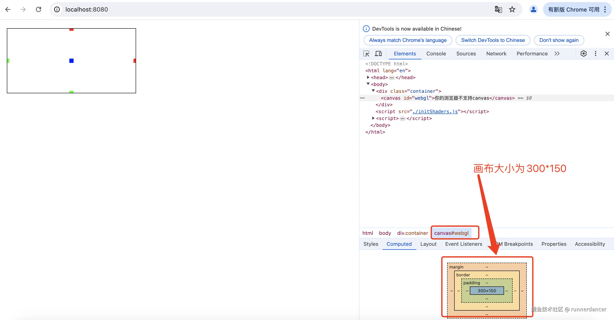

> 注意，为方便演示，这里的坐标不考虑z轴的坐标，z轴默认为0。

现在让我们通过css改变画布的显示大小。这次我们将画布的显示大小调整为600 \* 150，然后还是绘制上面的5个10 \* 10的点。可以猜一下，我们没有手动调整drawingbuffer的大小，因此drawingbuffer尺寸还是300 \* 150。这意味着在y轴方向，我们绘制的图形没有拉伸，而在x轴方向，绘制的图形宽度会被拉伸成2倍，那也就是我们会得到5个20 \* 10的点。

```html
<!DOCTYPE html>
<html lang="en">

<head>
  <meta charset="utf-8" />
  <meta name="viewport" content="width=device-width, initial-scale=1" />
  <meta name="theme-color" content="#000000" />
  <meta name="description" content="WebGL" />
  <title>WebGL</title>
  <style>
    body {
      margin: 20px;
    }
    #webgl {
      width: 600px;
      height: 150px;
    }
    .container {
      font-size: 0;
      display: inline-block;
      border: 1px solid black;
    }
    #relative {
      display: inline-block;
      width: 20px;
      height: 10px;
      background-color: red;
    }
  </style>
</head>

<body>
  <div class="container">
    <canvas id="webgl">你的浏览器不支持canvas</canvas>
  </div>
  <div>
    参照物：<div id="relative"></div>
  </div>
  
  <script src="./initShaders.js"></script>
  <script>
    const main = () => {
      const canvas = document.getElementById('webgl')
      const gl = canvas.getContext('webgl2')
      const vertexShaderSource1 = `
        attribute vec2 a_position;
        attribute vec3 a_color;
        varying vec3 v_color;
        void main(){
            gl_PointSize = 10.0;
            v_color = a_color;
            gl_Position = vec4(a_position, 0.0, 1.0);
        }
      `
      const fragmentShaderSource1 = `
        precision mediump float;
        varying vec3 v_color;
        void main(){
            gl_FragColor = vec4(v_color, 1.0);
        }
      `
      const program1 = initShaders(gl, vertexShaderSource1, fragmentShaderSource1)
      const positionLocation1 = gl.getAttribLocation(program1, 'a_position')
      const colorLocation1 = gl.getAttribLocation(program1, 'a_color')


      let verticesInfo = [
        // 每行前两个表示坐标，后面三个表示颜色
        1.0, 0.0, 1.0, 0.0, 0.0, // (1.0, 0.0) 红色
        -1.0, 0.0, 0.0, 1.0, 0.0, // (-1.0, 0.0) 绿色
        0.0, 0.0, 0.0, 0.0, 1.0, // (0.0, 0.0)蓝色
        0.0, 1.0, 1.0, 0.0, 0.0, // (0.0, 1.0) 红色
        0.0, -1.0, 0.0, 1.0, 0.0 // (0.0, -1.0) 绿色
      ]
      verticesInfo = new Float32Array(verticesInfo)

      const vertexBuffer = gl.createBuffer();
      gl.bindBuffer(gl.ARRAY_BUFFER, vertexBuffer)
      gl.bufferData(gl.ARRAY_BUFFER, verticesInfo, gl.STATIC_DRAW)


      gl.vertexAttribPointer(
        positionLocation1,
        2,
        gl.FLOAT,
        false,
        20,
        0
      );

      gl.vertexAttribPointer(
        colorLocation1,
        3,
        gl.FLOAT,
        false,
        20,
        8
      );


      gl.clearColor(0, 0, 0, 0)
      gl.clear(gl.COLOR_BUFFER_BIT);

      gl.useProgram(program1)

      gl.enableVertexAttribArray(positionLocation1);
      gl.enableVertexAttribArray(colorLocation1);

      gl.drawArrays(gl.POINTS, 0, 5)

    }

    main();

  </script>
</body>

</html>
```

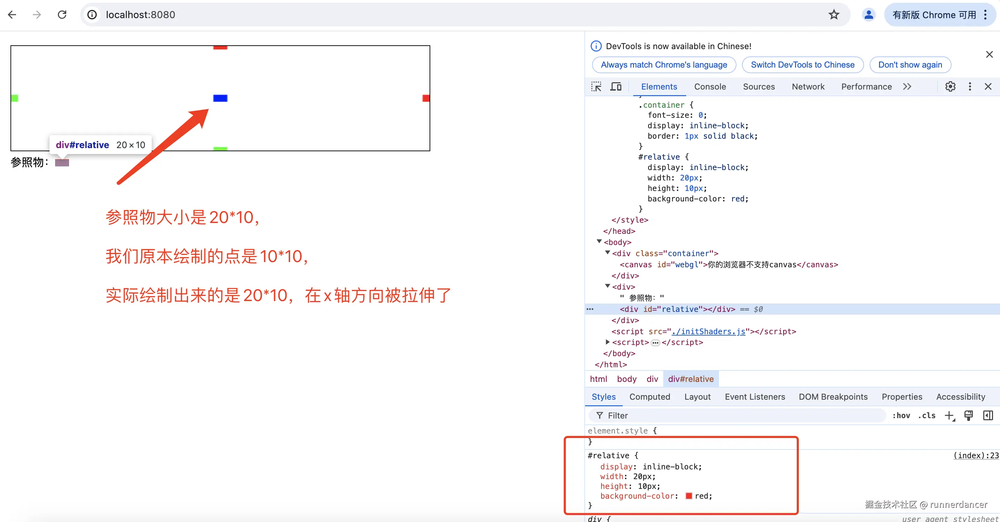

同样的，如果我们修改画布的css尺寸比drawingbuffer小，那么绘制的图形就会被缩小。比如修改上面的css代码，将#webgl的css尺寸修改成150 \* 150，同时将参照物的尺寸修改成5 \* 10，其他代码保持不变；

```html
//...
#webgl {
  width: 150px;
  height: 150px;
}
#relative {
  display: inline-block;
  width: 5px;
  height: 10px;
  background-color: red;
}
//...
```

可想而知，绘制出来的点，在y轴方向不会发生改变，在x轴方向被缩小1倍，结果如下：

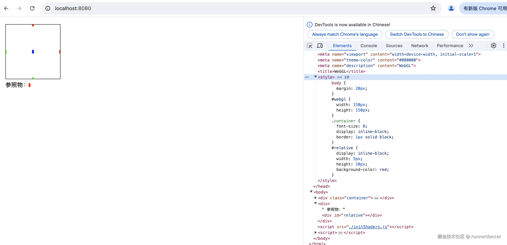

如果希望绘制出来的图形不变形，需要将drawingbuffer的尺寸调整成和css尺寸一样。有两种方式可以调整drawingbuffer的尺寸：

*   直接在html canvas标签上添加，比如：

```html
 <canvas  width="500" height="500"  id="webgl">你的浏览器不支持canvas</canvas>
```

*   通过js修改

```js
var canvas = document.querySelector("#c");
canvas.width = 400;
canvas.height = 300;
```

上面的代码，设置drawingbuffer尺寸为500 \* 500，浏览器得到 500 \* 500 像素的画布，将它拉伸或者缩放到画布的显示(比如600 \* 300)像素， 然后在拉伸或缩放的过程中进行了插值。

上面两种方式有些细微的差别，通过html标签设置drawingbuffer的尺寸，不需要重新调整`视口`。通过js设置，需要重新调整`视口`。

### 通过html标签修改

修改上面的代码，

```html
// ...
#webgl {
  width: 500px;
  height: 500px;
}
#relative {
  display: inline-block;
  width: 10px;
  height: 10px;
  background-color: red;
}
// ...
<canvas  width="500" height="500"  id="webgl">你的浏览器不支持canvas</canvas>
```

结果如下，可以发现图形绘制正常

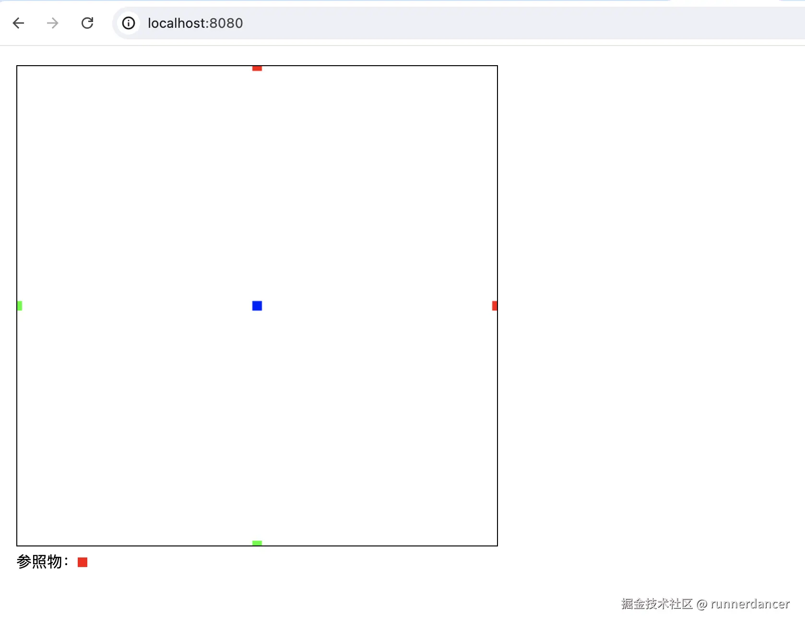

### 通过js修改尺寸

通过js修改drawingbuffer大小，需要重新调整视口，不然就会出现问题。

```html
<!DOCTYPE html>
<html lang="en">

<head>
  <meta charset="utf-8" />
  <meta name="viewport" content="width=device-width, initial-scale=1" />
  <meta name="theme-color" content="#000000" />
  <meta name="description" content="WebGL" />
  <title>WebGL</title>
  <style>
    body {
      margin: 20px;
    }
    #webgl {
      width: 500px;
      height: 500px;
    }
    .container {
      font-size: 0;
      display: inline-block;
      border: 1px solid black;
    }
    #relative {
      display: inline-block;
      width: 10px;
      height: 10px;
      background-color: red;
    }
    #relativecontainer {
      width: 300px;
      height: 150px;
      box-sizing: border-box;
      border: 1px solid red;;
    }
  </style>
</head>

<body>
  <div class="container">
    <canvas id="webgl">你的浏览器不支持canvas</canvas>
  </div>
  <div id="relativecontainer">
    参照物：<div id="relative"></div>
  </div>
  
  <script src="./initShaders.js"></script>
  <script>
    const main = () => {
      const canvas = document.getElementById('webgl')
      const gl = canvas.getContext('webgl2')
      const vertexShaderSource1 = `
        attribute vec2 a_position;
        attribute vec3 a_color;
        varying vec3 v_color;
        void main(){
            gl_PointSize = 10.0;
            v_color = a_color;
            gl_Position = vec4(a_position, 0.0, 1.0);
        }
      `
      const fragmentShaderSource1 = `
        precision mediump float;
        varying vec3 v_color;
        void main(){
            gl_FragColor = vec4(v_color, 1.0);
        }
      `
      const program1 = initShaders(gl, vertexShaderSource1, fragmentShaderSource1)
      const positionLocation1 = gl.getAttribLocation(program1, 'a_position')
      const colorLocation1 = gl.getAttribLocation(program1, 'a_color')


      let verticesInfo = [
        // 每行前两个表示坐标，后面三个表示颜色
        1.0, 0.0, 1.0, 0.0, 0.0, // (1.0, 0.0) 红色
        -1.0, 0.0, 0.0, 1.0, 0.0, // (-1.0, 0.0) 绿色
        0.0, 0.0, 0.0, 0.0, 1.0, // (0.0, 0.0)蓝色
        0.0, 1.0, 1.0, 0.0, 0.0, // (0.0, 1.0) 红色
        0.0, -1.0, 0.0, 1.0, 0.0 // (0.0, -1.0) 绿色
      ]
      verticesInfo = new Float32Array(verticesInfo)

      const vertexBuffer = gl.createBuffer();
      gl.bindBuffer(gl.ARRAY_BUFFER, vertexBuffer)
      gl.bufferData(gl.ARRAY_BUFFER, verticesInfo, gl.STATIC_DRAW)


      gl.vertexAttribPointer(
        positionLocation1,
        2,
        gl.FLOAT,
        false,
        20,
        0
      );

      gl.vertexAttribPointer(
        colorLocation1,
        3,
        gl.FLOAT,
        false,
        20,
        8
      );
      
      // 通过js调整drawingbuffer大小
      canvas.width  = canvas.clientWidth;
      canvas.height = canvas.clientHeight;
    
      gl.clearColor(0, 0, 0, 0)
      gl.clear(gl.COLOR_BUFFER_BIT);

      gl.useProgram(program1)

      gl.enableVertexAttribArray(positionLocation1);
      gl.enableVertexAttribArray(colorLocation1);

      gl.drawArrays(gl.POINTS, 0, 5)

    }

    main();

  </script>
</body>

</html>
```

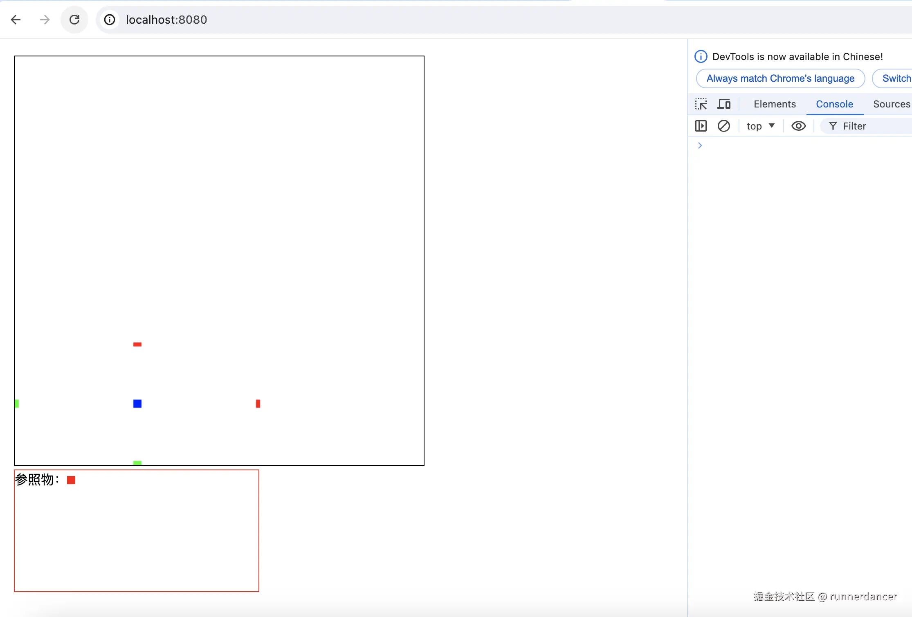

结果如上图，可以发现图形绘制虽然是正常了。但是绘制的点并没有覆盖整个画布，看上去在左下角的300 \* 150的区域（可以通过参照物容器的尺寸得出左下角绘制点的区域在300 \* 150）。

这是为什么？这就涉及到`视口`（viewport）。

## 视口(viewport)

在WebGL中，`viewport`对象是用于定义渲染区域的一个矩形，它规定了WebGL上下文渲染像素的坐标范围。`viewport`对象使用以下属性定义

*   `x` 和 `y`：表示矩形左下角的位置，通常为0。
*   `width` 和 `height`：表示矩形的宽度和高度。
    当我们第一次创建WebGL上下文的时候WebGL会设置视口大小和画布drawingbuffer大小匹配， 但是在那之后就需要我们自己设置。当改变画布大小就需要告诉WebGL新的视口设置。

上面的例子中，一开始创建WebGL上下文时，画布的drawingbuffer默为为300 \* 150，因此WebGL在一开始就会将视口大小设置成300 \* 150。然后我们通过js修改了drawingbuffer的尺寸为：500 \* 500，但我们没有重新设置视口大小，整个绘制就还是在300 \* 150的区域。所以**当我们手动调整过画布大小后，需要重新设置视口的大小**，可以通过gl.viewport修改视口。也可以通过gl.getParameter(gl.VIEWPORT);获取当前的视口

```js
gl.viewport(0, 0, gl.canvas.width, gl.canvas.height);
```

修改上面代码，其他保持不变

```html
// ...
    // 通过js调整drawingbuffer大小
    canvas.width  = canvas.clientWidth;
    canvas.height = canvas.clientHeight;
    // 需要重新调整视口
    gl.viewport(0, 0, gl.canvas.width, gl.canvas.height);
    console.log('当前视口：', gl.getParameter(gl.VIEWPORT))
    gl.clearColor(0, 0, 0, 0)
    gl.clear(gl.COLOR_BUFFER_BIT);
// ...
```

结果如下：

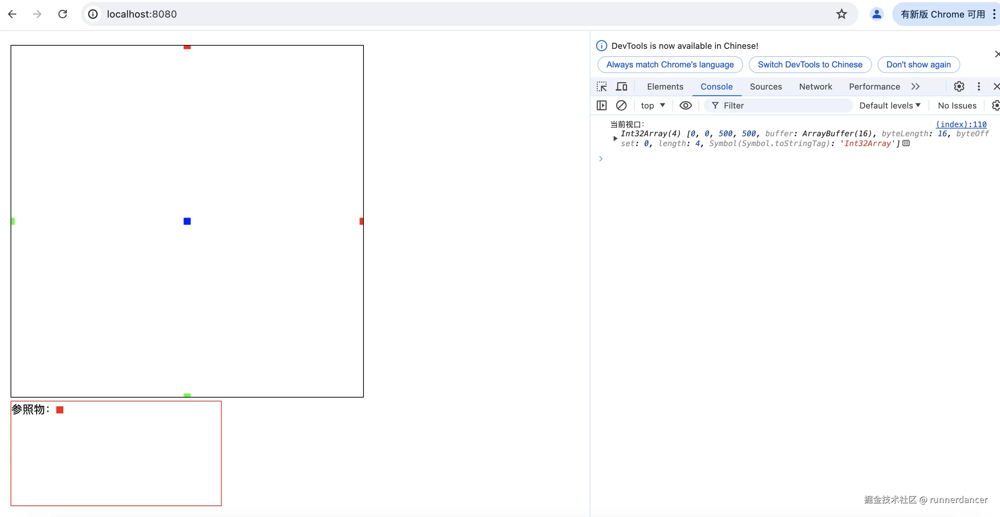

如何理解gl.viewport的x和y？实际上，viewport的x和y是相对于画布左下角的距离。比如

```js
gl.viewport(100, 100, 300, 150)
```

意思是，以距离画布左下角100 \* 100的点为矩形(WebGL实际渲染的区域)的左下角，在300 \* 150的范围绘制WebGL图形。可以通过下面的代码验证一下：

```html
<!DOCTYPE html>
<html lang="en">

<head>
  <meta charset="utf-8" />
  <meta name="viewport" content="width=device-width, initial-scale=1" />
  <meta name="theme-color" content="#000000" />
  <meta name="description" content="WebGL" />
  <title>WebGL</title>
  <style>
    body {
      margin: 20px;
    }
    #webgl {
      width: 500px;
      height: 500px;
    }
    .container {
      font-size: 0;
      display: inline-block;
      border: 1px solid black;
    }
    #relative {
      display: inline-block;
      width: 10px;
      height: 10px;
      background-color: red;
    }
    #relativecontainer {
      width: 100px;
      height: 100px;
      box-sizing: border-box;
      border: 1px solid red;;
    }
  </style>
</head>

<body>
  <div class="container">
    <canvas id="webgl">你的浏览器不支持canvas</canvas>
  </div>
  <div id="relativecontainer">
    参照物：<div id="relative"></div>
  </div>
  
  <script src="./initShaders.js"></script>
  <script>
    const main = () => {
      const canvas = document.getElementById('webgl')
      const gl = canvas.getContext('webgl2')
      const vertexShaderSource1 = `
        attribute vec2 a_position;
        attribute vec3 a_color;
        varying vec3 v_color;
        void main(){
            gl_PointSize = 10.0;
            v_color = a_color;
            gl_Position = vec4(a_position, 0.0, 1.0);
        }
      `
      const fragmentShaderSource1 = `
        precision mediump float;
        varying vec3 v_color;
        void main(){
            gl_FragColor = vec4(v_color, 1.0);
        }
      `
      const program1 = initShaders(gl, vertexShaderSource1, fragmentShaderSource1)
      const positionLocation1 = gl.getAttribLocation(program1, 'a_position')
      const colorLocation1 = gl.getAttribLocation(program1, 'a_color')


      let verticesInfo = [
        // 每行前两个表示坐标，后面三个表示颜色
        1.0, 0.0, 1.0, 0.0, 0.0, // (1.0, 0.0) 红色
        -1.0, 0.0, 0.0, 1.0, 0.0, // (-1.0, 0.0) 绿色
        0.0, 0.0, 0.0, 0.0, 1.0, // (0.0, 0.0)蓝色
        0.0, 1.0, 1.0, 0.0, 0.0, // (0.0, 1.0) 红色
        0.0, -1.0, 0.0, 1.0, 0.0 // (0.0, -1.0) 绿色
      ]
      verticesInfo = new Float32Array(verticesInfo)

      const vertexBuffer = gl.createBuffer();
      gl.bindBuffer(gl.ARRAY_BUFFER, vertexBuffer)
      gl.bufferData(gl.ARRAY_BUFFER, verticesInfo, gl.STATIC_DRAW)


      gl.vertexAttribPointer(
        positionLocation1,
        2,
        gl.FLOAT,
        false,
        20,
        0
      );

      gl.vertexAttribPointer(
        colorLocation1,
        3,
        gl.FLOAT,
        false,
        20,
        8
      );
      
      // 通过js调整drawingbuffer大小
      canvas.width  = canvas.clientWidth;
      canvas.height = canvas.clientHeight;
      // 重新设置视口
      gl.viewport(100, 100, 300, 150);
      console.log('当前视口：', gl.getParameter(gl.VIEWPORT))

      gl.clearColor(0, 0, 0, 0)
      
      gl.clear(gl.COLOR_BUFFER_BIT);

      gl.useProgram(program1)

      gl.enableVertexAttribArray(positionLocation1);
      gl.enableVertexAttribArray(colorLocation1);

      gl.drawArrays(gl.POINTS, 0, 5)

    }

    main();

  </script>
</body>

</html>
```

结果如下：

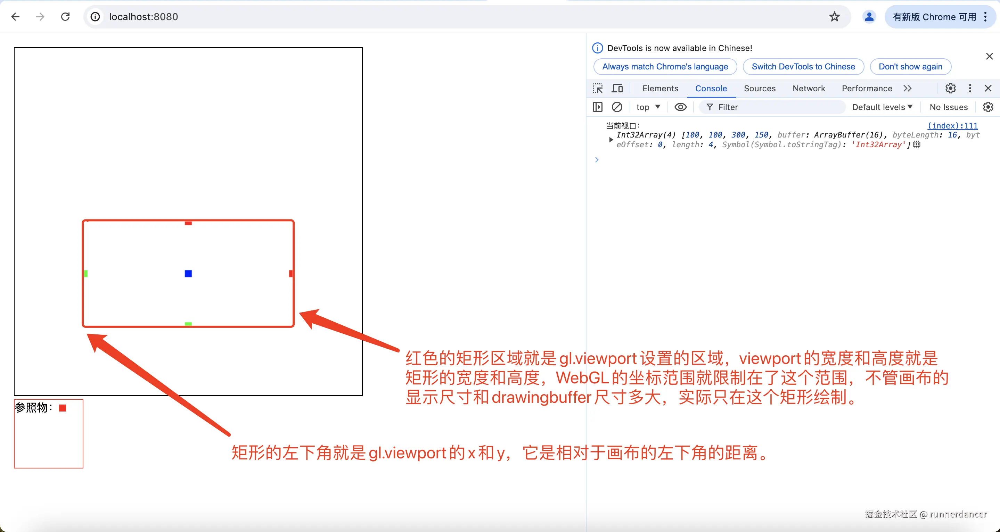

为什么WebGL不在画布尺寸改变的时候自动帮我们修改视域？原因是它不知道我们如何以及为什么使用视域， 我们可以渲染到一个帧缓冲或者做其他的事情需要不同的视域尺寸。 WebGL没办法知道我们的意图所以就不能自动设置视域。

## 高分辨率屏幕

使用CSS像素值声明画布的尺寸时，这个叫做CSS像素值，可能不是真实像素值。大多数现代智能手机有叫做高清显示(HD-DPI)或者苹果叫它“Retina Display”的特性。对于文字和大多数CSS样式浏览器会自动绘制HD-DPI图形，但是对于WebGL，由于是我们来控制绘制图形，所以取决于我们想绘制一般分辨率还是“HD-DPI”品质。

为了实现这个我们需要获得`window.devicePixelRatio`的值， 这个值告诉我们1个CSS像素对应多少个实际像素。

```html
<!DOCTYPE html>
<html lang="en">

<head>
  <meta charset="utf-8" />
  <meta name="viewport" content="width=device-width, initial-scale=1" />
  <meta name="theme-color" content="#000000" />
  <meta name="description" content="WebGL" />
  <title>WebGL</title>
  <style>
    body {
      margin: 20px;
    }

    #webgl {
      width: 500px;
      height: 500px;
    }

    .container {
      font-size: 0;
      display: inline-block;
      border: 1px solid black;
    }

    #relative {
      display: inline-block;
      width: 10px;
      height: 10px;
      background-color: red;
    }

    #relativecontainer {
      width: 100px;
      height: 100px;
      box-sizing: border-box;
      border: 1px solid red;
      ;
    }
  </style>
</head>

<body>
  <div class="container">
    <canvas id="webgl">你的浏览器不支持canvas</canvas>
  </div>
  <div id="relativecontainer">
    参照物：<div id="relative"></div>
  </div>

  <script src="./initShaders.js"></script>
  <script>
    const main = () => {
      const canvas = document.getElementById('webgl')
      const gl = canvas.getContext('webgl2')
      const vertexShaderSource1 = `
        attribute vec2 a_position;
        attribute vec3 a_color;
        varying vec3 v_color;
        void main(){
            gl_PointSize = 10.0;
            v_color = a_color;
            gl_Position = vec4(a_position, 0.0, 1.0);
        }
      `
      const fragmentShaderSource1 = `
        precision mediump float;
        varying vec3 v_color;
        void main(){
            gl_FragColor = vec4(v_color, 1.0);
        }
      `
      const program1 = initShaders(gl, vertexShaderSource1, fragmentShaderSource1)
      const positionLocation1 = gl.getAttribLocation(program1, 'a_position')
      const colorLocation1 = gl.getAttribLocation(program1, 'a_color')


      let verticesInfo = [
        // 每行前两个表示坐标，后面三个表示颜色
        1.0, 0.0, 1.0, 0.0, 0.0, // (1.0, 0.0) 红色
        -1.0, 0.0, 0.0, 1.0, 0.0, // (-1.0, 0.0) 绿色
        0.0, 0.0, 0.0, 0.0, 1.0, // (0.0, 0.0)蓝色
        0.0, 1.0, 1.0, 0.0, 0.0, // (0.0, 1.0) 红色
        0.0, -1.0, 0.0, 1.0, 0.0 // (0.0, -1.0) 绿色
      ]
      verticesInfo = new Float32Array(verticesInfo)

      const vertexBuffer = gl.createBuffer();
      gl.bindBuffer(gl.ARRAY_BUFFER, vertexBuffer)
      gl.bufferData(gl.ARRAY_BUFFER, verticesInfo, gl.STATIC_DRAW)


      gl.vertexAttribPointer(
        positionLocation1,
        2,
        gl.FLOAT,
        false,
        20,
        0
      );

      gl.vertexAttribPointer(
        colorLocation1,
        3,
        gl.FLOAT,
        false,
        20,
        8
      );

      // 通过js调整drawingbuffer大小
      canvas.width = canvas.clientWidth * window.devicePixelRatio;
      canvas.height = canvas.clientHeight * window.devicePixelRatio;
      // 重新设置视口
      gl.viewport(0, 0, gl.canvas.width, gl.canvas.height);
      console.log('当前视口：', gl.getParameter(gl.VIEWPORT))
      console.log('window.devicePixelRatio：', window.devicePixelRatio)

      gl.clearColor(0, 0, 0, 0)

      gl.clear(gl.COLOR_BUFFER_BIT);

      gl.useProgram(program1)

      gl.enableVertexAttribArray(positionLocation1);
      gl.enableVertexAttribArray(colorLocation1);

      gl.drawArrays(gl.POINTS, 0, 5)

    }

    main();

  </script>
</body>

</html>
```

结果如下：

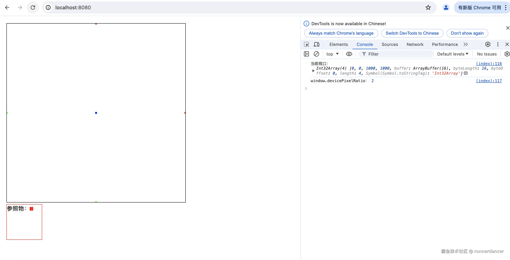

可以看到，我这台电脑window\.devicePixelRatio为2，绘制出来的点尺寸缩小了一倍，变成了5 \* 5(显示尺寸)。但实际上真实像素是10 \* 10。

## 坐标系统

在2D图形绘制中，canvas坐标的原点在左上角。比如下图

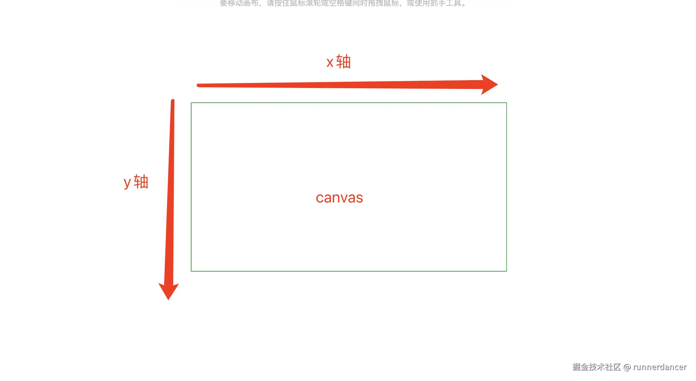

而在WebGL中，坐标系统是以画布中心为原点，同时x，y，z轴的范围永远都是-1到+1。如下图所示：

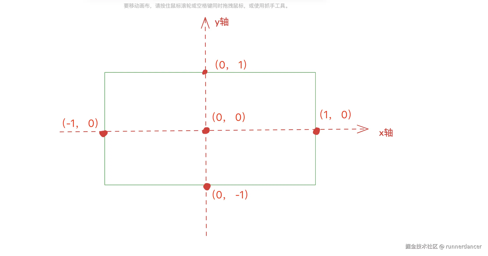

可以看出，在WebGL坐标系统中，在x轴方向，+1在原点的右边。而在y轴方向，+1在原点上面，这点需要注意下。这也被称为WebGL的裁剪空间坐标。

## 裁剪空间坐标转屏幕坐标

不论我们的画布大小是多少，在裁剪空间中每个方向的坐标范围都是-1到+1。因此我们传递给GPU的值肯定在-1到+1之间，即设置给gl\_Position的值一定在-1到+1之间。

对于描述二维空间中的物体，比起裁剪空间坐标我们可能更希望使用屏幕像素坐标。对于canvas画布中的任意一点A，它在canvas的屏幕坐标为A(x1, y1)。
而它在WebGL裁剪空间中的坐标为A(x2, y2)，那么可以得出下面的推导：

$$
x2 = (x1 - w/2)/(w/2) = (2*x1 / w) - 1
$$

$$
y2 = (h/2 - y1)/(h/2) = 1 - (2*y1 / h)
$$

其中，w是canvas的clientWidth,h是canvas的clientHeight

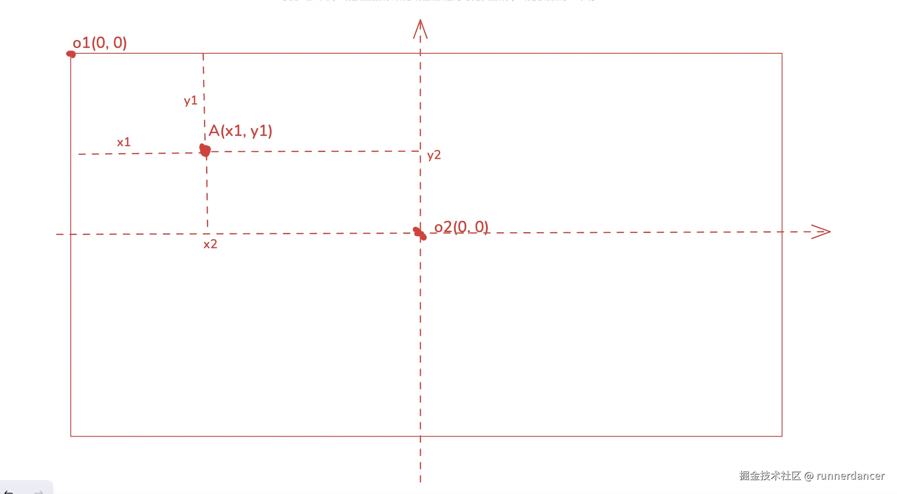


所以我们来改造一下顶点着色器，让我们提供给它像素坐标而不是裁剪空间坐标。如下面代码所示，我们给顶点着色器传递当前画布的尺寸，即u\_resolution

```html
<!DOCTYPE html>
<html lang="en">

<head>
  <meta charset="utf-8" />
  <meta name="viewport" content="width=device-width, initial-scale=1" />
  <meta name="theme-color" content="#000000" />
  <meta name="description" content="WebGL" />
  <title>WebGL</title>
  <style>
    body {
      margin: 20px;
    }

    #webgl {
      width: 500px;
      height: 500px;
    }

    .container {
      font-size: 0;
      display: inline-block;
      border: 1px solid black;
    }

    #relative {
      display: inline-block;
      width: 10px;
      height: 10px;
      background-color: red;
    }

    #relativecontainer {
      width: 100px;
      height: 100px;
      box-sizing: border-box;
      border: 1px solid red;
      ;
    }
  </style>
</head>

<body>
  <div class="container">
    <canvas id="webgl">你的浏览器不支持canvas</canvas>
  </div>
  <div id="relativecontainer">
    参照物：<div id="relative"></div>
  </div>

  <script src="./initShaders.js"></script>
  <script>
    const main = () => {
      const canvas = document.getElementById('webgl')
      const gl = canvas.getContext('webgl2')
      const vertexShaderSource1 = `
        attribute vec2 a_position;
        attribute vec3 a_color;
        varying vec3 v_color;
        uniform vec2 u_resolution;
        void main(){
            float x2 = 2.0 * a_position.x / u_resolution.x - 1.0;
            float y2 = 1.0 - 2.0 * a_position.y / u_resolution.y;
            gl_PointSize = 10.0;
            v_color = a_color;
            gl_Position = vec4(x2, y2, 0.0, 1.0);
        }
      `
      const fragmentShaderSource1 = `
        precision mediump float;
        varying vec3 v_color;
        void main(){
            gl_FragColor = vec4(v_color, 1.0);
        }
      `
      const program1 = initShaders(gl, vertexShaderSource1, fragmentShaderSource1)
      const positionLocation1 = gl.getAttribLocation(program1, 'a_position')
      const colorLocation1 = gl.getAttribLocation(program1, 'a_color')
      const resolutionUniformLocation = gl.getUniformLocation(program1, "u_resolution");


      let verticesInfo = [
        // 每行前两个表示坐标，后面三个表示颜色
        50, 50, 1.0, 0.0, 0.0, // 红色
        250, 50, 0.0, 1.0, 0.0, //  绿色
        50, 250, 0.0, 0.0, 1.0, // 蓝色
        250, 250, 1.0, 0.0, 0.0, //  红色
        0, 0, 0.0, 1.0, 0.0 // 绿色
      ]
      verticesInfo = new Float32Array(verticesInfo)

      const vertexBuffer = gl.createBuffer();
      gl.bindBuffer(gl.ARRAY_BUFFER, vertexBuffer)
      gl.bufferData(gl.ARRAY_BUFFER, verticesInfo, gl.STATIC_DRAW)


      gl.vertexAttribPointer(
        positionLocation1,
        2,
        gl.FLOAT,
        false,
        20,
        0
      );

      gl.vertexAttribPointer(
        colorLocation1,
        3,
        gl.FLOAT,
        false,
        20,
        8
      );

      // 通过js调整drawingbuffer大小
      canvas.width = canvas.clientWidth * window.devicePixelRatio;
      canvas.height = canvas.clientHeight * window.devicePixelRatio;
      // 重新设置视口
      gl.viewport(0, 0, gl.canvas.width, gl.canvas.height);
      console.log('当前视口：', gl.getParameter(gl.VIEWPORT))
      console.log('window.devicePixelRatio：', window.devicePixelRatio)

      gl.clearColor(0, 0, 0, 0)

      gl.clear(gl.COLOR_BUFFER_BIT);

      gl.useProgram(program1)
      gl.uniform2f(resolutionUniformLocation, gl.canvas.clientWidth, gl.canvas.clientHeight);

      gl.enableVertexAttribArray(positionLocation1);
      gl.enableVertexAttribArray(colorLocation1);

      gl.drawArrays(gl.POINTS, 0, 5)

    }

    main();

  </script>
</body>

</html>
```

我们传递给顶点着色器的verticesInfo缓冲，绘制5个点，其中绿色的点我们绘制在屏幕空间的(0, 0)坐标处。

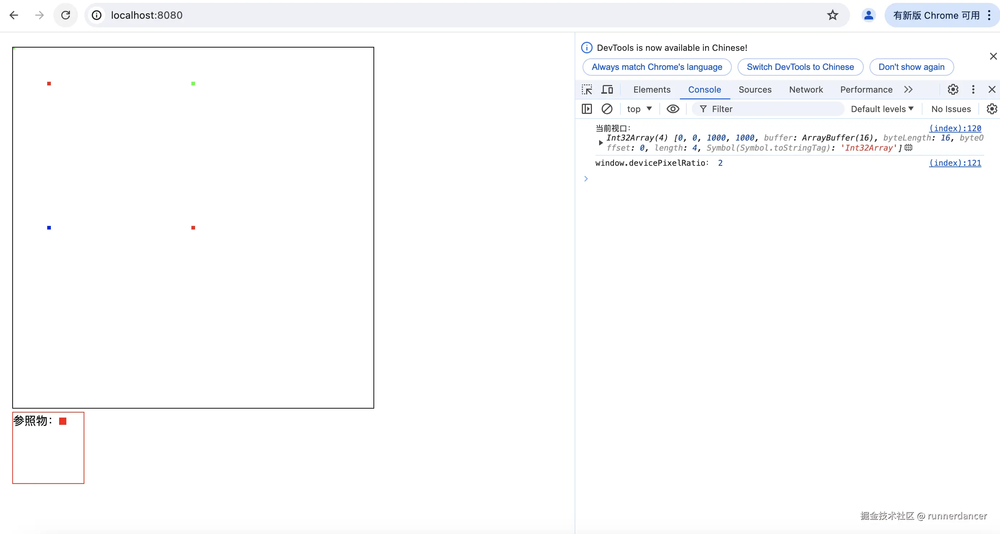

## 参考

*   <https://webglfundamentals.org/webgl/lessons/zh_cn/webgl-resizing-the-canvas.html>
*   <https://developer.mozilla.org/en-US/docs/Web/API/Window/devicePixelRatio>
