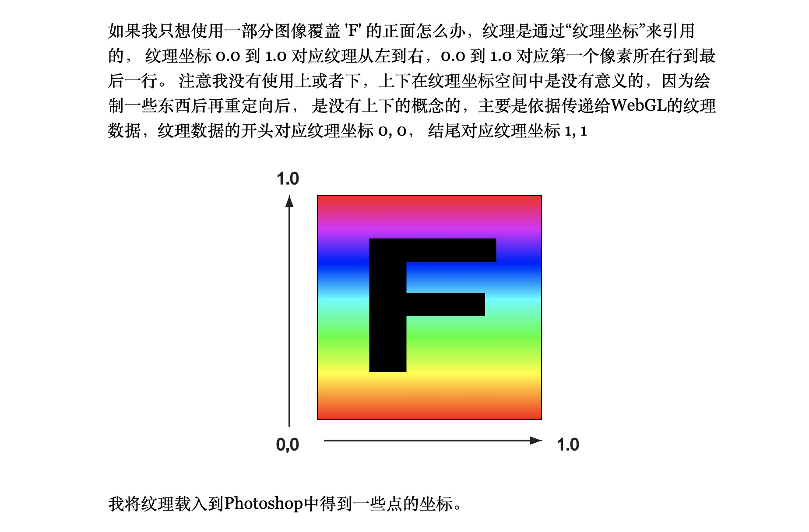
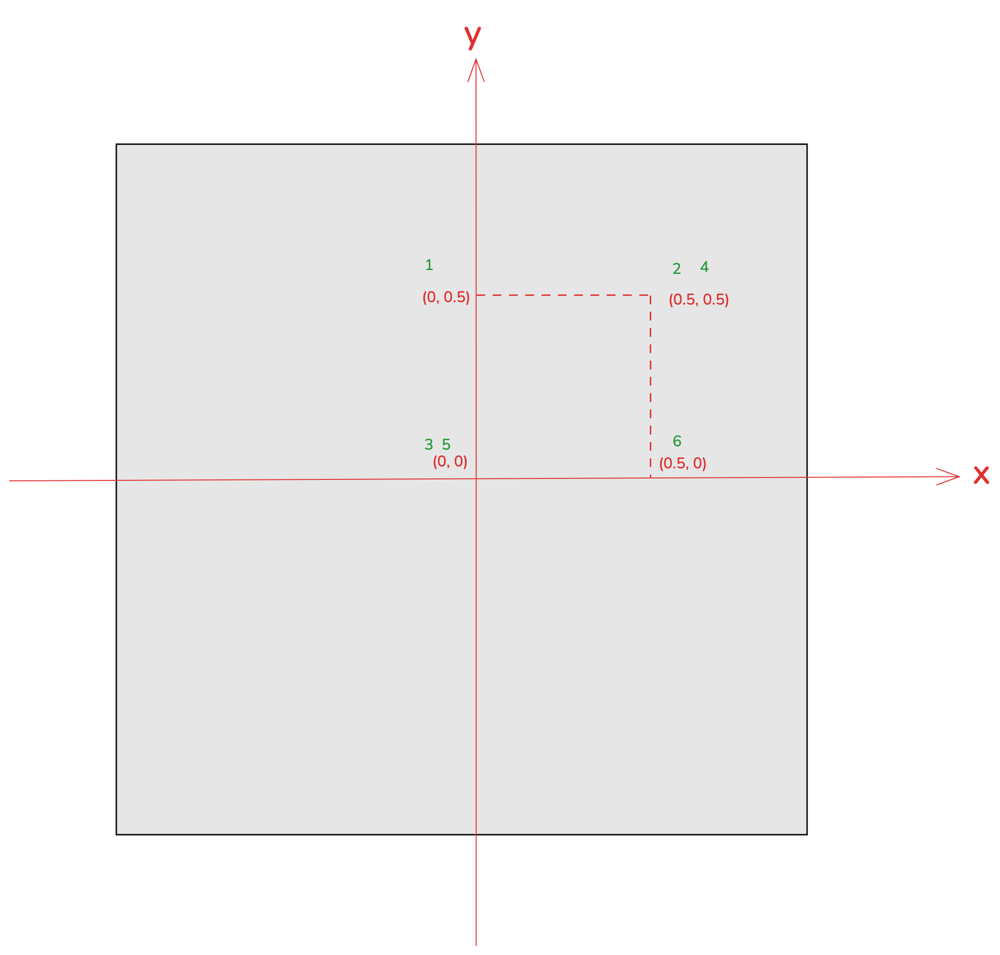
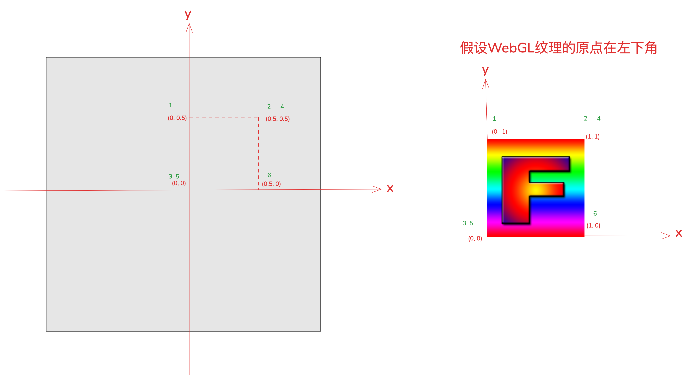
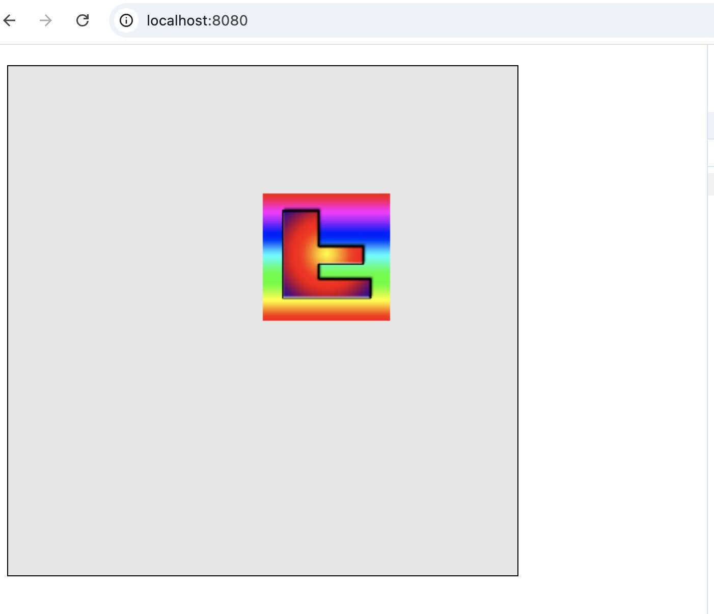
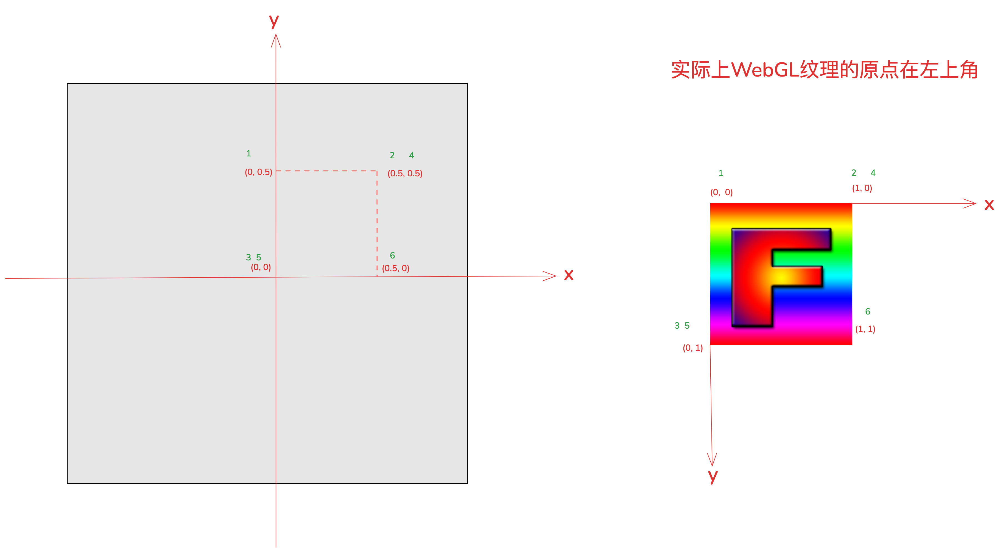
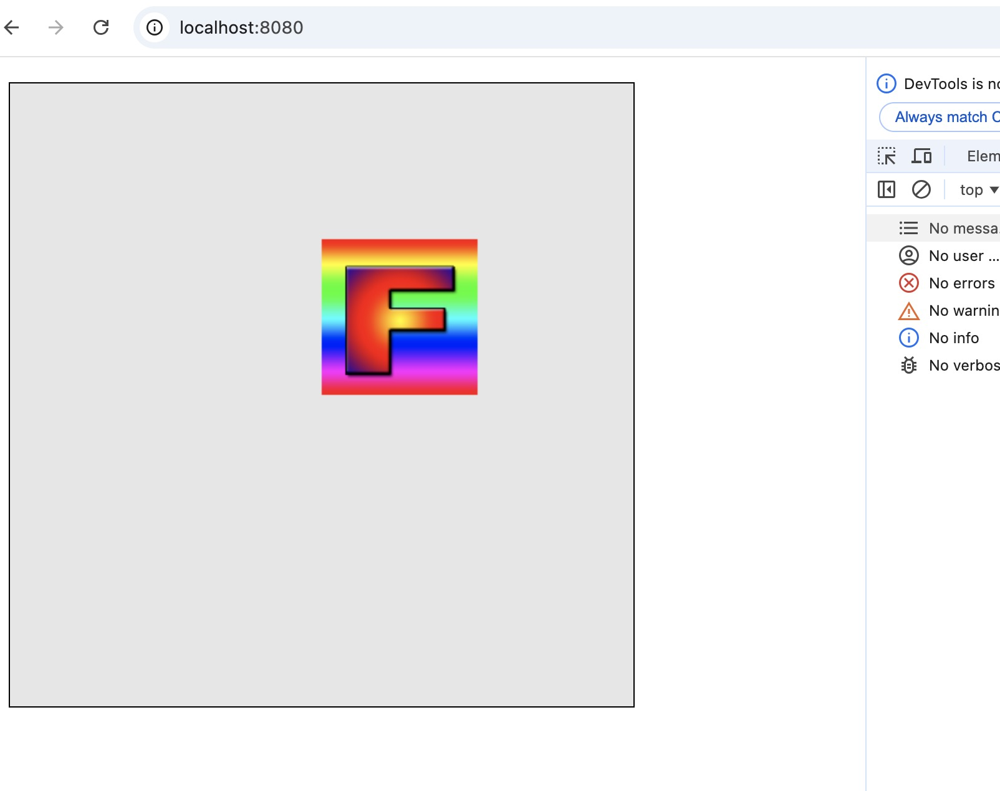

## 纹理坐标

纹理是通过“纹理坐标”来引用的， 纹理坐标 0.0 到 1.0 对应纹理从左到右，0.0 到 1.0 对应第一个像素所在行到最后一行。纹理坐标是没有上下的概念的，主要是依据传递给WebGL的纹理数据，纹理数据的开头对应纹理坐标(0, 0)， 结尾对应纹理坐标(1, 1)。

## 纹理坐标原点
在社区大部分文章中，都普遍认为WebGL纹理坐标的原点在左下角。比如在[webglfundamentals](https://webglfundamentals.org/webgl/lessons/zh_cn/webgl-3d-textures.html)一文中，也认为WebGL纹理坐标在左下角：



实际上，在OpenGL中，纹理坐标的原点确实在左下角。而在WebGL中，纹理坐标的原点在左上角！！下面我们将通过例子验证


下图中，灰色背景区域是Canvas画布，我们在(0,0)，(0, 0.5), (0.5,0.5), (0.5, 0)处画一个矩形。



对应的矩形坐标为：

```js
const rectX = 0.5, rectY =  0.5;
let verticesInfo = [
    0.0, rectY,
    rectX, rectY,
    0, 0,
    rectX, rectY,
    0, 0,
    rectX, 0,
]
verticesInfo = new Float32Array(verticesInfo)
```

矩形的坐标顺序需要和纹理贴图的坐标顺序一一对应。上图中，绿色字体的1，2，3，4，5，6就是矩形的坐标顺序。

假设WebGL中纹理贴图的原点在左下角，我们使用下面的图片贴到上面的矩形中


那么纹理坐标和矩形的坐标对应关系就如下图所示，图中绿色字体就是表示坐标在缓冲中的顺序。



因此，对应的纹理坐标应该如下：

```js
const x = 1.0, y = 1.0;
// 假设WebGL纹理坐标的原点在左下角，那么纹理坐标应该如下：
gl.bufferData(gl.ARRAY_BUFFER, new Float32Array([
    0.0, y,
    x, y,
    0.0, 0.0,
    x, y,
    0.0,0.0,
    x, 0
]), gl.STATIC_DRAW);
```

实际绘制的结果如下图所示，可以看到，贴图是颠倒的！！



完整demo如下：
```js
const main = (image) => {
    const canvas = document.getElementById('webgl')
    const gl = canvas.getContext('webgl')
    const vertexShaderSource1 = `
      attribute vec2 a_texCoord;
      attribute vec2 a_position;
      varying vec2 v_texCoord;
      void main(){
          gl_PointSize = 10.0;
          gl_Position = vec4(a_position, 0.0, 1.0);
          // 将纹理坐标传给片段着色器
          // GPU会在点之间进行插值
          v_texCoord = a_texCoord;
      }
    `
    const fragmentShaderSource1 = `
      precision mediump float;
      uniform sampler2D u_image;
      // 从顶点着色器传入的纹理坐标
      varying vec2 v_texCoord;
      void main(){
        // 在纹理上寻找对应颜色值
        gl_FragColor = texture2D(u_image, v_texCoord);
      }
    `
    const program1 = initShaders(gl, vertexShaderSource1, fragmentShaderSource1)
    const positionLocation1 = gl.getAttribLocation(program1, 'a_position')
    const texCoordLocation = gl.getAttribLocation(program1, "a_texCoord");
  
    // 给矩形提供纹理坐标
    const texCoordBuffer = gl.createBuffer();
    gl.bindBuffer(gl.ARRAY_BUFFER, texCoordBuffer);
    const x = 1.0, y = 1.0;
    // 假设WebGL纹理坐标的原点在左下角，那么纹理坐标应该如下：
    gl.bufferData(gl.ARRAY_BUFFER, new Float32Array([
     0.0, y,
     x, y,
     0.0, 0.0,
     x, y,
     0.0,0.0,
     x, 0
    ]), gl.STATIC_DRAW);

    // WebGL纹理坐标的原点在左上角，因此我们应该按下面的顺序提供纹理坐标：
    // gl.bufferData(gl.ARRAY_BUFFER, new Float32Array([
    //   0.0, 0.0,
    //   x, 0.0,
    //   0.0, y,
    //   x, 0.0,
    //   0.0, y,
    //   x, y
    // ]), gl.STATIC_DRAW);
    gl.enableVertexAttribArray(texCoordLocation);
    gl.vertexAttribPointer(texCoordLocation, 2, gl.FLOAT, false, 0, 0);
  
    // 创建纹理
    var texture = gl.createTexture();
    gl.bindTexture(gl.TEXTURE_2D, texture);
  
    // 设置参数，让我们可以绘制任何尺寸的图像
    gl.texParameteri(gl.TEXTURE_2D, gl.TEXTURE_WRAP_S, gl.CLAMP_TO_EDGE);
    gl.texParameteri(gl.TEXTURE_2D, gl.TEXTURE_WRAP_T, gl.CLAMP_TO_EDGE);
    gl.texParameteri(gl.TEXTURE_2D, gl.TEXTURE_MIN_FILTER, gl.NEAREST);
    gl.texParameteri(gl.TEXTURE_2D, gl.TEXTURE_MAG_FILTER, gl.NEAREST);
  
    // 将图像上传到纹理
    gl.texImage2D(gl.TEXTURE_2D, 0, gl.RGBA, gl.RGBA, gl.UNSIGNED_BYTE, image);
  
    const rectX = 0.5, rectY =  0.5;
    let verticesInfo = [
      0.0, rectY,
      rectX, rectY,
      0, 0,
      rectX, rectY,
      0, 0,
      rectX, 0,
    ]
    verticesInfo = new Float32Array(verticesInfo)
  
    const vertexBuffer = gl.createBuffer();
    gl.bindBuffer(gl.ARRAY_BUFFER, vertexBuffer)
    gl.bufferData(gl.ARRAY_BUFFER, verticesInfo, gl.STATIC_DRAW)
  
  
    gl.vertexAttribPointer(
      positionLocation1,
      2,
      gl.FLOAT,
      false,
      8,
      0
    );
  
  
  
    gl.clearColor(0, 0, 0, 0.1)
  
    gl.clear(gl.COLOR_BUFFER_BIT);
  
    gl.useProgram(program1)
  
    gl.enableVertexAttribArray(positionLocation1);
  
    gl.drawArrays(gl.TRIANGLES, 0,6)
  
  }
  
  
  const image = new Image();
  image.src = "./f.png";  // 必须在同一域名下
  image.onload = function () {
    main(image);
  }
```

实际上，WebGL纹理的原点在左上角。如下图所示：



因此我们应该这样提供纹理坐标：

```js
const x = 1.0, y = 1.0;
// WebGL纹理坐标的原点在左上角，因此我们应该按下面的顺序提供纹理坐标：
gl.bufferData(gl.ARRAY_BUFFER, new Float32Array([
    0.0, 0.0,
    x, 0.0,
    0.0, y,
    x, 0.0,
    0.0, y,
    x, y
]), gl.STATIC_DRAW);
```

实际的绘制结果如下图，可以看到结果是正确的



## 结论
在OpenGL中，纹理贴图的原点在左下角。而在WebGL中，纹理贴图的原点实际上在左上角。如果在WebGL中将左下角当作纹理贴图的原点并提供纹理坐标，需要设置gl.pixelStorei(gl.UNPACK_FLIP_Y_WEBGL, true);

## 参考
- [三维纹理](https://webglfundamentals.org/webgl/lessons/zh_cn/webgl-3d-textures.html)
- [为什么WebGL纹理是颠倒的](https://jameshfisher.com/2020/10/22/why-is-my-webgl-texture-upside-down/)

