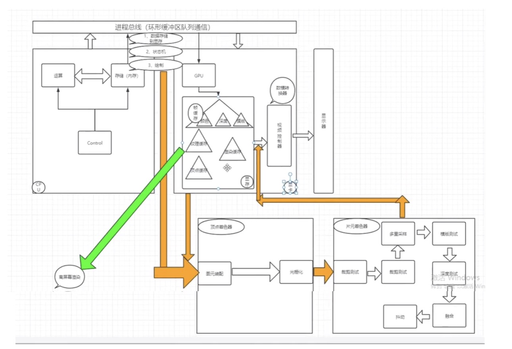

## WebGL 流程线

GPU：图形处理器(Graphics Processing Unit)

WebGL 的核心就是渲染管线

- 1.从总线进入 GPU：将 CPU 送来的数据总线，再从总线送到 GPU 里面进行处理
- 2.从 GPU 进入帧缓冲存储器(或称显存)：将 GPU 芯片处理完的数据送到显存
- 3.从显存进入视频控制器：视频控制器有可能是 DAC(Digital Analog Converter，随机读写存储数一模转换器)，从显存读取出数据再送到 RAM DAC 进行数据转换的工作(数字信号转模拟信号)：但是如果是 DVI 接口类型的显卡，则不需要经过数字信号转模拟信号，而直接输出数字信号。
- 4.从视频控制器进入显示器：将转换完的模拟信号送到显示屏

### 帧缓存

图形数据通过整个 GPU 流水线传送后，最后写入到帧缓存中。帧缓存是一个存储器，它保存了最终显示在屏幕上图像的全部信息。用作帧缓存的物理内存有几种不同的位置。对于简单的图形系统，帧缓存实际上通常就是主存的一部分。但是，最新的图形系统，帧缓存属于 GPU 中专用的快速图形存储器，或者是靠近 GPU 一侧的单独存储芯片

帧缓存一般有三种：

- 颜色缓冲
- Z-缓冲，记录对象距离相机的前后顺序，什么时候看得见，什么时候看不见
- 模版缓冲：过滤器

当图形数据通过整个 WebGL 流水线后，GPU 就把结果写入到 WebGL 称之为绘制缓存的内存中，我们不妨把绘制缓存看成 WebGL 的帧缓存。它与帧缓存一样，也有一个颜色缓存、一个 z-缓存和一个模版缓存。但是绘制缓存中的内容在传送到物理帧缓存之前，需要与 HTML 页面中的其他内容进行组合。物理帧缓存中的实际结果直接显示在屏幕上。

#### 顶点着色器

图元装配、光栅化

#### 片元着色器

- 1.裁剪测试

裁剪测试决定片段是否位于裁剪矩形中。此裁剪矩形是由一个左下角的坐标、一个宽度和一个高度决定的。如果片段位于裁剪矩形内，则通过测试，并把片段传递给下一个阶段。如果片段位于裁剪矩形之外，则被丢弃，而且不会到达绘制缓存

- 2.多重采样片段操作

多重采样技术就是为了解决抗锯齿而诞生的。抗锯齿处理是基于混合操作的，这就需要从前到后对所有的图元进行排序，这是十分麻烦的。除了包含了颜色、深度、模版值的帧缓冲区外，还需要存储多重采样的计算机结果

- 3.深度缓存测试

深度缓存测试根据深度缓存(也称 Z-缓存)的值丢弃输入的部分片段。当我们把一个 3D 场景绘制到 2D 的颜色缓存中时，颜色缓存只存储场景中在某个时刻对观察者可见对象的颜色。有些对象可能会被其他对象遮挡，深度缓存和深度缓存测试决定哪些像素出现在颜色缓存中。对于每个像素，深度缓存都要保存观察者到当前最近图元的距离。

- 4.融合

流水线中的下一个操作时融合。利用融合，把传入片段的颜色与已经在颜色缓存中相应位置的片段的颜色进行组合。当我们要创建透明对象时，就需要使用融合技术

- 5.抖动

位于绘制缓存之前的最后一个步骤是抖动。颜色缓存用有限的二进制位数表示每个颜色。抖动用来以某种方式排列颜色，得到比实际颜色数更多的颜色。当颜色缓存可用的颜色数有限时，抖动就非常有用

#### 纹理缓存

存储纹理信息，最终实现将纹理信息全部给几何框架纹上纹身。用缓存来存储这些信息，是为了更加便于计算机进行访问计算

#### 顶点缓存

通过方法`createBuffer`可以在显存上创建一个顶点缓冲区，用来存储顶点的位置、颜色、法向量等数据，渲染管线的顶点着色器可以从顶点缓冲区中获取顶点数据

#### 渲染缓存

渲染缓冲区可以作为帧缓冲区的子缓冲区使用，用来接收渲染管线生成的像素或深度数据

## 图形硬件基础

### CPU 和 GPU 的用途

CPU 和 GPU 分别针对了两种不同的应用场景：

- CPU 需要很强的通用性来处理各种不同的数据类型。同时又要逻辑判断又会引入大量的分支跳转和中断的处理。这些都使得 CPU 的内部结构异常复杂
  - CPU 的优点在于调度、管理、协调能力强
- GPU 面对的则是类型高度统一的、相互无依赖的大规模数据和不需要被打断的纯净的计算环境
  - GPU 提供了多核并行计算的基础结构，且核心数非常多，可以支撑大量数据的并行计算。并行计算或称平行计算是相对于串行计算来说的。它是一种一次可执行多个指令的算法，目的是提高计算速度，及通过扩大问题求解规模，解决大型而复杂的计算问题
  - GPU 相当于一个接受 CPU 调度的“拥有大量计算能力”的员工

### 其他 WebGL 有关的硬件概念

- 集成显卡。集成的显卡一般不带有显存，而是使用系统的一部分主内存作为显存，具体的数量一般是系统根据需要自动动态调整的。显然如果使用集成显卡运行需要大量占用内存的空间，对整个系统的影响会比较明显，此外系统内存的频率通常比独立显卡的显存低很多，因此集成显卡的性能比独立显卡要逊色一些。

- 独立显卡。独立显卡，简称独显，是指成独立的板卡，需要插在主板的相应接口上的显卡。独立显卡分为`内置独立显卡`和`外置显卡`。
  - 独立显卡是指以独立板卡形式存在，可在具备显卡接口的主板上自由插拔的显卡。独立显卡具备`单独的显存，不占用系统内存`，而且技术上领先于集成显卡，能够提供更好的`显示效果`和`运行性能`

### GPU 加速

GPU 加速计算是指同时利用图形处理器(GPU)和 CPU，加快科学、分析、工程、消费和企业应用程序的运行速度。

GPU 加速计算可以提供非凡的应用程序性能，能将应用程序计算密集部分的工作负载转移到 GPU，同时仍由 CPU 运行其余程序代码。从用户的角度来看，应用程序的运行速度明显加快
