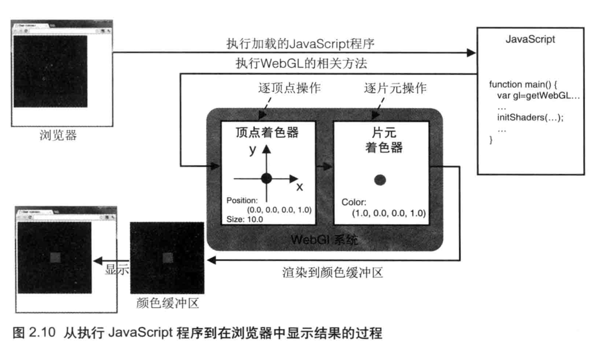
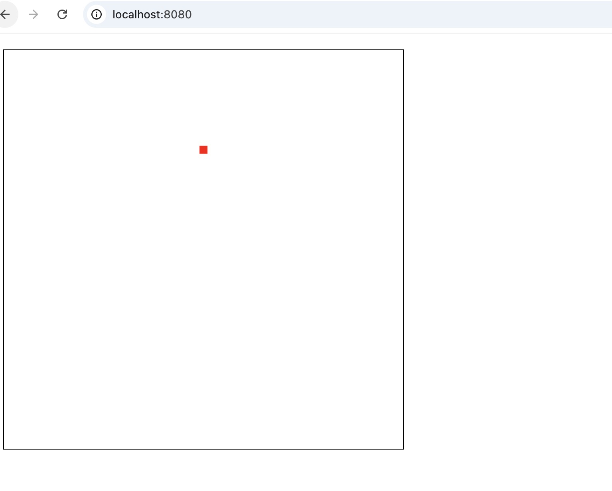
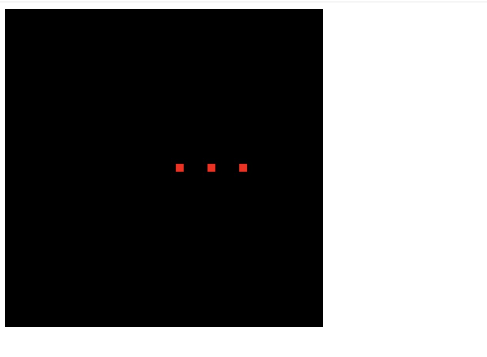

## 颜色缓冲区



如上图，webgl 系统中的绘制操作实际上是在颜色缓冲区中进行绘制的，绘制结束后系统将缓冲区中的内容显示在屏幕上，然后颜色缓冲区就会被重置，其中的内容会丢失。那颜色缓冲区在什么时候会被重置？

### Demo1：同步多次调用drawArrays
在下面的代码中，我们先后两次调用gl.drawArrays分别在(0.5, 0.0, 0.0)和(0.3, 0.0, 0.0)处绘制两个红色的点。
```js
const canvas = document.getElementById('webgl')
const gl = canvas.getContext('webgl')

const vertexShaderSource = `
    attribute vec4 a_Position;
    void main() {
        gl_Position = a_Position;
        gl_PointSize = 10.0;
    }
`;

const fragmentShaderSource = `
    precision mediump float;
    void main(){
        gl_FragColor = vec4(1,0,0,1.0);
    }
`;

const program = initShaders(gl, vertexShaderSource, fragmentShaderSource);
gl.useProgram(program);
const a_Position = gl.getAttribLocation(program, "a_Position");
gl.clearColor(0, 0, 0, 1);
gl.clear(gl.COLOR_BUFFER_BIT);

gl.vertexAttrib3f(a_Position, 0.5, 0.0, 0.0);
gl.drawArrays(gl.POINTS, 0, 1);

gl.vertexAttrib3f(a_Position, 0.3, 0.0, 0.0);
gl.drawArrays(gl.POINTS, 0, 1);
```

这里，我们同步调用 `drawArrays`，此时页面显示如下：


### Demo2：先同步后宏任务调用drawArrays
在下面的代码中，我们先后调用两次drawArrays方法，然后在定时器中再调用一次。

```js
gl.clearColor(0, 0, 0, 1);
gl.clear(gl.COLOR_BUFFER_BIT);

gl.vertexAttrib3f(a_Position, 0.5, 0.0, 0.0);
gl.drawArrays(gl.POINTS, 0, 1);

gl.vertexAttrib3f(a_Position, 0.3, 0.0, 0.0);
gl.drawArrays(gl.POINTS, 0, 1);

setTimeout(() => {
  gl.vertexAttrib3f(a_Position, 0.0, 0.5, 0.0);
  gl.drawArrays(gl.POINTS, 0, 1);
}, 0);
```

刷新页面，可以看到先显示绘制黑色的背景，黑色背景有两个红色的点。然后立马绘制白色背景，上面只有一个点：



### Demo3：微任务
在下面的代码中，我们先后调用两次drawArrays方法，然后在Promise中再调用一次。


```js
gl.clearColor(0, 0, 0, 1);
gl.clear(gl.COLOR_BUFFER_BIT);

gl.vertexAttrib3f(a_Position, 0.5, 0.0, 0.0);
gl.drawArrays(gl.POINTS, 0, 1);

gl.vertexAttrib3f(a_Position, 0.3, 0.0, 0.0);
gl.drawArrays(gl.POINTS, 0, 1);

Promise.resolve().then((res) => {
  gl.vertexAttrib3f(a_Position, 0.1, 0.0, 0.0);
  gl.drawArrays(gl.POINTS, 0, 1);
});
```

刷新页面，可以看到三个点是同时绘制出来的，页面最终效果如下：




## 结论
从上面的示例中，我们可以得出结论，颜色缓冲区大概是在微任务之后，宏任务之前被清空的


>webgl 不需要交换颜色缓冲区
