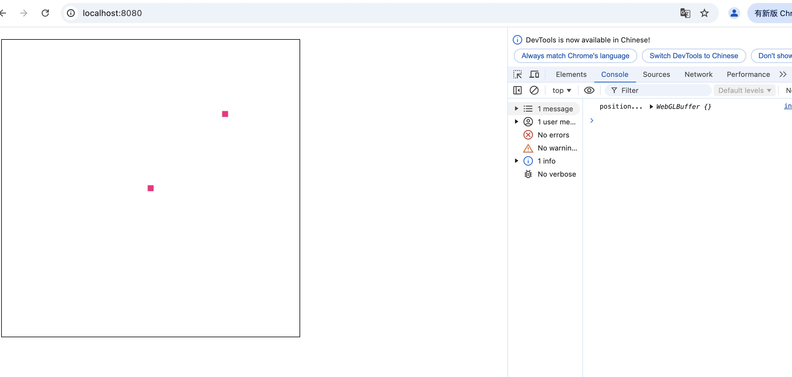

## 前言

WebGL代码由一对着色程序组成，即`顶点着色器`和`片段着色器`。着色器代码都是在GPU中运行，它们所需的任何数据都需要发送到GPU，在GPU中读取。着色器可以通过下面4种方法获取数据：

- 属性(Attributes)和缓冲。属性仅适用于顶点着色器
- 全局变量（Uniforms）。在一次绘制中对所有顶点或者像素保持一致值。适用于顶点着色器和片段着色器
- 纹理（Textures）。从像素或纹理元素中获取的数据。适用于顶点着色器和片段着色器
- 可变量（Varyings）。顶点着色器给片段着色器传值的一种方式。给顶点着色器中可变量设置的值，会作为参考值进行内插，在绘制像素时传给片段着色器的可变量

`缓冲`是发送到GPU的一些二进制数据序列，是GPU中的一块内存区域，可以存储任何数据。`属性`用来指明怎么从缓冲中获取所需数据并将它提供给顶点着色器。

本节主要讲属性以及属性的两种赋值方式。本节使用到的html代码如下：
```html
<!DOCTYPE html>
<html lang="en">
<head>
  <meta charset="utf-8" />
  <meta name="viewport" content="width=device-width, initial-scale=1" />
  <meta name="theme-color" content="#000000" />
  <meta name="description" content="WebGL" />
  <title>WebGL</title>
  <style>
    body {
      margin: 20px;
    }
    #webgl {
      width: 500px;
      height: 500px;
    }
    .container {
      font-size: 0;
      display: inline-block;
      border: 1px solid black;
      background: red;
    }
  </style>
</head>
<body>
  <div class="container">
    <canvas width="500" height="500" id="webgl">你的浏览器不支持canvas</canvas>
  </div>
  <script src="./initShaders.js"></script>
  <script src="./index.js"></script>
</body>
</html>
```

## 属性

在 WebGL 中，属性是顶点着色器的输入，可以直接给属性赋值，也可以从缓冲中获取数据。有两种方式可以给属性赋值：

- `WebGLRenderingContext.vertexAttrib[1234]f[v]()`。这种方式不常用，了解一下即可
- 缓冲。常用的方式


### 使用gl.vertexAttrib[1234]f[v]赋值
下面的代码通过gl.vertexAttrib2f给属性赋值绘制一个点：

```js
const canvas = document.getElementById('webgl')
const gl = canvas.getContext('webgl')
const vertexShaderSource = `
    attribute vec2 a_position1;
    void main() {
      gl_Position = vec4(a_position1, 0, 1);
      gl_PointSize = 10.0;
    }
`
const fragmentShaderSource = `
    precision mediump float;
    void main() {
      gl_FragColor = vec4(1,0,0.5,1);
    }
`
const program = initShaders(gl, vertexShaderSource, fragmentShaderSource)
const positionLocation1 = gl.getAttribLocation(program, 'a_position1')

gl.clearColor(0, 0, 0, 0)
gl.clear(gl.COLOR_BUFFER_BIT);

gl.useProgram(program)
gl.vertexAttrib2f(positionLocation1, 0.5, 0.5)

gl.drawArrays(gl.POINTS, 0, 1)
```

结果如下，在(0.5,0.5)坐标上绘制了一个10 * 10大小的点


## 缓冲

缓冲区对象是 WebGL系统中的一块内存区域，我们可以一次性地向缓冲区对象中填充大量的顶点数据，供顶点着色器使用。


### 为什么需要缓冲？

在解释这个问题前，我们先来看下如何通过`gl.vertexAttrib[1234]f[v]()`的方式绘制多个点。

```js
  const canvas = document.getElementById('webgl')
  const gl = canvas.getContext('webgl')
  const vertexShaderSource1 = `
    attribute vec2 a_position1;
    void main() {
      gl_Position = vec4(a_position1, 0, 1);
      gl_PointSize = 10.0;
    }
  `
  const fragmentShaderSource1 = `
    precision mediump float;
    void main() {
      gl_FragColor = vec4(1,0,0.5,1);
    }
  `
  const program1 = initShaders(gl, vertexShaderSource1, fragmentShaderSource1)

  const positionLocation1 = gl.getAttribLocation(program1, 'a_position1')

  const positions = [
    0.0, 0.0,
    0.5, 0.5,
    0.5, 0.0,
  ]

  gl.clearColor(0, 0, 0, 0)
  gl.clear(gl.COLOR_BUFFER_BIT);
  gl.useProgram(program1)

  for(let i = 0; i < 6;i=i+2){
    console.log(i)
    const x = positions[i]
    const y = positions[i+1]
    gl.vertexAttrib2f(positionLocation1, x, y)

    gl.drawArrays(gl.POINTS, 0, 1)
  }
```

结果如下：


在上面的代码中，我们绘制三个点，for循环里调用了三次`gl.vertexAttrib2f`给属性传值。这意味着CPU和GPU至少有三次通信的过程。如果绘制的点有n个，就需要n次通信传值，效率低下，存在较大的性能瓶颈。

因此，更好的做法是，我们一次性往GPU发送这些顶点数据，并通过设置属性的一些状态，告诉GPU怎么读取这些顶点数据。

### 如何给缓冲传值

使用缓冲区对象向顶点着色器传入多个顶点的数据，需要遵循以下五个步骤。处理其他对象，比如纹理对象、帧缓冲区对象时的步骤也比较类似：

- gl.createBuffer。创建缓冲区对象。
- gl.bindBuffer。绑定缓冲区对象。
- gl.bufferData。将数据写入缓冲区对象。
- gl.vertexAttribPointer。将缓冲区对象分配给一个属性(attribute)变量，并告诉属性应该怎么读取缓冲中的数据
- gl.enableVertexAttribArray。开启属性(attribute)变量。实际上就是告诉webgl，这个属性应该从缓冲中读取数据，如果调用gl.disableVertexAttribArray关闭属性，那属性就会从attributeValues中读取值。

也太繁琐了吧！不知道你是否有很多疑问，为什么要bindBuffer？为什么要enableVertexAttribArray？vertexAttribPointer是干什么的？

别急，在介绍上面各个API前，我们先来看下如何使用缓冲绘制三个点：

```js
  const canvas = document.getElementById('webgl')
  const gl = canvas.getContext('webgl')
  const vertexShaderSource1 = `
    attribute vec2 a_position1;
    void main() {
      gl_Position = vec4(a_position1, 0, 1);
      gl_PointSize = 10.0;
    }
  `
  const fragmentShaderSource1 = `
    precision mediump float;
    void main() {
      gl_FragColor = vec4(1,0,0.5,1);
    }
  `
  const program1 = initShaders(gl, vertexShaderSource1, fragmentShaderSource1)

  const positionLocation1 = gl.getAttribLocation(program1, 'a_position1')

  const positions = [
    0.0, 0.0,
    0.5, 0.5,
    0.5, 0.0,
  ]
  const positionBuffer = gl.createBuffer();
  gl.bindBuffer(gl.ARRAY_BUFFER, positionBuffer)
  gl.bufferData(gl.ARRAY_BUFFER, new Float32Array(positions), gl.STATIC_DRAW)

  // 设置属性positionLocation1的一系列状态，告诉它应该怎么从缓冲中读取数据
  gl.vertexAttribPointer(
    positionLocation1, 2, gl.FLOAT, false, 0, 0)

  // 告诉webgl，属性positionLocation1应该从缓冲中读取数据，而不是从attributeValues中读取数据
  gl.enableVertexAttribArray(positionLocation1);

  gl.clearColor(0, 0, 0, 0)
  gl.clear(gl.COLOR_BUFFER_BIT);

  gl.useProgram(program1)
  // 告诉webgl绘制三个点
  gl.drawArrays(gl.POINTS, 0, 3)
```


这次，我们调用gl.createBuffer在webgl中创建一个缓冲区对象，并调用gl.bufferData往缓冲区发送数据。然后调用gl.vertexAttribPointer告诉属性应该怎么读取值。

那为什么使用缓冲需要这么繁琐的步骤呢？实际上，在webgl内部维护了一系列的全局状态，类似指针，比如gl.ARRAY\_BUFFER就是用来操作缓冲。当调用gl.bindBuffer(gl.ARRAY\_BUFFER, positionBuffer)时，实际上就是将全局的gl.ARRAY\_BUFFER指向`positionBuffer`这个内存区域。后续对gl.ARRAY\_BUFFER的操作都是对`positionBuffer`内存的操作，除非调用gl.bindBuffer重新绑定到其他内存区域。gl.bufferData(gl.ARRAY\_BUFFER, new Float32Array(positions), gl.STATIC\_DRAW)就是给`positionBuffer`内存设置数据。

gl.bindBuffer伪代码如下：

```js
// 伪代码
gl.bindBuffer = function(target, buffer) {
  switch (target) {
    case ARRAY_BUFFER:
      gl.arrayBuffer = buffer;
      break;
    case ELEMENT_ARRAY_BUFFER;
      gl.vertexArray.elementArrayBuffer = buffer;
      break;
  ...
};
gl.bufferData = function(target, data, type) {
  gl.arrayBuffer = data;
  ...
};
```

因此，调用gl.bufferData给缓冲区传数据前，一定要先确保已经调用gl.bindBuffer绑定了正确的缓冲区。

gl.vertexAttribPointer 用来设置几乎所有其它属性设置。它实现起来像这样：

```js
// 伪代码
gl.vertexAttribPointer = function(location, size, type, normalize, stride, offset) {
  const attrib = gl.vertexArray.attributes[location];
  attrib.size = size;
  attrib.type = type;
  attrib.normalize = normalize;
  attrib.stride = stride ? stride : sizeof(type) * size;
  attrib.offset = offset;
  attrib.buffer = gl.arrayBuffer;  // !!!! <-----
};
```

注意，当我们调用 gl.vertexAttribPointer 时，attrib.buffer 会被设置成当前 gl.arrayBuffer 的值。属性就会自动绑定到缓冲区。因此，在调用gl.vertexAttribPointer设置属性的状态前，务必确保已经调用了gl.bindBuffer绑定了正确的缓冲区。

gl.enableVertexAttribArray伪代码如下：

```js
// 伪代码
gl.enableVertexAttribArray = function(location) {
  const attrib = gl.vertexArray.attributes[location];
  attrib.enable = true;
};
 
gl.disableVertexAttribArray = function(location) {
  const attrib = gl.vertexArray.attributes[location];
  attrib.enable = false;
};
```

attrib.enable设置成true，告诉webgl属性需要从缓冲中读取数据。设置成false，告诉wegbl属性需要从attributeValues中读取数据。

下面可以通过一个例子来验证一下gl.enableVertexAttribArray的作用。

```js
  const canvas = document.getElementById('webgl')
  const gl = canvas.getContext('webgl')
  const vertexShaderSource1 = `
    attribute vec2 a_position1;
    void main() {
      gl_Position = vec4(a_position1, 0, 1);
      gl_PointSize = 10.0;
    }
  `
  const fragmentShaderSource1 = `
    precision mediump float;
    void main() {
      gl_FragColor = vec4(1,0,0.5,1);
    }
  `
  const program1 = initShaders(gl, vertexShaderSource1, fragmentShaderSource1)

  const positionLocation1 = gl.getAttribLocation(program1, 'a_position1')

  const positions = [
    0.0, 0.0,
  ]
  const positionBuffer = gl.createBuffer();
  console.log('position...',positionBuffer)
  gl.bindBuffer(gl.ARRAY_BUFFER, positionBuffer)
  gl.bufferData(gl.ARRAY_BUFFER, new Float32Array(positions), gl.STATIC_DRAW)

  // 设置属性positionLocation1的一系列状态，告诉它应该怎么从缓冲中读取数据
  gl.vertexAttribPointer(
    positionLocation1, 2, gl.FLOAT, false, 0, 0)

  // 告诉webgl，属性positionLocation1应该从缓冲中读取数据，而不是从attributeValues中读取数据
  gl.enableVertexAttribArray(positionLocation1);
  // 当调用enableVertexAttribArray告诉属性从缓冲读取数据，即使再调用vertexAttrib2f设置属性的值，也没用
  // 属性依旧会从缓冲中读取数据
  gl.vertexAttrib2f(positionLocation1, 0.5, 0.5)
  gl.clearColor(0, 0, 0, 0)
  gl.clear(gl.COLOR_BUFFER_BIT);

  gl.useProgram(program1)
  // 告诉webgl绘制1个点
  gl.drawArrays(gl.POINTS, 0, 1)

  // 告诉属性不要再从缓冲中读取数据
  gl.disableVertexAttribArray(positionLocation1);
  gl.drawArrays(gl.POINTS, 0, 1)
```

我们首先使用缓冲中的数据在(0.0,0.0)处绘制一个点。然后调用gl.disableVertexAttribArray(positionLocation1)告诉WebGL不要从缓冲中读取数据，因此第二次调用gl.drawArrays时，WebGL使用gl.attributeValues中的值，即(0.5,0.5)。



