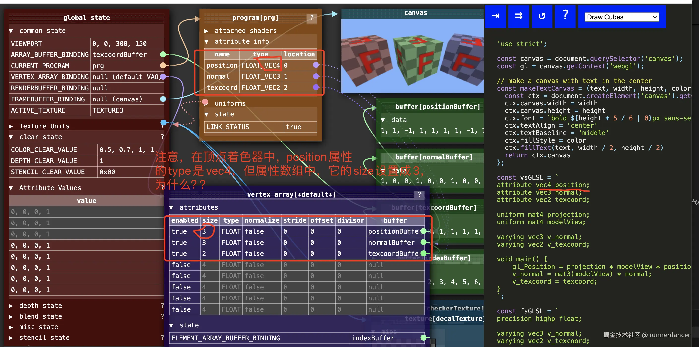
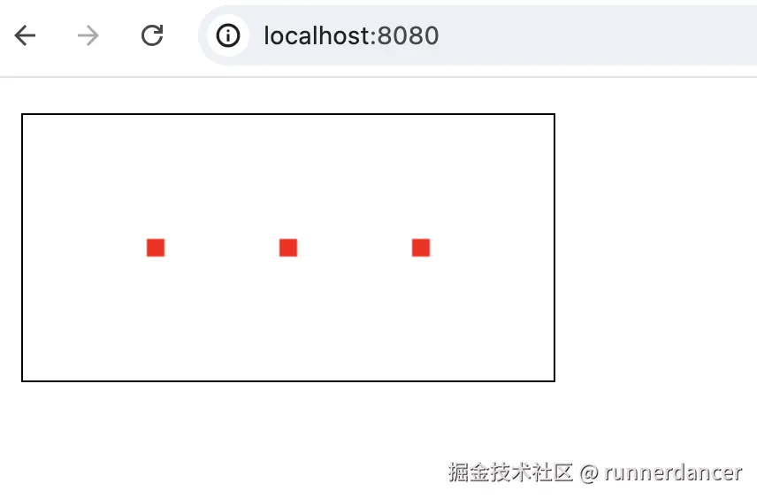
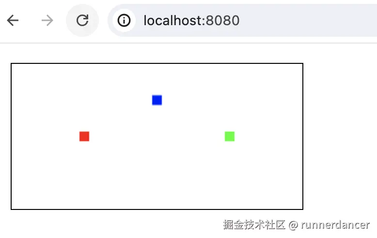
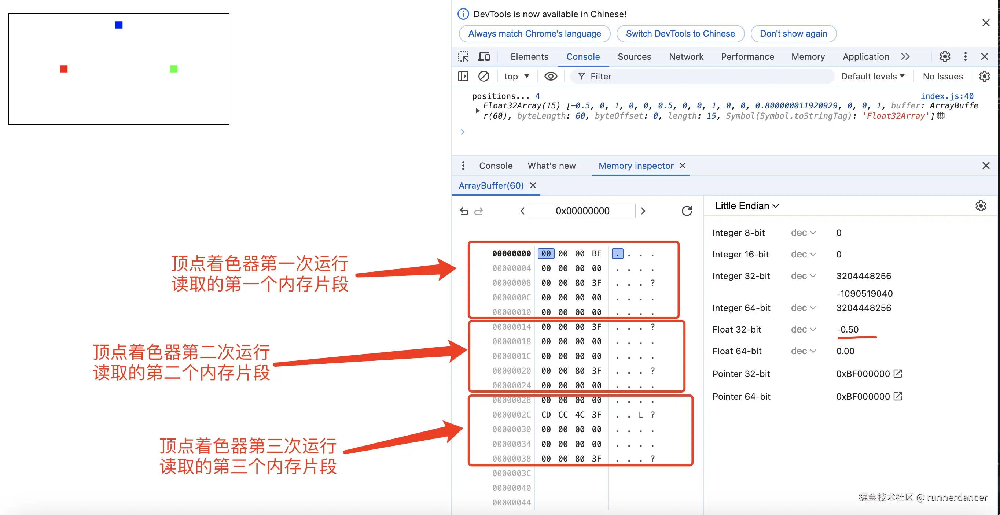
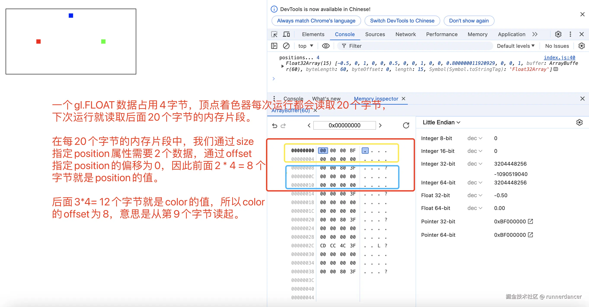
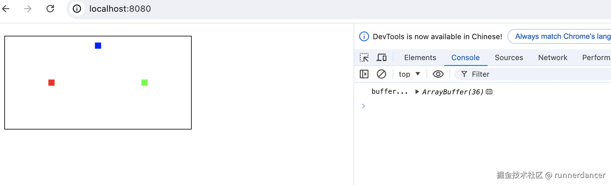
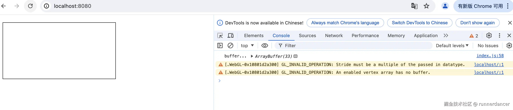

## 前言

本篇文章对应的掘金地址：[https://juejin.cn/post/7443087089444536370](https://juejin.cn/post/7443087089444536370)

在webgl中，我们调用`WebGLRenderingContext.vertexAttribPointer()`方法告诉显卡从当前绑定的缓冲区（bindBuffer() 指定的缓冲区）中读取顶点数据。本篇文章主要内容：

- 详细解析vertexAttribPointer方法及各个参数的作用，看看属性如何从缓冲中读取数据。
- 如何使用同一个缓冲同时存储顶点的坐标和颜色等信息
- 如何使用同一个缓冲同时存储不同类型的数据

语法：

```js
vertexAttribPointer(index, size, type, normalized, stride, offset)
```

可以用javascript伪代码表示如下：

```js
// 伪代码
gl.vertexAttribPointer = function(location, size, type, normalize, stride, offset) {
  const attrib = gl.vertexArray.attributes[location];
  attrib.size = size;
  attrib.type = type;
  attrib.normalize = normalize;
  attrib.stride = stride ? stride : sizeof(type) * size;
  attrib.offset = offset;
  attrib.buffer = gl.arrayBuffer;  // !!!! <-----
};
```



上图的顶点着色器中，position属性的type是vec4，但属性数组中，它的size设置成3，为什么？本节文章会解答这个问题。

本篇文章会详细解读vertexAttribPointer方法的各个参数字段的作用。

### 属性索引(Attribute index)

vertexAttribPointer方法的第一个参数就是属性的索引，即属性在顶点数组(vertex array)中的索引。顶点数组能支持多少个顶点取决于显卡。可以调用`gl.getParameter(gl.MAX_VERTEX_ATTRIBS)`获取顶点数组支持的顶点数量。每个属性都必须指定索引，有两种方法可以指定索引：

#### 1.手动绑定顶点索引。

在调用`gl.linkProgram()`前，调用`bindAttribLocation`绑定顶点索引。比如：

```js
const positionLocation = 6; // 必须小于gl.getParameter(gl.MAX_VERTEX_ATTRIBS)
gl.bindAttribLocation(program, positionLocation, 'position');
```

上面的代码将着色程序program中的position属性绑定在顶点数组中索引为6的位置上。后续可以直接将6传递给`gl.vertexAttribPointer()`。

#### 2.显卡自动分配

默认情况下，在编译顶点着色器时，显卡会自动为每个属性分配索引位置。每个属性的索引取决于显卡的分配，会有较大差异。这也就是为什么我们需要先调用`gl.getAttribLocation()`获取属性的索引，然后再赋值给`gl.vertexAttribPointer()`

### SIZE

vertexAttribPointer方法的第二个参数就是size。size用来指定每个顶点属性的组成数量，必须是 1，2，3或4。实际上这就是我们在顶点着色器中声明属性时的`vec[1234]`的大小。所以`size`最大为4。

在继续之前，我们先回顾一下上一篇文章中[【WebGL】深入理解属性和缓冲](https://juejin.cn/post/7440065311319326747#heading-3)讲的属性默认值对象。每个属性都有默认值，存在`gl.attributeValues`数组中。属性的默认值为`vec4(0.0, 0.0, 0.0, 1.0)`。我们可以通过`gl.vertexAttrib[1234]f[v]()`修改默认值。或者通过gl.enableVertexAttribArray()告诉webgl从缓冲中读取数据。

以下面的代码为例，我们在顶点着色器中使用`vec4`告诉webgl，`a_position`期望的是4个数字。

```js
const vertexShaderSource1 = `
    attribute vec4 a_position;
    void main(){
        gl_PointSize = 10.0;
        gl_Position = vec4(a_position);
    }
`
```

当我们调用gl.vertexAttribPointer并将size设为2时，**webgl会先从缓冲中读取两个数字，然后第三和第四个数字会从默认值vec4(0.0, 0.0, 0.0, 1.0)中读取**。
比如下面的代码，顶点着色器运行三次，属性a\_position最终的值为：

*   vec(-0.5, 0.0, 0.0, 1.0)
*   vec(0.5, 0.0, 0.0, 1.0)
*   vec(0.0, 0.0, 0.0, 1.0)

```js
 let positions = [
    -0.5, 0.0,
    0.5, 0.0,
    0.0, 0.0
  ]
 gl.vertexAttribPointer(
    positionLocation1,
    2, // size
    gl.FLOAT, // type, buffer的数据类型
    false,
    0, // 每个点的信息所占的bytes
    0
  )
```

需要特别注意的是，即使调用`gl.vertexAttrib3f(positionLocation1, 0.0, 0.5, 0.6);`修改了属性的默认值，webgl在读取缓冲时，默认值还是按照vec4(0.0, 0.0, 0.0, 1.0)读取。比如下面的代码：

```js
const main = () => {
  const canvas = document.getElementById('webgl')
  const gl = canvas.getContext('webgl2')
  const vertexShaderSource1 = `
    attribute vec4 a_position;
    void main(){
        gl_PointSize = 10.0;
        gl_Position = vec4(a_position);
    }
  `
  const fragmentShaderSource1 = `
    precision mediump float;
    void main(){
        gl_FragColor = vec4(1.0, 0.0, 0.0, 1.0);
    }
  `
  const program1 = initShaders(gl, vertexShaderSource1, fragmentShaderSource1)

  const positionLocation1 = gl.getAttribLocation(program1, 'a_position')
  gl.vertexAttrib3f(positionLocation1, 0.0, 0.5, 0.6);

  let positions = [
    -0.5,
    0.5,
    0.0, 
  ]
  positions = new Float32Array(positions)


  const positionBuffer = gl.createBuffer();
  gl.bindBuffer(gl.ARRAY_BUFFER, positionBuffer)
  gl.bufferData(gl.ARRAY_BUFFER, positions, gl.STATIC_DRAW)

  // 设置属性positionLocation1的一系列状态，告诉它应该怎么从缓冲中读取数据
  // 定义点的信息
  gl.vertexAttribPointer(
    positionLocation1,
    1, 
    gl.FLOAT, // type, buffer的数据类型
    false,
    0, // 每个点的信息所占的bytes
    0
  );
 

  gl.enableVertexAttribArray(positionLocation1);

  gl.clearColor(0, 0, 0, 0)
  gl.clear(gl.COLOR_BUFFER_BIT);

  gl.useProgram(program1)
  // 告诉webgl绘制3个点
  gl.drawArrays(gl.POINTS, 0, 3)

}

main();
```

上面的代码，我们先调用`gl.vertexAttrib3f(positionLocation1, 0.0, 0.5, 0.6);`修改了属性a\_position的默认值。a\_position的默认值变成vec4(0.0, 0.5, 0.6,1.0)。

然后我们通过缓冲传递了3个数字，并调用`gl.vertexAttribPointer`告诉webgl怎么从缓冲中读取数据，这里我们将size设为1，因此顶点着色器运行三次，a\_position的最终取值：

*   vec(-0.5, 0.0, 0.0, 1.0)
*   vec(0.5, 0.0, 0.0, 1.0)
*   vec(0.0, 0.0, 0.0, 1.0)

而不是

*   vec(-0.5, 0.5, 0.6, 1.0)
*   vec(0.5, 0.5, 0.6, 1.0)
*   vec(0.0, 0.5, 0.6, 1.0)

效果如下，从图中可以看出三个点的y轴方向均为0.0，而不是0.5



> MDN关于size从[缓冲和默认值取值](https://developer.mozilla.org/zh-CN/docs/Web/API/WebGLRenderingContext/vertexAttribPointer#default_attribute_values)的描述应该是个陷阱，上面的实践结果表明即使改变了默认值，webgl读取默认值时还是会按照vec4(0.0, 0.0, 0.0, 1.0)读取

### TYPE

vertexAttribPointer方法的第三个参数就是type。type用来指定数组中每个元素的数据类型，可以是下面的类型：

*   gl.BYTE：有符号的8位整数，范围\[-128, 127]。一个数字占1个字节。可以使用new Int8Array创建
*   gl.SHORT：有符号的16位整数，范围\[-32768, 32767]。一个数字占2个字节。可以使用new Int16Array创建
*   gl.UNSIGNED\_BYTE：无符号的8位整数，范围 \[0, 255]。一个数字占1个字节。可以使用new Uint8Array创建
*   gl.UNSIGNED\_SHORT：无符号的16位整数，范围\[0, 65535]。一个数字占2个字节。可以使用new Uint16Array创建
*   gl.FLOAT：32位IEEE标准的浮点。一个数字占4个字节。可以使用new Float32Array创建
*   使用 WebGL2 版本的还可以使用以下值：gl.HALF\_FLOAT

### NORMALIZED(归一化)

vertexAttribPointer方法的第四个参数就是normalized。在WebGL中，归一化是指将数据按比例缩放到一个特定范围的过程，通常是 \[0, 1] 或 \[-1, 1]。这个过程在图形编程中非常重要，因为它可以帮助我们更好地控制颜色、纹理坐标和法向量等数据，从而实现更加精确和高效的渲染。`归一化`适用于所有非浮点型数据。

如果传递`false`就**解读原数据类型**。 BYTE类型的范围是从-128到127，UNSIGNED\_BYTE类型的范围是从0到255，SHORT类型的范围是从-32768到32767，等等...

如果设为`true`，BYTE数据的值(-128 to 127)将会转换到-1.0到+1.0之间，UNSIGNED\_BYTE (0 to 255) 变为 0.0 到 +1.0 之间，SHORT 也是转换到 -1.0 到 +1.0 之间，但比BYTE精确度高。

*   对于类型gl.BYTE和gl.SHORT，如果是 true 则将值归一化为 \[-1, 1]
*   对于类型gl.UNSIGNED\_BYTE和gl.UNSIGNED\_SHORT，如果是 true 则将值归一化为 \[0, 1]
*   对于类型gl.FLOAT和gl.HALF\_FLOAT，此参数无效

最常用的是标准化颜色数据，将颜色值从\[0, 255]范围缩放到\[0, 1]范围，这样可以简化计算并提高渲染性能。用javascript实现就是：

```js
function normalizeColor(color) {
  return color.map(c => c / 255);
}
```

在webgl中，颜色值范围为0.0到+1.0。使用4个浮点型数据存储红，绿，蓝和阿尔法通道数据时，每个顶点的颜色将会占用16字节空间（一个gl.FLOAT类型数据占用4个字节），如果你有复杂的几何体将会占用很多内存。代替的做法是将颜色数据转换为四个UNSIGNED\_BYTE，其中0表示0.0，255表示 1.0。现在每个顶点只需要四个字节存储颜色值，省了75% 空间。

比如下面使用UNSIGNED\_BYTE传送颜色数据：

```js
import initShaders from "./initShaders.js";


const main = () => {
  const canvas = document.getElementById('webgl')
  const gl = canvas.getContext('webgl')
  const vertexShaderSource1 = `
    attribute vec3 a_position;
    attribute vec3 a_color;
    varying vec3 v_color;
    void main(){
        v_color = a_color;
        gl_PointSize = 10.0;
        gl_Position = vec4(a_position, 1.0);
    }
  `
  const fragmentShaderSource1 = `
    precision mediump float;
    varying vec3 v_color;
    void main(){
        gl_FragColor = vec4(v_color, 1.0);
    }
  `
  const program1 = initShaders(gl, vertexShaderSource1, fragmentShaderSource1)

  const positionLocation1 = gl.getAttribLocation(program1, 'a_position')
  const colorPosition = gl.getAttribLocation(program1, 'a_color')

  let positions = [
    -0.5, 0.0,
    0.5, 0.0, 
    0.0, 0.5,
  ]
  let colors = [ // 这些数据在存入缓冲时将被截取成Uint8Array类型
    255, 0.1, 0.1111,// 会被截取成255,0,0
    0.222, 255, 0,// 会被截取成0,255,0
    0, 0, 255.888, // 会被截取成0, 0, 255
  ]
  colors = new Uint8Array(colors)
  positions = new Float32Array(positions)


  const FSIZE = positions.BYTES_PER_ELEMENT // 4
  const ISIZE = colors.BYTES_PER_ELEMENT // 1

  console.log('positions...',FSIZE, positions)

  const positionBuffer = gl.createBuffer();
  gl.bindBuffer(gl.ARRAY_BUFFER, positionBuffer)
  gl.bufferData(gl.ARRAY_BUFFER, positions, gl.STATIC_DRAW)

  const colorBuffer = gl.createBuffer();
  gl.bindBuffer(gl.ARRAY_BUFFER, colorBuffer)
  gl.bufferData(gl.ARRAY_BUFFER, colors, gl.STATIC_DRAW)

  gl.bindBuffer(gl.ARRAY_BUFFER, positionBuffer)
  gl.vertexAttribPointer(
    positionLocation1,
    2, // size，
    gl.FLOAT, // type, buffer的数据类型
    false,
    2 * FSIZE, // 每个点的信息所占的bytes
    0
  );

  gl.bindBuffer(gl.ARRAY_BUFFER, colorBuffer)
  gl.vertexAttribPointer(
    colorPosition,
    3, // size，
    gl.UNSIGNED_BYTE,
    true,// 需要归一化
    3 * ISIZE,
    0
  );

  // 告诉webgl，属性positionLocation1应该从缓冲中读取数据，而不是从attributeValues中读取数据
  gl.enableVertexAttribArray(positionLocation1);
  gl.enableVertexAttribArray(colorPosition);

  gl.clearColor(0, 0, 0, 0)
  gl.clear(gl.COLOR_BUFFER_BIT);

  gl.useProgram(program1)
  // 告诉webgl绘制3个点
  gl.drawArrays(gl.POINTS, 0, 3)

}

main();

```

效果如下：



### STRIDE 和 OFFSET

`stride`：以字节为单位指定连续顶点属性开始之间的偏移(即数组中一行长度)。不能大于255。如果 stride为0，则假定该属性是紧密打包的，即不`交错属性`，每个属性在一个单独的块中，下一个顶点的属性紧跟当前顶点之后。具体可看[这里](https://developer.mozilla.org/zh-CN/docs/Web/API/WebGLRenderingContext/vertexAttribPointer#stride)

`offset`：指定顶点属性数组中第一部分的字节偏移量。必须是类型的字节长度的倍数。

在[webglfundamentals](https://webglfundamentals.org/webgl/lessons/zh_cn/webgl-how-it-works.html)中提到，如果stride和offset使用 0 以外的值时会复杂得多，虽然这样会取得一些性能能上的优势， 但是一般情况下并不值得，除非你想充分压榨WebGL的性能。

具体点，stride表示顶点着色器每执行一次，从缓冲中读取的一个片段，或者说顶点着色器每次执行，都需要前进的字节数。

> 交错属性：即使用同一个缓冲存储两个或多个属性需要的数据

假设我们有下面的顶点着色器：

```js
const vertexShaderSource1 = `
    attribute vec3 a_position;
    attribute vec3 a_color;
    varying vec3 v_color;
    void main(){
        v_color = a_color;
        gl_PointSize = 10.0;
        gl_Position = vec4(a_position, 1.0);
    }
`
```

我们使用同一个`positions`缓冲存储每个顶点的坐标和颜色数据，下面数组中，每一行前两个表示顶点的坐标，后面三个表示顶点的颜色值。

```js
  let positions = [
    // x y  r g b 前面两个代表坐标，后面三个代表颜色rgb的值
    -0.5, 0.0, 1.0, 0.0, 0.0,
    0.5, 0.0, 0.0, 1.0, 0.0,
    0.0, 0.8, 0.0, 0.0, 1.0
  ]
  positions = new Float32Array(positions)
```

然后调用gl.vertexAttribPointer告诉webgl怎么从缓冲中读取数据：

```js
  gl.vertexAttribPointer(
    positionLocation1,
    2, // size，
    gl.FLOAT, // type, buffer的数据类型
    false,
    5 * FSIZE, // 每个点的信息所占的bytes
    0
  );
  gl.vertexAttribPointer(
    colorPosition,
    3, // size，attribute变量的长度(vec3)
    gl.FLOAT,
    false,
    5 * FSIZE,
    2 * FSIZE
  );
```

`positions`缓冲中，每个数字占用4个字节，我们用每5个数字存储一个顶点的坐标和颜色数据，因此一个顶点需要的坐标和颜色数据占用5 \* 4 = 20个字节。比如下图所示，每一行(4个字节)表示一个数字，比如`00 00 00 BF`表示0.5。`00 00 00 00`表示0.0。

顶点着色器每次运行读取`stride`（即传给gl.vertexAttribPointer方法的stride参数的值）个字节。然后这stride个字节中，又有坐标数据，又有颜色数据，那怎么读取每个属性的数据？这就是offet的作用






### 不同数据类型的交错属性

到目前为止，我们基本都是用buffer传递类型固定的数据给GPU，那能不能用同一个buffer传递包含不同数据类型的数据到GPU？本节我们就来实践一下。

我们使用下面的数据结构表示一个顶点的数据，数组中每一项代表一个顶点，每个顶点包含坐标(position)和颜色(color)数据。坐标使用gl.FLOAT存储，需要8个字节。颜色使用gl.UNSIGNED\_BYTE存储，需要4个字节，所以一个顶点需要12个字节

```js
  // position需要8个字节，color需要4个字节，所以一个顶点需要12个字节
  const verticesInfo = [
    {
      position: [-0.5, 0.0], // 需要8个字节
      color: [255, 0, 0, 255], // 需要4个字节
    },
    {
      position: [0.5, 0.0],
      color: [0, 255, 0, 255],
    },
    {
      position: [0.0, 0.8],
      color: [0, 0, 255, 255]
    }
  ]
```

根据以上数据创建缓冲：

```js

  // position需要8个字节，color需要4个字节，所以一个顶点需要12个字节
  const totalSizePerVertex = 12;
  const buffer = new ArrayBuffer(totalSizePerVertex * verticesInfo.length)
  const dv = new DataView(buffer);
  for (let i = 0; i < verticesInfo.length; i++) {
    const vertex = verticesInfo[i]
    dv.setFloat32(totalSizePerVertex * i, vertex.position[0], true)
    dv.setFloat32(totalSizePerVertex * i + 4, vertex.position[1], true)
    dv.setUint8(totalSizePerVertex * i + 8, vertex.color[0], true)
    dv.setUint8(totalSizePerVertex * i + 9, vertex.color[1], true)
    dv.setUint8(totalSizePerVertex * i + 10, vertex.color[2], true)
    dv.setUint8(totalSizePerVertex * i + 11, vertex.color[3], true)

  }
  console.log('buffer...', buffer)
```

然后告诉WebGL怎么读取缓冲：

```js
  const vertexBuffer = gl.createBuffer();
  gl.bindBuffer(gl.ARRAY_BUFFER, vertexBuffer)
  gl.bufferData(gl.ARRAY_BUFFER, buffer, gl.STATIC_DRAW)

  // 设置属性positionLocation1的一系列状态，告诉它应该怎么从缓冲中读取数据
  // 定义点的信息
  gl.vertexAttribPointer(
    positionLocation1,
    2, 
    gl.FLOAT, 
    false,
    totalSizePerVertex, 
    0
  );
  gl.vertexAttribPointer(
    colorPosition,
    4, 
    gl.UNSIGNED_BYTE,
    true,
    totalSizePerVertex,
    2 * Float32Array.BYTES_PER_ELEMENT
  );
```

绘制结果如下：



完整代码如下：

```js
import initShaders from "./initShaders.js";


const main = () => {
  const canvas = document.getElementById('webgl')
  const gl = canvas.getContext('webgl')
  const vertexShaderSource1 = `
    attribute vec3 a_position;
    attribute vec4 a_color;
    varying vec4 v_color;
    void main(){
        v_color = a_color;
        gl_PointSize = 10.0;
        gl_Position = vec4(a_position, 1.0);
    }
  `
  const fragmentShaderSource1 = `
    precision mediump float;
    varying vec4 v_color;
    void main(){
        gl_FragColor = vec4(v_color);
    }
  `
  const program1 = initShaders(gl, vertexShaderSource1, fragmentShaderSource1)

  const positionLocation1 = gl.getAttribLocation(program1, 'a_position')
  const colorPosition = gl.getAttribLocation(program1, 'a_color')

  // position需要8个字节，color需要4个字节，所以一个顶点需要12个字节
  const verticesInfo = [
    {
      position: [-0.5, 0.0], // 需要8个字节
      color: [255, 0, 0, 255], // 需要4个字节
    },
    {
      position: [0.5, 0.0],
      color: [0, 255, 0, 255],
    },
    {
      position: [0.0, 0.8],
      color: [0, 0, 255, 255]
    }
  ]

  // position需要8个字节，color需要4个字节，所以一个顶点需要12个字节
  const totalSizePerVertex = 12;
  const buffer = new ArrayBuffer(totalSizePerVertex * verticesInfo.length)
  const dv = new DataView(buffer);
  for (let i = 0; i < verticesInfo.length; i++) {
    const vertex = verticesInfo[i]
    dv.setFloat32(totalSizePerVertex * i, vertex.position[0], true)
    dv.setFloat32(totalSizePerVertex * i + 4, vertex.position[1], true)
    dv.setUint8(totalSizePerVertex * i + 8, vertex.color[0], true)
    dv.setUint8(totalSizePerVertex * i + 9, vertex.color[1], true)
    dv.setUint8(totalSizePerVertex * i + 10, vertex.color[2], true)
    dv.setUint8(totalSizePerVertex * i + 11, vertex.color[3], true)

  }
  console.log('buffer...', buffer)
  const vertexBuffer = gl.createBuffer();
  gl.bindBuffer(gl.ARRAY_BUFFER, vertexBuffer)
  gl.bufferData(gl.ARRAY_BUFFER, buffer, gl.STATIC_DRAW)

  // 设置属性positionLocation1的一系列状态，告诉它应该怎么从缓冲中读取数据
  // 定义点的信息
  gl.vertexAttribPointer(
    positionLocation1,
    2, 
    gl.FLOAT, 
    false,
    totalSizePerVertex, 
    0
  );
  gl.vertexAttribPointer(
    colorPosition,
    4, 
    gl.UNSIGNED_BYTE,
    true,
    totalSizePerVertex,
    2 * Float32Array.BYTES_PER_ELEMENT
  );


  gl.enableVertexAttribArray(positionLocation1);
  gl.enableVertexAttribArray(colorPosition);

  gl.clearColor(0, 0, 0, 0)
  gl.clear(gl.COLOR_BUFFER_BIT);

  gl.useProgram(program1)
  // 告诉webgl绘制3个点
  gl.drawArrays(gl.POINTS, 0, 3)

}

main();
```

#### 交错属性需要特别注意的点

回顾一下，传递给vertexAttribPointer的stride参数的值必须是传递的数据类型的大小的整数倍。
比如传递给vertexAttribPointer的type是gl.FLOAT，那么stride必须是4的整数倍

```js
vertexAttribPointer(index, size, type, normalized, stride, offset)
```

这在使用缓冲存储不同数据类型的交错属性时尤其需要注意，比如下面的数据：

```js
  // position需要8个字节，color需要3个字节，所以一个顶点需要11个字节
  const verticesInfo = [
    {
      position: [-0.5, 0.0], // 需要8个字节
      color: [255, 0, 0], // 需要3个字节
    },
    {
      position: [0.5, 0.0],
      color: [0, 255, 0],
    },
    {
      position: [0.0, 0.8],
      color: [0, 0, 255]
    }
  ]
```

这里一个顶点需要11个字节，当我们调用vertexAttribPointer给position属性指定如何读取缓冲时：

```js
  gl.vertexAttribPointer(
    positionLocation1,
    2, 
    gl.FLOAT, 
    false,
    totalSizePerVertex, 
    0
  );
```

由于type是gl.FLOAT，即4个字节，但是stride并不是4的倍数，此时是会报错的，如下面所示：



可以通过下面的代码验证：

```js
import initShaders from "./initShaders.js";


const main = () => {
  const canvas = document.getElementById('webgl')
  const gl = canvas.getContext('webgl')
  const vertexShaderSource1 = `
    attribute vec3 a_position;
    attribute vec3 a_color;
    varying vec3 v_color;
    void main(){
        v_color = a_color;
        gl_PointSize = 10.0;
        gl_Position = vec4(a_position, 1.0);
    }
  `
  const fragmentShaderSource1 = `
    precision mediump float;
    varying vec3 v_color;
    void main(){
        gl_FragColor = vec4(v_color, 1.0);
    }
  `
  const program1 = initShaders(gl, vertexShaderSource1, fragmentShaderSource1)

  const positionLocation1 = gl.getAttribLocation(program1, 'a_position')
  const colorPosition = gl.getAttribLocation(program1, 'a_color')

  // position需要8个字节，color需要3个字节，所以一个顶点需要11个字节
  const verticesInfo = [
    {
      position: [-0.5, 0.0], // 需要8个字节
      color: [255, 0, 0], // 需要3个字节
    },
    {
      position: [0.5, 0.0],
      color: [0, 255, 0],
    },
    {
      position: [0.0, 0.8],
      color: [0, 0, 255]
    }
  ]

  // position需要8个字节，color需要3个字节，所以一个顶点需要11个字节
  const totalSizePerVertex = 11;
  const buffer = new ArrayBuffer(totalSizePerVertex * verticesInfo.length)
  const dv = new DataView(buffer);
  for (let i = 0; i < verticesInfo.length; i++) {
    const vertex = verticesInfo[i]
    dv.setFloat32(totalSizePerVertex * i, vertex.position[0], true)
    dv.setFloat32(totalSizePerVertex * i + 4, vertex.position[1], true)
    dv.setUint8(totalSizePerVertex * i + 8, vertex.color[0], true)
    dv.setUint8(totalSizePerVertex * i + 9, vertex.color[1], true)
    dv.setUint8(totalSizePerVertex * i + 10, vertex.color[2], true)

  }
  console.log('buffer...', buffer)
  const vertexBuffer = gl.createBuffer();
  gl.bindBuffer(gl.ARRAY_BUFFER, vertexBuffer)
  gl.bufferData(gl.ARRAY_BUFFER, buffer, gl.STATIC_DRAW)


  gl.vertexAttribPointer(
    positionLocation1,
    2, 
    gl.FLOAT, 
    false,
    totalSizePerVertex, 
    0
  );
  gl.vertexAttribPointer(
    colorPosition,
    3, 
    gl.UNSIGNED_BYTE,
    true,
    totalSizePerVertex,
    2 * Float32Array.BYTES_PER_ELEMENT
  );


  gl.enableVertexAttribArray(positionLocation1);
  gl.enableVertexAttribArray(colorPosition);

  gl.clearColor(0, 0, 0, 0)
  gl.clear(gl.COLOR_BUFFER_BIT);

  gl.useProgram(program1)
  // 告诉webgl绘制3个点
  gl.drawArrays(gl.POINTS, 0, 3)

}

main();
```

## 参考

*   [MDN](https://developer.mozilla.org/zh-CN/docs/Web/API/WebGLRenderingContext/vertexAttribPointer#stride)
*   [webglfundamentals](https://webglfundamentals.org/webgl/lessons/zh_cn/webgl-how-it-works.html)
