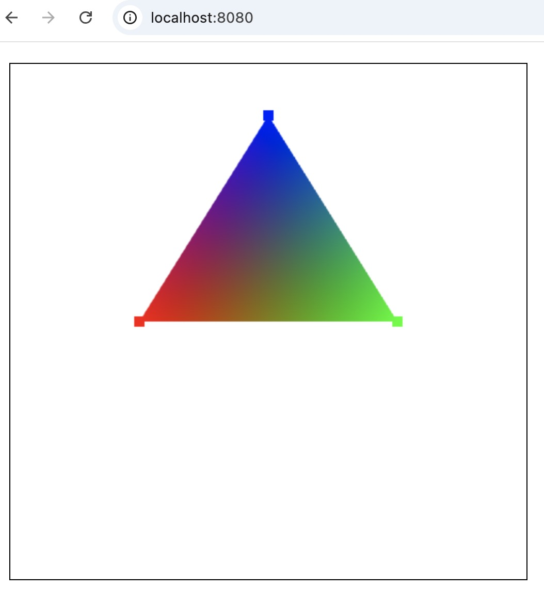

## 使用同一个缓冲传递坐标和颜色值

缓冲中不仅可以存储坐标数据，还可以存储颜色，法向量坐标等数据。我们通过一个demo实践一下，如何利用缓冲同时存储一个点的坐标和颜色值。

下面的代码中，positions每5个数字存储一个点的坐标和颜色数据，其中前两个数字表示坐标，后面三个数字表示这个点的颜色值。


```js
const canvas = document.getElementById('webgl')
const gl = canvas.getContext('webgl')
const vertexShaderSource1 = `
  attribute vec2 a_position;
  attribute vec3 a_color;
  varying vec3 v_color;
  void main(){
      v_color = a_color;
      gl_PointSize = 10.0;
      gl_Position = vec4(a_position, 0.0, 1.0);
  }
`
const fragmentShaderSource1 = `
  precision mediump float;
  varying vec3 v_color;
  void main(){
      gl_FragColor = vec4(v_color, 1.0);
  }
`
const program1 = initShaders(gl, vertexShaderSource1, fragmentShaderSource1)

const positionLocation1 = gl.getAttribLocation(program1, 'a_position')
const colorPosition = gl.getAttribLocation(program1, 'a_color')

let positions = [
  // x y  r g b 前面两个代表坐标，后面三个代表颜色rgb的值
  -0.5, 0.0, 1.0, 0.0, 0.0,
  0.5, 0.0, 0.0, 1.0, 0.0,
  0.0, 0.8, 0.0, 0.0, 1.0
]
positions = new Float32Array(positions)
const FSIZE = positions.BYTES_PER_ELEMENT // 4

const positionBuffer = gl.createBuffer();
gl.bindBuffer(gl.ARRAY_BUFFER, positionBuffer)
gl.bufferData(gl.ARRAY_BUFFER, positions, gl.STATIC_DRAW)

// 设置属性positionLocation1的一系列状态，告诉它应该怎么从缓冲中读取数据
// 定义点的信息
gl.vertexAttribPointer(
  positionLocation1,
  2, // size，attribute变量的长度(vec2)
  gl.FLOAT, // type, buffer的数据类型
  false,
  5 * FSIZE, // 每个点的信息所占的bytes
  0
);
gl.vertexAttribPointer(
  colorPosition,
  3, // size，attribute变量的长度(vec3)
  gl.FLOAT,
  false,
  5 * FSIZE,
  2 * FSIZE
);

// 告诉webgl，属性positionLocation1应该从缓冲中读取数据，而不是从attributeValues中读取数据
gl.enableVertexAttribArray(positionLocation1);
gl.enableVertexAttribArray(colorPosition);

gl.clearColor(0, 0, 0, 0)
gl.clear(gl.COLOR_BUFFER_BIT);

gl.useProgram(program1)
// 告诉webgl绘制3个点
gl.drawArrays(gl.POINTS, 0, 3)
gl.drawArrays(gl.TRIANGLES, 0, 3);
```

positions存储了三个顶点的数据。每一行表示一个顶点。其中前面两个数据代表顶点的坐标，后面三个代表顶点颜色的rgb值。


结果如下：




