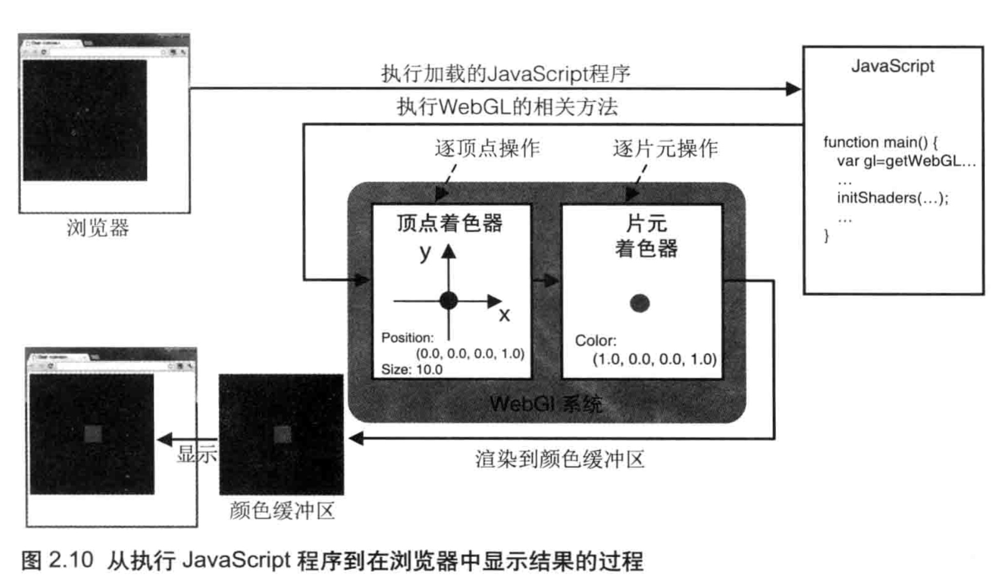
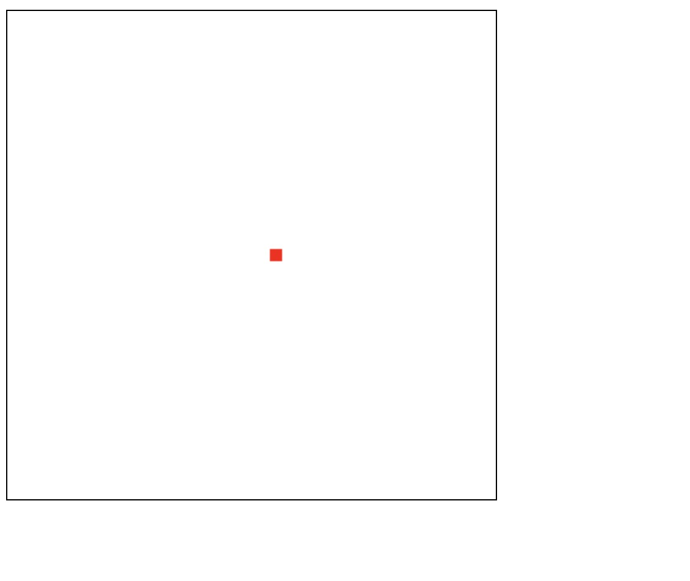
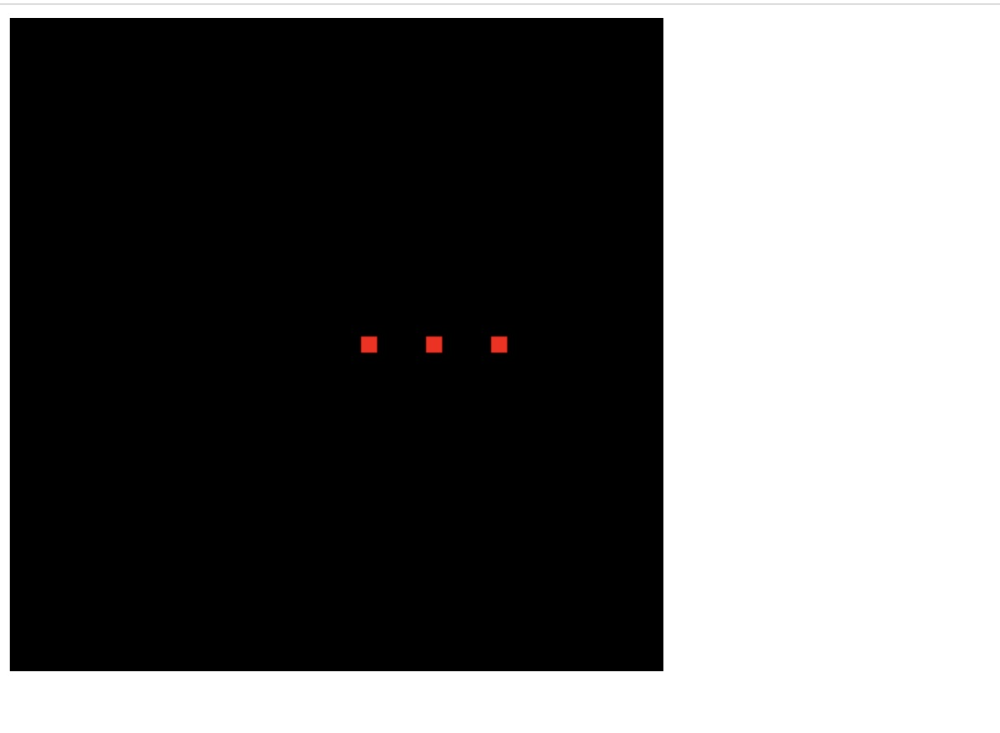

## gl.clearColor

用于指定背景色。一旦指定了背景色之后，背景色就会驻存在 WebGL 系统中，在下一次调用 gl.clearColor()方法前不会改变。换句话说，如果将来什么时候你还想用同一个颜色再清空一次绘图区，没必要再指定一次背景色

## gl.clear

gl.clear 函数可以用于清空颜色缓冲区、深度缓冲区、模版缓冲区。

清空绘图区域，实际上就是在清空颜色缓冲区

gl.clear 的伪代码如下：

```js
clear(type){
    if(type === gl.COLOR_BUFFER_BIT){
        //清空颜色缓冲区
    }
    if(type === gl.DEPTH_BUFFER_BIT){
        // 清空深度缓冲区
    }
    if(type === gl.STENCIL_BUFFER_BIT){
        // 清空模版缓冲区
    }
}
```

## 着色器

顶点着色器先执行，它对`gl_Position`变量和`gl_PointSize`变量进行赋值，并将他们传入片元着色器，然后片元着色器再执行。实际上，片元着色器接收到的是经过光栅化处理后的片元值。目前，我们可以简单地认为这两个变量从顶点着色器中被传入了片元着色器。

- 顶点着色器控制点的位置和大小
- 片元着色器控制点的颜色
- 片元就是显示在屏幕上的一个像素。严格意义上来说，片元包括这个像素的位置、颜色和其他信息

- webgl 不需要交换颜色缓冲区

## gl.drawArrays

当调用 `gl.drawArrays(mode, first, count)`时，顶点着色器将被执行 count 次，每次处理一个顶点。在着色器执行的时候，将调用并逐行执行内部的 main 函数

## 从 JavaScript 程序中传递数据给顶点着色器

- attribute 变量。传输的是那些与顶点相关的数据
- uniform 变量。传输的是那些对于所有顶点都相同(或与顶点无关)的数据

## getAttribLocation

```js
const VSHADER_SOURCE = `
    attribute vec4 a_Position;
    attribute float a_Size;
    void main() {
        gl_Position = a_Position;
        gl_PointSize = a_Size;
    }
`;
const a_Position = gl.getAttribLocation(gl.program, "a_Position");
const a_Size = gl.getAttribLocation(gl.program, "a_Size");
console.log("===", a_Position, a_Size);
```

实际上，getAttribLocation 获取的是变量在顶点着色器中的索引。比如上面的代码输出的是 0 和 1

## 颜色缓冲区

在第一章的示例中，为什么要把鼠标每次点击的位置都记录下来，而不是仅仅记录最近一次鼠标点击的位置？这是因为 webGL 使用的是颜色缓冲区。



如上图，webgl 系统中的绘制操作实际上是在颜色缓冲区中进行绘制的，绘制结束后系统将缓冲区中的内容显示在屏幕上，然后颜色缓冲区就会被重置，其中的内容会丢失。

用代码举例

```js
gl.clearColor(0, 0, 0, 1);
gl.clear(gl.COLOR_BUFFER_BIT);

gl.vertexAttrib3f(a_Position, 0.5, 0.0, 0.0);
gl.drawArrays(gl.POINTS, 0, 1);

gl.vertexAttrib3f(a_Position, 0.3, 0.0, 0.0);
gl.drawArrays(gl.POINTS, 0, 1);
```

在上面的代码中，我们同步调用 `drawArrays`，此时页面显示如下：


如果改成下面的代码：

```js
gl.clearColor(0, 0, 0, 1);
gl.clear(gl.COLOR_BUFFER_BIT);

gl.vertexAttrib3f(a_Position, 0.5, 0.0, 0.0);
gl.drawArrays(gl.POINTS, 0, 1);

gl.vertexAttrib3f(a_Position, 0.3, 0.0, 0.0);
gl.drawArrays(gl.POINTS, 0, 1);

setTimeout(() => {
  gl.vertexAttrib3f(a_Position, 0.1, 0.0, 0.0);
  gl.drawArrays(gl.POINTS, 0, 1);
}, 0);
```

刷新页面，可以看到显示绘制黑色的背景，黑色背景有两个红色的点。最后才是绘制白色背景，上面只有一个点：


如果换成在微任务中

```js
gl.clearColor(0, 0, 0, 1);
gl.clear(gl.COLOR_BUFFER_BIT);

gl.vertexAttrib3f(a_Position, 0.5, 0.0, 0.0);
gl.drawArrays(gl.POINTS, 0, 1);

gl.vertexAttrib3f(a_Position, 0.3, 0.0, 0.0);
gl.drawArrays(gl.POINTS, 0, 1);

// setTimeout(() => {
//     gl.vertexAttrib3f(a_Position, 0.1, 0.0, 0.0)
//     gl.drawArrays(gl.POINTS, 0, 1);
// }, 0);
Promise.resolve().then((res) => {
  gl.vertexAttrib3f(a_Position, 0.1, 0.0, 0.0);
  gl.drawArrays(gl.POINTS, 0, 1);
});
```

刷新页面，效果如下：



> 从上面的示例中，我们可以得出结论，颜色缓冲区大概是在微任务之后，宏任务之前被清空的

## 总结

顶点着色器进行的是逐顶点的操作，片元着色器进行的是逐片元的操作

## 本章示例代码

```js
const canvas = document.getElementById("webgl");

const gl = canvas.getContext("webgl");

const VSHADER_SOURCE = `
    attribute vec4 a_Position;
    attribute float a_Size;
    void main() {
        gl_Position = a_Position;
        gl_PointSize = a_Size;
    }
`;

const FSHADER_SOURCE = `
    precision mediump float;
    uniform vec4 u_FragColor;
    void main(){
        gl_FragColor = u_FragColor;
    }
`;

const initShaders = (gl, vsource, fsource) => {
  const vertexShader = gl.createShader(gl.VERTEX_SHADER);
  gl.shaderSource(vertexShader, vsource);
  gl.compileShader(vertexShader);

  const fragmentShader = gl.createShader(gl.FRAGMENT_SHADER);
  gl.shaderSource(fragmentShader, fsource);
  gl.compileShader(fragmentShader);

  const program = gl.createProgram();
  gl.attachShader(program, vertexShader);
  gl.attachShader(program, fragmentShader);

  gl.linkProgram(program);
  gl.useProgram(program);
  gl.program = program;
};

initShaders(gl, VSHADER_SOURCE, FSHADER_SOURCE);
const a_Position = gl.getAttribLocation(gl.program, "a_Position");
const a_Size = gl.getAttribLocation(gl.program, "a_Size");
const u_FragColor = gl.getUniformLocation(gl.program, "u_FragColor");

console.log("u_FragColor===", u_FragColor);

const g_points = [];
const g_colors = [];
canvas.onclick = (ev) => {
  let x = ev.clientX;
  let y = ev.clientY;
  const rect = ev.target.getBoundingClientRect();
  x = (x - rect.left - canvas.height / 2) / (canvas.height / 2);
  y = (canvas.width / 2 - (y - rect.top)) / (canvas.width / 2);
  g_points.push([x, y]);

  if (x >= 0.0 && y >= 0.0) {
    g_colors.push([1.0, 0.0, 0.0, 1.0]);
  } else if (x < 0.0 && y < 0.0) {
    g_colors.push([0.0, 1.0, 0.0, 1.0]);
  } else {
    g_colors.push([1.0, 1.0, 1.0, 1.0]);
  }

  gl.clear(gl.COLOR_BUFFER_BIT);

  for (let i = 0; i < g_points.length; i++) {
    const xy = g_points[i];
    const rgba = g_colors[i];
    gl.uniform4f(u_FragColor, rgba[0], rgba[1], rgba[2], rgba[3]);
    gl.vertexAttrib3f(a_Position, xy[0], xy[1], 0.0);
    gl.drawArrays(gl.POINTS, 0, 1);
  }
};

gl.vertexAttrib1f(a_Size, 10.0);

gl.clearColor(0, 0, 0, 1);
gl.clear(gl.COLOR_BUFFER_BIT);
```
