## 为什么WebGL纹理是上下颠倒的

## 前言
在WebGL中绘制图片需要使用`纹理数据`。和WebGL渲染时需要裁剪空间坐标相似，渲染纹理时需要纹理坐标，而不是像素坐标。`纹理数据`的类型非常丰富，比如图像数据，JS生成的数据纹理等。本节所说的纹理上下颠倒，实际上说的是WebGL在将图像纹理数据绘制到WebGL画布时，画布的图片是上下颠倒的。本节我们就深入剖析这个问题。

在此之前，我们先简单了解一下纹理的工作原理和纹理数据类型。


### 纹理数据类型
WebGL纹理数据的类型非常丰富，涵盖图像、程序生成的数据、特殊效果映射等。**WebGL纹理数据的底层通常是数组形式的**。以下是常见的纹理数据分类及其特点：
- **1.基础图像数据：**通过图像文件(如PNG、JPEG等)加载的2D纹理，是最常见的类型。图像纹理的使用可以看这篇文章[WebGL图像处理](https://webglfundamentals.org/webgl/lessons/zh_cn/webgl-image-processing.html)。图像类纹理加载后，会解码为像素值的数组，每个元素表示一个像素的颜色或透明度，再通过gl.texImage2D上传到GPU。WebGL会将数组转换为纹理的内部格式（如gl.RGBA8、gl.RGBA32F）。
- **2.程序生成的数据纹理：**无需外部图像，直接通过JS生成的数据纹理。数据纹理直接使用数值数组（如Float32Array、Uint8Array）生成纹理并上传到GPU。数据纹理的使用可以看这篇文章[WebGL数据纹理](https://webglfundamentals.org/webgl/lessons/zh_cn/webgl-data-textures.html)


### 纹理的工作原理
- **1.加载与创建：**使用gl.texImage2D将`纹理数据`上传到GPU
- **2.纹理坐标映射：**模型顶点通过(u,v)纹理坐标(范围[0,1]或[1,0])绑定到纹理
- **3.着色器采样：**在片段着色器中，通过texture2D函数获取像素值，并计算最终颜色。


gl.texImage2D是OpenGL/WebGL中用于将2D纹理数据上传到GPU的核心函数。它的底层操作会根据传入数据的类型（图像纹理或数据纹理）有不同的处理逻辑。无论数据类型如何，gl.texImage2D的最终目标是将数据存储到GPU的纹理内存中，供着色器采样。其核心步骤包括：

- 数据格式转换：将CPU侧的数组或图像数据转换为GPU可识别的内部格式（如 GL_RGBA8、GL_RGBA32F）。
- 内存分配：在GPU上为纹理分配存储空间。
- 数据拷贝：将CPU数据复制到GPU内存。
- MIPMAP生成（可选）：根据参数自动生成多级渐远纹理（MIPMAP）。

> 因此，不管是图像纹理数据还是数据纹理，最终在GPU纹理内存中都是类数组的形式存储


### 纹理坐标
纹理是通过“纹理坐标”来引用的，纹理坐标0.0到1.0对应纹理从左到右，0.0到1.0对应第一个像素所在行到最后一行。上下在纹理坐标空间中是没有意义的，主要是依据传递给WebGL的纹理数据，纹理数据的开头对应纹理坐标(0,0)，结尾对应纹理坐标(1,1)

​纹理坐标是将纹理映射到三维物体表面的关键机制。纹理坐标定义了每个三维顶点在纹理图像中的对应位置，告诉 WebGL：“这个顶点应该显示纹理图像的哪个部分”

下面通过例子来演示不同类型纹理数据，如何通过纹理坐标引用。我们将在画布(0, 0)到(0.5, 0.5)处使用纹理绘制矩形。

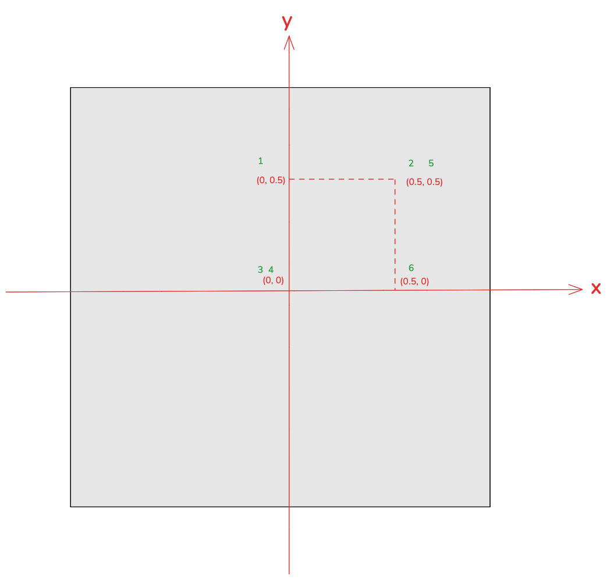

对应的矩形的顶点坐标为：
```js
const rectX = 0.0, rectY = 0.5, rectWidth = 0.5, rectHeight = 0.5
let verticesInfo = [
    rectX, rectY,
    rectX + rectWidth, rectY,
    rectX, rectY - rectHeight,
    rectX, rectY - rectHeight,
    rectX + rectWidth, rectY,
    rectX + rectWidth, rectY - rectHeight,
]
```


#### 数据纹理
我们使用下面 `4 x 4` 像素的数据纹理填充上面的矩形
```js
  // 用 4x4 的像素填充纹理
  const level = 0;
  const internalFormat = gl.RGBA;
  const width = 4;
  const height = 4;
  const border = 0;
  const format = gl.RGBA;
  const type = gl.UNSIGNED_BYTE;
  const data = new Uint8Array([
    255, 0, 0, 255, // 红
    0, 255, 0, 255, // 绿
    0, 0, 255, 255, // 蓝
    255, 255, 0, 255, // 黄

    255, 0, 255, 255, // 品红色
    0, 255, 255, 255, // 青色
    105, 255, 105, 255,   // 青柠绿
    0, 0, 0, 255, // 黑色


    255, 165, 0, 255,    // 橙色
    75, 32, 132, 255,    // 深紫色
    255, 218, 0, 255,    // 金色
    124, 252, 0,  255,   // 荧光绿

    255, 20, 133, 255,      // 珊瑚色
    255, 182, 193, 255,   // 淡粉红
    138, 43, 238, 255,    // 魔法蓝
    255, 255, 255, 255,     // 白色
  ]);
  gl.texImage2D(
    gl.TEXTURE_2D,
    level,
    internalFormat,
    width,
    height,
    border,
    format,
    type,
    data
  );
  gl.texParameteri(gl.TEXTURE_2D, gl.TEXTURE_WRAP_S, gl.CLAMP_TO_EDGE);
  gl.texParameteri(gl.TEXTURE_2D, gl.TEXTURE_WRAP_T, gl.CLAMP_TO_EDGE);
  gl.texParameteri(gl.TEXTURE_2D, gl.TEXTURE_MIN_FILTER, gl.NEAREST);
  gl.texParameteri(gl.TEXTURE_2D, gl.TEXTURE_MAG_FILTER, gl.NEAREST);

```

如果用纹理坐标表示数据纹理，那么数据纹理的第一个颜色(即红色)像素位于左下角，最后一个颜色(即白色)像素位于右上角，如下图所示：


现在我们用这个数据纹理填充上面的矩形，我们给WebGL提供的纹理坐标如下：
```js
  const x = 0, y = 0, textWidth = 1.0, textHeight = 1.0;
  gl.bufferData(gl.ARRAY_BUFFER, new Float32Array([
    x, y + textHeight,
    x + textWidth, y + textHeight,
    x, y,
    x, y,
    x + textWidth, y + textHeight,
    x + textWidth, y
  ]), gl.STATIC_DRAW);
```
对应关系见下图绿色数字，图中绿色数字表示传输给WebGL的顶点坐标和纹理坐标的顺序。

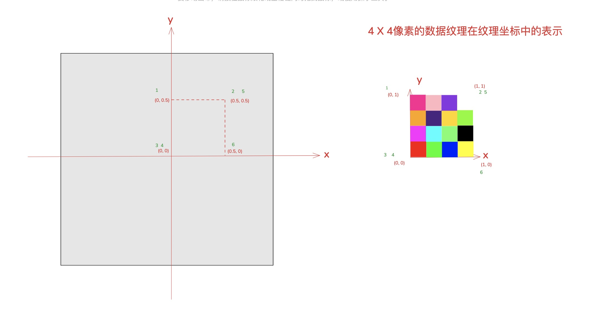

绘制结果如下：

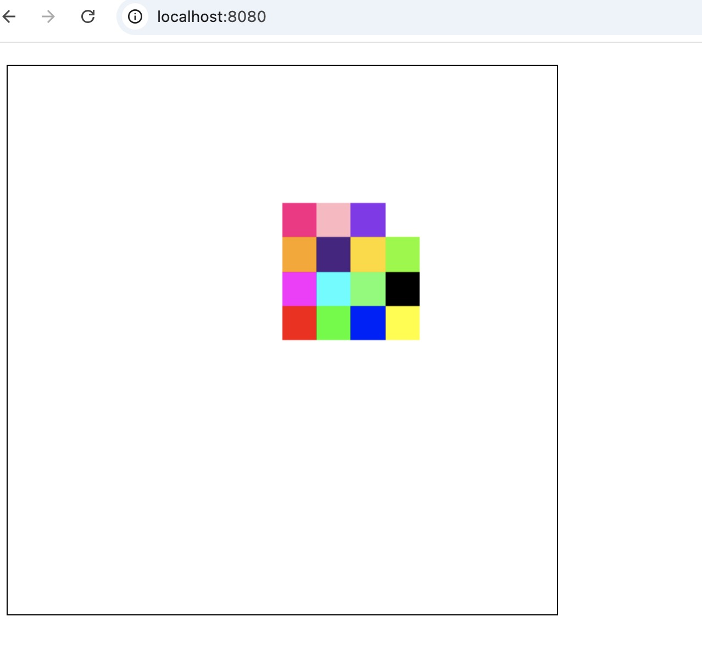

如果我们只需要用中间四个像素填充矩形，即下图红框中四个像素

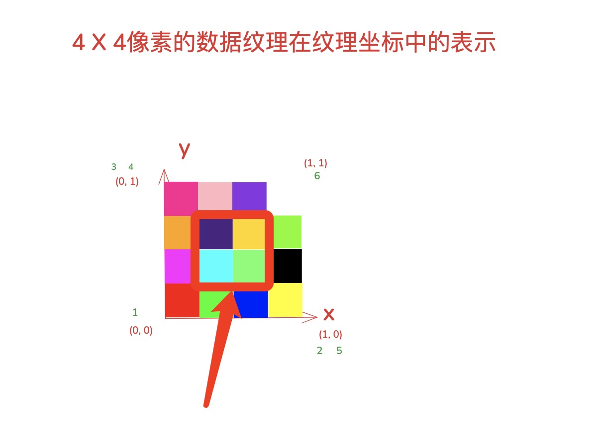

只需要修改上面的代码

```js
const x = 0.25, y = 0.25, textWidth = 0.5, textHeight = 0.5;
// const x = 0, y = 0, textWidth = 1.0, textHeight = 1.0;
```

绘制结果如下

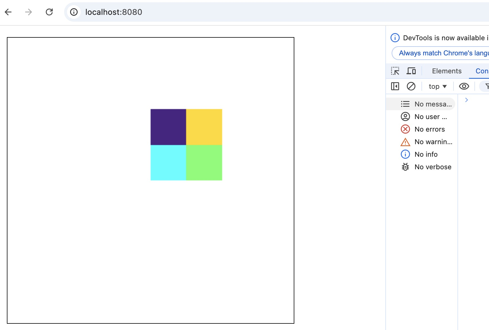


完整代码如下：
```js
const main = () => {
  const canvas = document.getElementById('webgl')
  const gl = canvas.getContext('webgl2')
  const vertexShaderSource1 = `
    attribute vec2 a_texCoord;
    attribute vec2 a_position;
    varying vec2 v_texCoord;
    void main(){
        gl_PointSize = 10.0;
        gl_Position = vec4(a_position, 0.0, 1.0);
        // 将纹理坐标传给片段着色器
        // GPU会在点之间进行插值
        v_texCoord = a_texCoord;
    }
  `
  const fragmentShaderSource1 = `
    precision mediump float;
    uniform sampler2D u_image;
    // 从顶点着色器传入的纹理坐标
    varying vec2 v_texCoord;
    void main(){
      // 在纹理上寻找对应颜色值
      gl_FragColor = texture2D(u_image, v_texCoord);
    }
  `
  const program1 = initShaders(gl, vertexShaderSource1, fragmentShaderSource1)
  const positionLocation1 = gl.getAttribLocation(program1, 'a_position')
  const texCoordLocation = gl.getAttribLocation(program1, "a_texCoord");

  // 给矩形提供纹理坐标
  const texCoordBuffer = gl.createBuffer();
  gl.bindBuffer(gl.ARRAY_BUFFER, texCoordBuffer);
  const x = 0.25, y = 0.25, textWidth = 0.5, textHeight = 0.5;
  // const x = 0, y = 0, textWidth = 1.0, textHeight = 1.0;
  gl.bufferData(gl.ARRAY_BUFFER, new Float32Array([
    x, y + textHeight,
    x + textWidth, y + textHeight,
    x, y,
    x, y,
    x + textWidth, y + textHeight,
    x + textWidth, y
  ]), gl.STATIC_DRAW);
  gl.enableVertexAttribArray(texCoordLocation);
  gl.vertexAttribPointer(texCoordLocation, 2, gl.FLOAT, false, 0, 0);

  const rectX = 0.0, rectY = 0.5, rectWidth = 0.5, rectHeight = 0.5
  let verticesInfo = [
    rectX, rectY,
    rectX + rectWidth, rectY,
    rectX, rectY - rectHeight,
    rectX, rectY - rectHeight,
    rectX + rectWidth, rectY,
    rectX + rectWidth, rectY - rectHeight,
  ]
 
  verticesInfo = new Float32Array(verticesInfo);

  const vertexBuffer = gl.createBuffer();
  gl.bindBuffer(gl.ARRAY_BUFFER, vertexBuffer);
  gl.bufferData(gl.ARRAY_BUFFER, verticesInfo, gl.STATIC_DRAW);

  gl.vertexAttribPointer(positionLocation1, 2, gl.FLOAT, false, 8, 0);

  gl.enableVertexAttribArray(positionLocation1);

  // 创建纹理
  var texture = gl.createTexture();
  gl.bindTexture(gl.TEXTURE_2D, texture);

  // 用 4x4 的像素填充纹理
  const level = 0;
  const internalFormat = gl.RGBA;
  const width = 4;
  const height = 4;
  const border = 0;
  const format = gl.RGBA;
  const type = gl.UNSIGNED_BYTE;
  const data = new Uint8Array([
    255, 0, 0, 255, // 红
    0, 255, 0, 255, // 绿
    0, 0, 255, 255, // 蓝
    255, 255, 0, 255, // 黄

    255, 0, 255, 255, // 品红色
    0, 255, 255, 255, // 青色
    105, 255, 105, 255,   // 青柠绿
    0, 0, 0, 255, // 黑色


    255, 165, 0, 255,    // 橙色
    75, 32, 132, 255,    // 深紫色
    255, 218, 0, 255,    // 金色
    124, 252, 0,  255,   // 荧光绿

    255, 20, 133, 255,      // 珊瑚色
    255, 182, 193, 255,   // 淡粉红
    138, 43, 238, 255,    // 魔法蓝
    255, 255, 255, 255,     // 白色
  ]);
  gl.texImage2D(
    gl.TEXTURE_2D,
    level,
    internalFormat,
    width,
    height,
    border,
    format,
    type,
    data
  );
  gl.texParameteri(gl.TEXTURE_2D, gl.TEXTURE_WRAP_S, gl.CLAMP_TO_EDGE);
  gl.texParameteri(gl.TEXTURE_2D, gl.TEXTURE_WRAP_T, gl.CLAMP_TO_EDGE);
  gl.texParameteri(gl.TEXTURE_2D, gl.TEXTURE_MIN_FILTER, gl.NEAREST);
  gl.texParameteri(gl.TEXTURE_2D, gl.TEXTURE_MAG_FILTER, gl.NEAREST);


  gl.clearColor(0, 0, 0, 0)

  gl.clear(gl.COLOR_BUFFER_BIT);

  gl.useProgram(program1)


  gl.drawArrays(gl.TRIANGLES, 0, 6)

}

main();
```

至此，我们通过demo演示了数据纹理是如何通过纹理坐标填充三维物体表面的。

#### 图像数据纹理
这次我们使用下面的`color.png`图片填充矩形，这是一张4 * 4像素的图片，每个像素的颜色使用数据纹理中的数据生成，可以看到和上面的数据纹理的颜色和顺序一致。

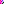


理论上来说，如果图片纹理的原点在左下角，那么红色像素将位于矩形的左下角，白色像素将位于矩形的右上角

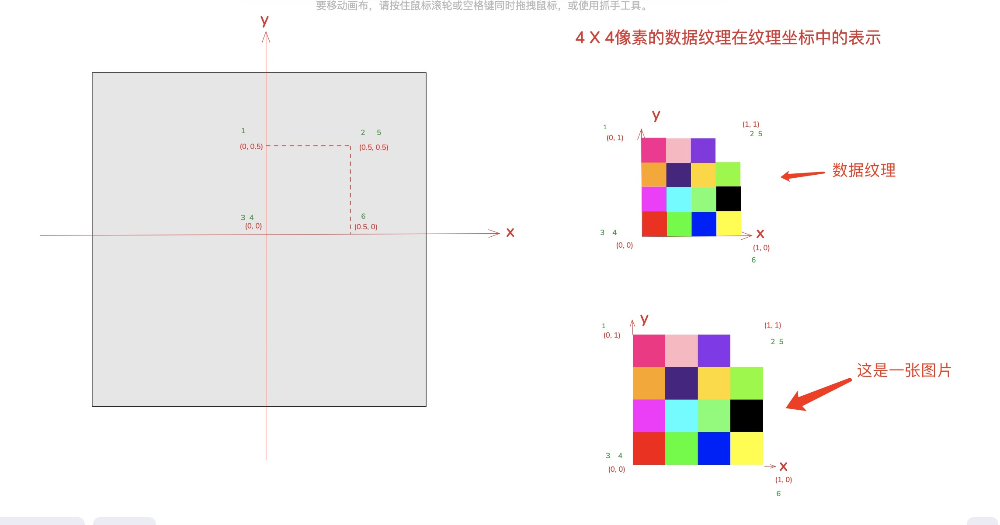

我们复用数据纹理的demo代码，包括纹理坐标等数据。如下所示：
```js
const main = (image) => {
  const canvas = document.getElementById('webgl')
  const gl = canvas.getContext('webgl2')
  const vertexShaderSource1 = `
    attribute vec2 a_texCoord;
    attribute vec2 a_position;
    varying vec2 v_texCoord;
    void main(){
        gl_PointSize = 10.0;
        gl_Position = vec4(a_position, 0.0, 1.0);
        // 将纹理坐标传给片段着色器
        // GPU会在点之间进行插值
        v_texCoord = a_texCoord;
    }
  `
  const fragmentShaderSource1 = `
    precision mediump float;
    uniform sampler2D u_image;
    // 从顶点着色器传入的纹理坐标
    varying vec2 v_texCoord;
    void main(){
      // 在纹理上寻找对应颜色值
      gl_FragColor = texture2D(u_image, v_texCoord);
    }
  `
  const program1 = initShaders(gl, vertexShaderSource1, fragmentShaderSource1)
  const positionLocation1 = gl.getAttribLocation(program1, 'a_position')
  const texCoordLocation = gl.getAttribLocation(program1, "a_texCoord");

  // 给矩形提供纹理坐标
  const texCoordBuffer = gl.createBuffer();
  gl.bindBuffer(gl.ARRAY_BUFFER, texCoordBuffer);
  // const x = 0.25, y = 0.25, textWidth = 0.5, textHeight = 0.5;
  const x = 0, y = 0, textWidth = 1.0, textHeight = 1.0;
  gl.bufferData(gl.ARRAY_BUFFER, new Float32Array([
    x, y + textHeight,
    x + textWidth, y + textHeight,
    x, y,
    x, y,
    x + textWidth, y + textHeight,
    x + textWidth, y
  ]), gl.STATIC_DRAW);
  gl.enableVertexAttribArray(texCoordLocation);
  gl.vertexAttribPointer(texCoordLocation, 2, gl.FLOAT, false, 0, 0);

  const rectX = 0.0, rectY = 0.5, rectWidth = 0.5, rectHeight = 0.5
  let verticesInfo = [
    rectX, rectY,
    rectX + rectWidth, rectY,
    rectX, rectY - rectHeight,
    rectX, rectY - rectHeight,
    rectX + rectWidth, rectY,
    rectX + rectWidth, rectY - rectHeight,
  ]
 
  verticesInfo = new Float32Array(verticesInfo);

  const vertexBuffer = gl.createBuffer();
  gl.bindBuffer(gl.ARRAY_BUFFER, vertexBuffer);
  gl.bufferData(gl.ARRAY_BUFFER, verticesInfo, gl.STATIC_DRAW);

  gl.vertexAttribPointer(positionLocation1, 2, gl.FLOAT, false, 8, 0);

  gl.enableVertexAttribArray(positionLocation1);

  // 创建纹理
  var texture = gl.createTexture();
  gl.bindTexture(gl.TEXTURE_2D, texture);
   // 将图像上传到纹理
  gl.texImage2D(gl.TEXTURE_2D, 0, gl.RGBA, gl.RGBA, gl.UNSIGNED_BYTE, image);
  gl.texParameteri(gl.TEXTURE_2D, gl.TEXTURE_WRAP_S, gl.CLAMP_TO_EDGE);
  gl.texParameteri(gl.TEXTURE_2D, gl.TEXTURE_WRAP_T, gl.CLAMP_TO_EDGE);
  gl.texParameteri(gl.TEXTURE_2D, gl.TEXTURE_MIN_FILTER, gl.NEAREST);
  gl.texParameteri(gl.TEXTURE_2D, gl.TEXTURE_MAG_FILTER, gl.NEAREST);


  gl.clearColor(0, 0, 0, 0)

  gl.clear(gl.COLOR_BUFFER_BIT);

  gl.useProgram(program1)


  gl.drawArrays(gl.TRIANGLES, 0, 6)

}

// // 图片URL
const imageUrl = "./color.png"

const image = new Image();
image.src = imageUrl  
image.onload = function () {
  main(image);
}
```

绘制结果如下，可以发现绘制的结果是上下颠倒的！

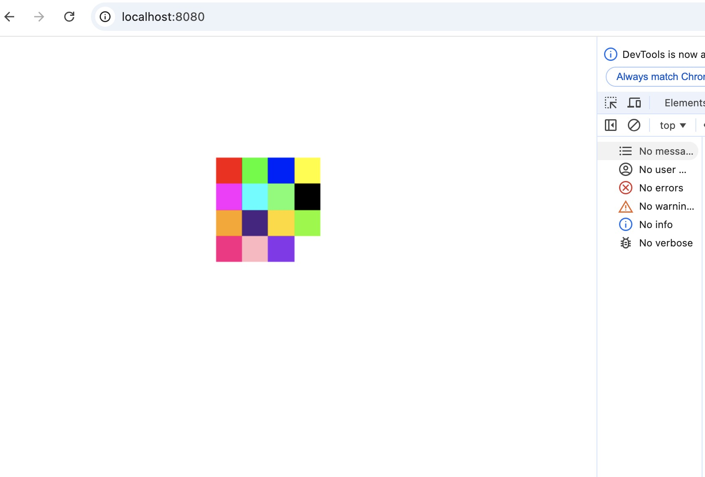

这次的代码只是将数据纹理更换成图片纹理，即
```js
    // 用 4x4 的像素填充纹理
    const level = 0;
    const internalFormat = gl.RGBA;
    const width = 4;
    const height = 4;
    const border = 0;
    const format = gl.RGBA;
    const type = gl.UNSIGNED_BYTE;
    const data = new Uint8Array([
      255, 0, 0, 255, // 红
      0, 255, 0, 255, // 绿
      0, 0, 255, 255, // 蓝
      255, 255, 0, 255, // 黄
  
      255, 0, 255, 255, // 品红色
      0, 255, 255, 255, // 青色
      105, 255, 105, 255,   // 青柠绿
      0, 0, 0, 255, // 黑色
  
  
      255, 165, 0, 255,    // 橙色
      75, 32, 132, 255,    // 深紫色
      255, 218, 0, 255,    // 金色
      124, 252, 0,  255,   // 荧光绿
  
      255, 20, 133, 255,      // 珊瑚色
      255, 182, 193, 255,   // 淡粉红
      138, 43, 238, 255,    // 魔法蓝
      255, 255, 255, 255,     // 白色
    ]);
    gl.texImage2D(
      gl.TEXTURE_2D,
      level,
      internalFormat,
      width,
      height,
      border,
      format,
      type,
      data
    );
```

替换成：

```js
// 将图像上传到纹理
gl.texImage2D(gl.TEXTURE_2D, 0, gl.RGBA, gl.RGBA, gl.UNSIGNED_BYTE, image);
```

我们传递的纹理坐标和顶点坐标都一样，但图片纹理最终的绘制结果却是上下颠倒的，这也是本篇文章想探讨的。

### 为什么图片纹理绘制结果是上下颠倒的
在回答这个问题之前，我们先通过代码读取color.png这张图片的rgba值。
```js
const img = new Image();
img.src =  "./color.png";

img.onload = () => {
  const canvas = document.createElement('canvas');
  const ctx = canvas.getContext('2d');
  canvas.width = img.width;
  canvas.height = img.height;
  ctx.drawImage(img, 0, 0);

  const imageData = ctx.getImageData(0, 0, canvas.width, canvas.height);
  const data = imageData.data;

  console.log('rgba：', data)

};
```

可以看到，color.png中第一个颜色块（即珊瑚色）位于像素数组的开头

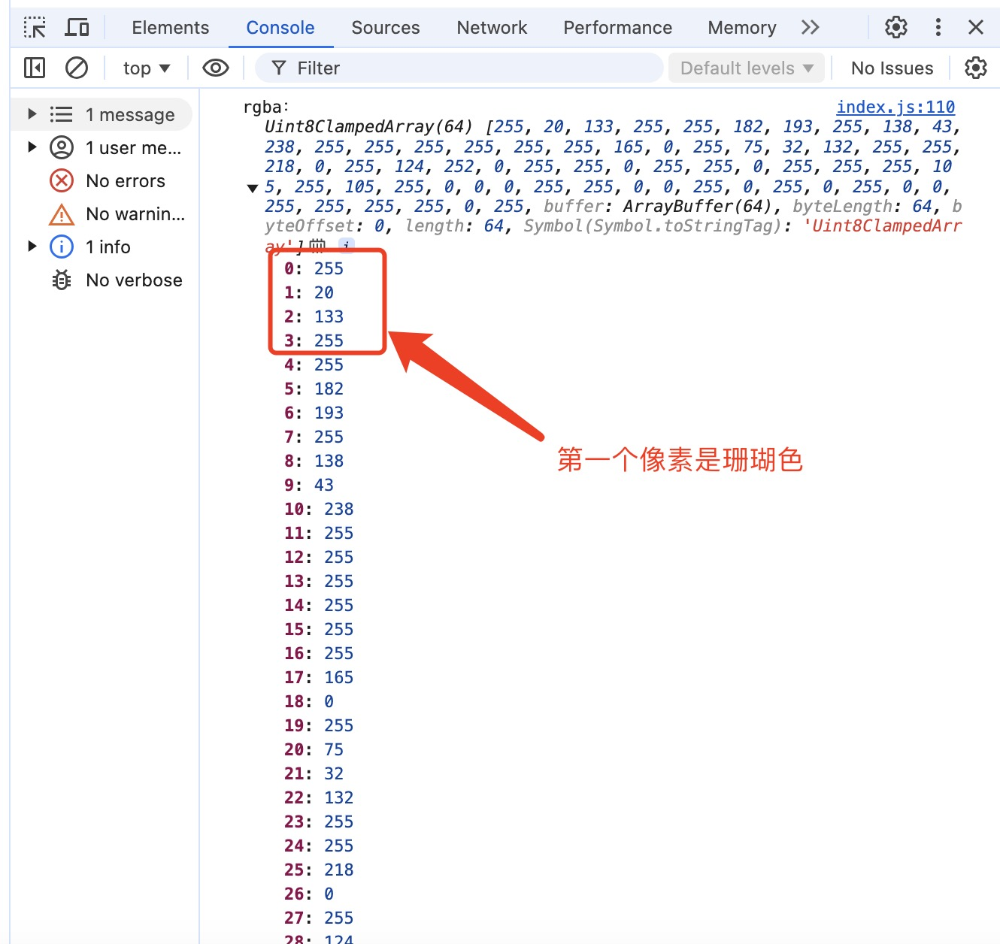

最后一个颜色块（即黄色）位于像素数组的结尾

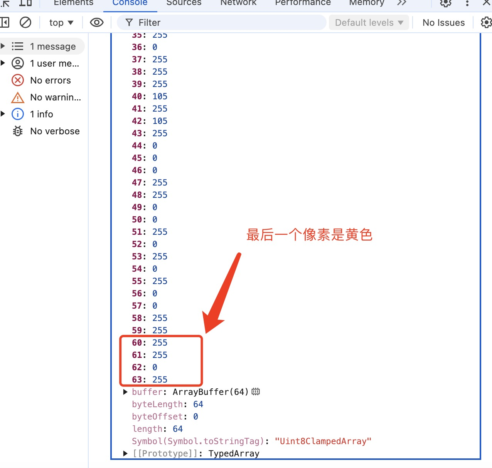

由此可见，在浏览器中，图片转成纹理像素数据时，浏览器底层是先从图片的左上角开始复制第一个像素点，直到图片的右下角。


回到我们的代码中，我们使用gl.texImage2D将`纹理数据`上传到GPU。WebGL的texImage2D函数是对OpenGL的glTexImage2D函数的轻量级包装器。​在OpenGL中，glTexImage2D函数并不接受HTMLImageElement类型的源对象，它仅接收一个 const void* data类型的数据指针。该函数期望传入的像素数组中的数据以`​自下而上`的顺序存储：​第一个元素对应纹理图像的左下角；最后一个元素则对应纹理图像的右上角。

然而，[​WebGL规范](https://registry.khronos.org/webgl/specs/latest/1.0/#TEXIMAGE2D_HTML)对 texImage2D 函数的定义却指出：第一个元素对应纹理图像的左上角。

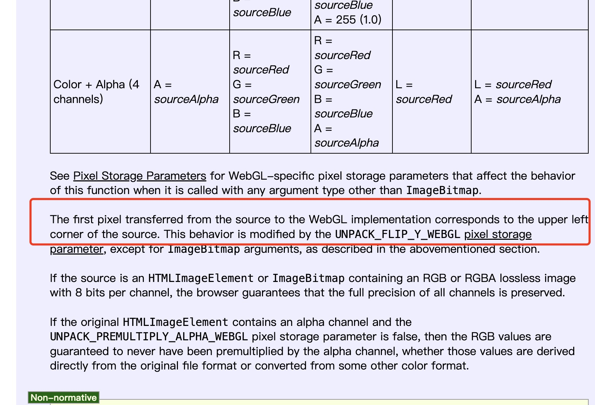

这意味着，尽管OpenGL期望像素数据`以自下而上`的顺序排列，但浏览器在处理 `` 元素时，仍然会以自上而下的顺序复制像素！

这就导致，如果我们在WebGL中，在处理图片类型的纹理时，如果还是按照纹理坐标原点在左下角传输纹理坐标，那么最终绘制出来的图片将是上下颠倒的。如果希望修复这个问题，有两种方案：

- 1.使用`gl.pixelStorei(gl.UNPACK_FLIP_Y_WEBGL, true);`翻转Y轴
- 2.将图片左上角作为原点传输纹理坐标

我们采用第2种方案修复这个问题，即将左上角当作原点传输坐标：

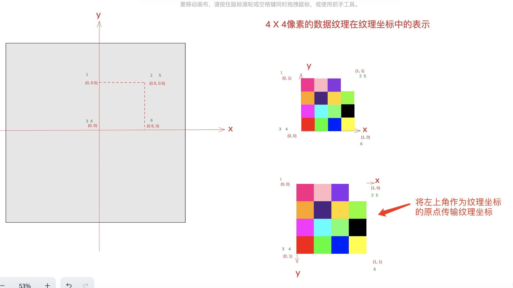

对应的纹理坐标如下：

```js
const x = 0, y = 0, textWidth = 1.0, textHeight = 1.0;
gl.bufferData(gl.ARRAY_BUFFER, new Float32Array([
  x, y,
  x + textWidth, y,
  x, y + textHeight,
  x, y + textHeight,
  x + textWidth, y,
  x + textWidth, y + textHeight,
]), gl.STATIC_DRAW);
```

可以发现绘制的结果是我们所期望的。


### 结论
在OpenGL中，纹理坐标的原点在左下角，glTexImage2D函数期望传入的像素数组中的数据以自下而上的顺序存储。而WebGL的texImage2D函数只是基于glTexImage2D的简单封装，因此理论上也是期望传入的像素数组中的数据以自下而上的顺序存储。这就意味着，在WebGL中，纹理坐标的原点也是在左下角。

但是图片类型的纹理数据比较特殊，由于在浏览器设计之初，复制图片像素数据都是从左上角开始，这就导致传入给WebGL的texImage2D函数的像素数据是从上到下存储的。就会导致绘制的结果是上下颠倒的。

因此，在WebGL中，关于纹理坐标原点需要分两种场景：
- 图片类型的纹理数据，纹理坐标原点在左上角
- 其他类型的纹理数据，纹理坐标原点在左下角

实际上，上或者下在纹理坐标空间中是没有意义的，毕竟底层的glTexImage2D最终接收的是像素数组，纹理坐标(0,0)对应数据的开头，(1,1)对应数据的结尾


### 参考
- [why-is-my-webgl-texture-upside-down/](https://jameshfisher.com/2020/10/22/why-is-my-webgl-texture-upside-down/)

- [webgl规范](https://registry.khronos.org/webgl/specs/latest/1.0/#TEXIMAGE2D_HTML)

- [WebGL三维纹理](https://webglfundamentals.org/webgl/lessons/zh_cn/webgl-3d-textures.html)