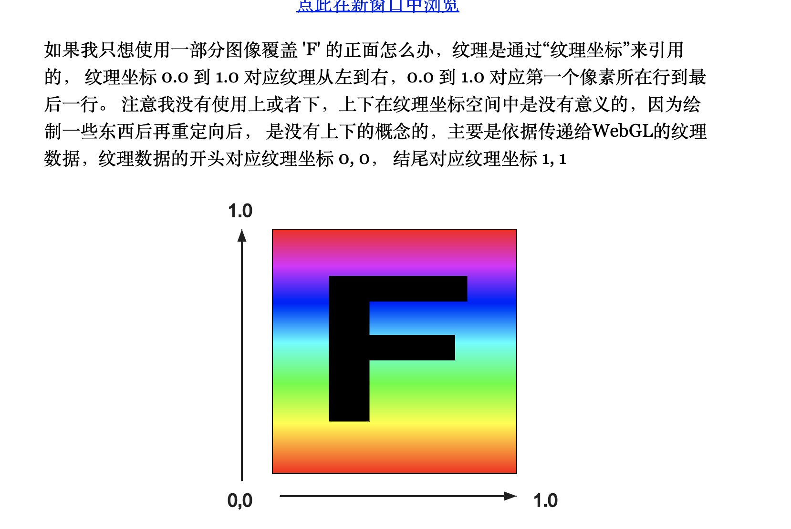

## 为什么WebGL纹理是上下颠倒的

## 前言
在WebGL中绘制图片需要使用`纹理数据`。和WebGL渲染时需要裁剪空间坐标相似，渲染纹理时需要纹理坐标，而不是像素坐标。`纹理数据`的类型非常丰富，比如图像数据，JS生成的数据纹理等。本节所说的纹理上下颠倒，实际上说的是WebGL在将图像纹理数据绘制到WebGL画布时，画布的图片是上下颠倒的。本节我们就深入剖析这个问题。

在此之前，我们先简单了解一下纹理的工作原理和纹理数据类型。

### 纹理数据类型
WebGL纹理数据的类型非常丰富，涵盖图像、程序生成的数据、特殊效果映射等。**WebGL纹理数据的底层通常是数组形式的**。以下是常见的纹理数据分类及其特点：
- **1.基础图像数据：**通过图像文件(如PNG、JPEG等)加载的2D纹理，是最常见的类型。图像纹理的使用可以看这篇文章[WebGL图像处理](https://webglfundamentals.org/webgl/lessons/zh_cn/webgl-image-processing.html)。图像类纹理加载后，会解码为像素值的数组，每个元素表示一个像素的颜色或透明度，再通过gl.texImage2D上传到GPU。WebGL会将数组转换为纹理的内部格式（如gl.RGBA8、gl.RGBA32F）。
- **2.程序生成的数据纹理：**无需外部图像，直接通过JS生成的数据纹理。数据纹理直接使用数值数组（如Float32Array、Uint8Array）生成纹理并上传到GPU。数据纹理的使用可以看这篇文章[WebGL数据纹理](https://webglfundamentals.org/webgl/lessons/zh_cn/webgl-data-textures.html)

### 纹理的工作原理
- **1.加载与创建：**使用gl.texImage2D将`纹理数据`上传到GPU
- **2.纹理坐标映射：**模型顶点通过(u,v)纹理坐标(范围[0,1]或[1,0])绑定到纹理
- **3.着色器采样：**在片段着色器中，通过texture2D函数获取像素值，并计算最终颜色。

gl.texImage2D是OpenGL/WebGL中用于将2D纹理数据上传到GPU的核心函数。它的底层操作会根据传入数据的类型（图像纹理或数据纹理）有不同的处理逻辑。无论数据类型如何，gl.texImage2D的最终目标是将数据存储到GPU的纹理内存中，供着色器采样。其核心步骤包括：

- 数据格式转换：将CPU侧的数组或图像数据转换为GPU可识别的内部格式（如 GL_RGBA8、GL_RGBA32F）。
- 内存分配：在GPU上为纹理分配存储空间。
- 数据拷贝：将CPU数据复制到GPU内存。
- MIPMAP生成（可选）：根据参数自动生成多级渐远纹理（MIPMAP）。

### 纹理坐标
在将纹理数据绘制到画布上时，WebGL的绘制是从左下角(即纹理坐标的原点)开始绘制，直到右上角的。纹理数据的开头对应纹理坐标(0,0)，结尾对应纹理坐标(1,1)。可以看这篇文章[WebGL三维纹理](https://webglfundamentals.org/webgl/lessons/zh_cn/webgl-3d-textures.html)。这就是我们说的`纹理坐标原点在左下角`的原因。因为将纹理数据绘制到画布中，就是从左下角开始的。

在WebGL/OpenGL中，我们通过纹理坐标告诉WebGL如何采样