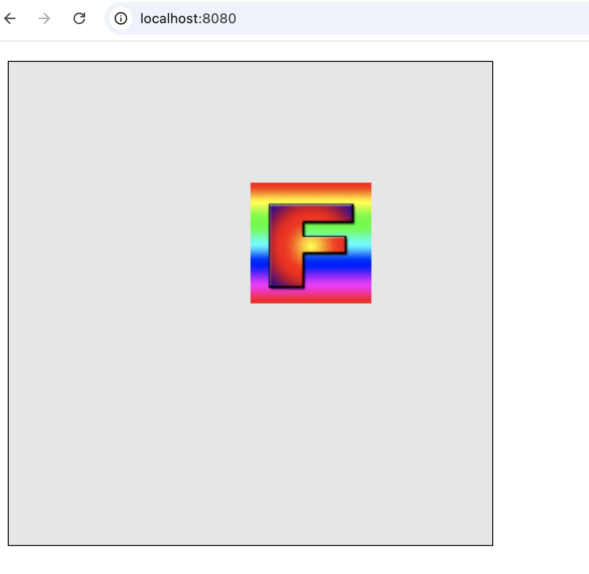
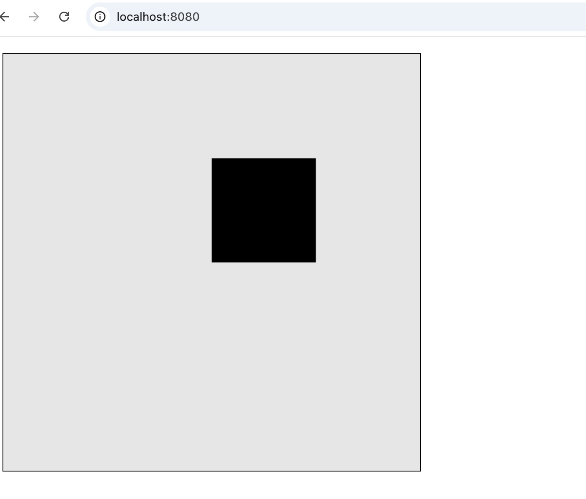
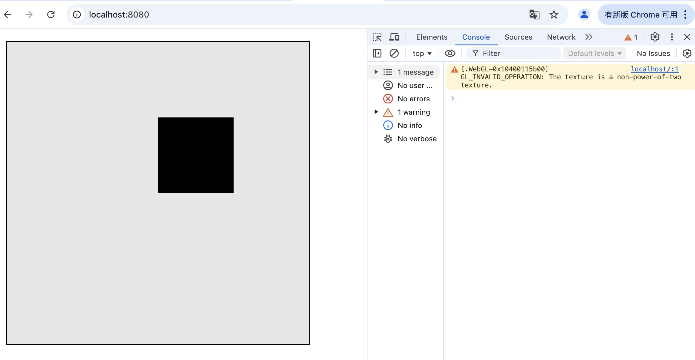
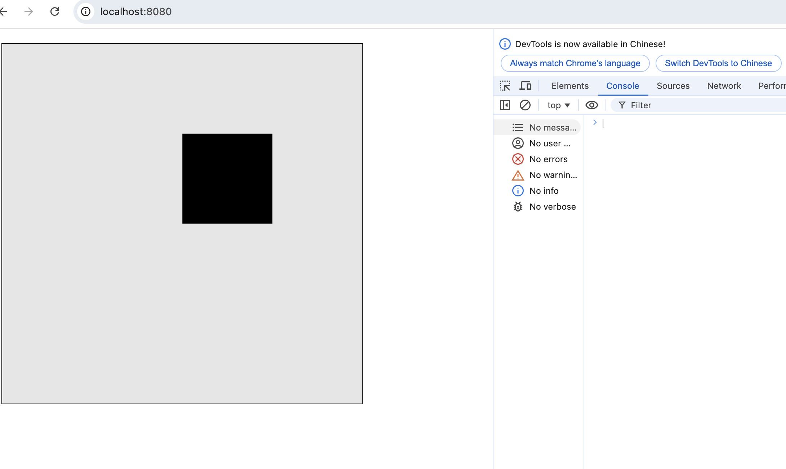

## 一、 纹理尺寸

WebGL 对纹理维度的限制主要源于其基于 OpenGL ES 2.0 规范，该规范要求纹理的宽度和高度必须是 2 的整数次幂（如 1x1, 2x2, 4x4, 8x8 等）。这一限制影响了纹理的渲染和性能。

### 1.1 限制的原因

- **性能优化**：2 的幂次方纹理可以更高效地使用硬件加速，提高渲染性能。
- **纹理过滤和 mipmap 生成**：2 的幂次方纹理支持更高质量的纹理过滤和 mipmap 生成，提升图像质量。

### 1.2 如何处理非 2 的幂次方纹理

- **调整纹理尺寸**：将纹理的宽度和高度调整为最接近的 2 的幂次方。
- **使用纹理参数**：设置纹理参数为 CLAMP_TO_EDGE 和 LINEAR，以支持非 2 的幂次方纹理的渲染

我们使用下面两张图片验证一下

“F”图像，尺寸：256 \* 256。


“猫”图像，尺寸：640 \* 853


同时，本篇文章使用下面的Demo演示：


```js
const main = (image) => {
    const canvas = document.getElementById('webgl')
    const gl = canvas.getContext('webgl')
    const vertexShaderSource1 = `
      attribute vec2 a_texCoord;
      attribute vec2 a_position;
      varying vec2 v_texCoord;
      void main(){
          gl_PointSize = 10.0;
          gl_Position = vec4(a_position, 0.0, 1.0);
          // 将纹理坐标传给片段着色器
          // GPU会在点之间进行插值
          v_texCoord = a_texCoord;
      }
    `
    const fragmentShaderSource1 = `
      precision mediump float;
      uniform sampler2D u_image;
      // 从顶点着色器传入的纹理坐标
      varying vec2 v_texCoord;
      void main(){
        // 在纹理上寻找对应颜色值
        gl_FragColor = texture2D(u_image, v_texCoord);
      }
    `
    const program1 = initShaders(gl, vertexShaderSource1, fragmentShaderSource1)
    const positionLocation1 = gl.getAttribLocation(program1, 'a_position')
    const texCoordLocation = gl.getAttribLocation(program1, "a_texCoord");
  
    // 给矩形提供纹理坐标
    const texCoordBuffer = gl.createBuffer();
    gl.bindBuffer(gl.ARRAY_BUFFER, texCoordBuffer);
    const x = 1.0, y = 1.0;
    gl.bufferData(gl.ARRAY_BUFFER, new Float32Array([
      0.0, 0.0,
      x, 0.0,
      0.0, y,
      x, 0.0,
      0.0, y,
      x, y
    ]), gl.STATIC_DRAW);
    gl.enableVertexAttribArray(texCoordLocation);
    gl.vertexAttribPointer(texCoordLocation, 2, gl.FLOAT, false, 0, 0);
  
    // 创建纹理
    var texture = gl.createTexture();
    gl.bindTexture(gl.TEXTURE_2D, texture);
  
  
    // 将图像上传到纹理
    gl.texImage2D(gl.TEXTURE_2D, 0, gl.RGBA, gl.RGBA, gl.UNSIGNED_BYTE, image);
    // gl.texParameteri(gl.TEXTURE_2D, gl.TEXTURE_MIN_FILTER, gl.LINEAR);
    // gl.generateMipmap(gl.TEXTURE_2D);

    const rectX = 0.5, rectY =  0.5;
    let verticesInfo = [
      0.0, rectY,
      rectX, rectY,
      0, 0,
      rectX, rectY,
      0, 0,
      rectX, 0,
    ]
    verticesInfo = new Float32Array(verticesInfo)
  
    const vertexBuffer = gl.createBuffer();
    gl.bindBuffer(gl.ARRAY_BUFFER, vertexBuffer)
    gl.bufferData(gl.ARRAY_BUFFER, verticesInfo, gl.STATIC_DRAW)
  
  
    gl.vertexAttribPointer(
      positionLocation1,
      2,
      gl.FLOAT,
      false,
      8,
      0
    );
  
  
  
    gl.clearColor(0, 0, 0, 0.1)
  
    gl.clear(gl.COLOR_BUFFER_BIT);
  
    gl.useProgram(program1)
  
    gl.enableVertexAttribArray(positionLocation1);
  
    gl.drawArrays(gl.TRIANGLES, 0,6)
  
  }
  
  
  const image = new Image();
  // image.src = "./cat.jpeg";  // 必须在同一域名下
  // image.src = "./f.png";  // 必须在同一域名下

  image.onload = function () {
    main(image);
  }
```

## 二、纹理尺寸为 2 的整数次幂

上面的图像“F”尺寸为 256\*256，为 2 的整数次幂。当纹理尺寸为 2 的整数次幂时，必须要设置下面至少一项
- 调用并设置`gl.TEXTURE_MIN_FILTER`为`gl.NEAREST`或者`gl.LINEAR`以关闭纹理映射
- 调用`gl.generateMipmap`生成纹理映射，这样webgl就可以选择使用纹理映射绘制

修改上面的DEMO，使用图像"F"
```js
const image = new Image();
// image.src = "./cat.jpeg";  // 必须在同一域名下
image.src = "./f.png";  // 必须在同一域名下
```

下面的两行注释中，至少有一行是放开的，图像都可以正常绘制
```js
// 将图像上传到纹理
gl.texImage2D(gl.TEXTURE_2D, 0, gl.RGBA, gl.RGBA, gl.UNSIGNED_BYTE, image);
// gl.texParameteri(gl.TEXTURE_2D, gl.TEXTURE_MIN_FILTER, gl.LINEAR);
// gl.generateMipmap(gl.TEXTURE_2D);
```
比如只设置gl.TEXTURE_MIN_FILTER

```js
// 将图像上传到纹理
gl.texImage2D(gl.TEXTURE_2D, 0, gl.RGBA, gl.RGBA, gl.UNSIGNED_BYTE, image);
gl.texParameteri(gl.TEXTURE_2D, gl.TEXTURE_MIN_FILTER, gl.LINEAR);
// gl.generateMipmap(gl.TEXTURE_2D);
```
或者只调用generateMipmap
```js
// 将图像上传到纹理
gl.texImage2D(gl.TEXTURE_2D, 0, gl.RGBA, gl.RGBA, gl.UNSIGNED_BYTE, image);
// gl.texParameteri(gl.TEXTURE_2D, gl.TEXTURE_MIN_FILTER, gl.LINEAR);
gl.generateMipmap(gl.TEXTURE_2D);
```

上面集中方式，纹理都可以正常绘制，如下所示：




### 2.1 gl.TEXTURE_MIN_FILTER的取值
gl.TEXTURE_MIN_FILTER的取值：
- NEAREST 
- LINEAR
- NEAREST_MIPMAP_NEAREST
- LINEAR_MIPMAP_NEAREST
- NEAREST_MIPMAP_LINEAR
- LINEAR_MIPMAP_LINEAR

如果不调用gl.generateMipmap生成纹理映射，那么gl.TEXTURE_MIN_FILTER只能取值为gl.LINEAR或者gl.NEAREST。下面的代码绘制将出错：

```js
// 将图像上传到纹理
gl.texImage2D(gl.TEXTURE_2D, 0, gl.RGBA, gl.RGBA, gl.UNSIGNED_BYTE, image);
gl.texParameteri(gl.TEXTURE_2D, gl.TEXTURE_MIN_FILTER, gl.NEAREST_MIPMAP_NEAREST);
// gl.generateMipmap(gl.TEXTURE_2D);
```
这是因为我们没有调用gl.generateMipmap生成纹理映射，但gl.TEXTURE_MIN_FILTER参数却设置成从纹理映射中选择贴图。在着色器中当 texture2D 被调用的时候由于纹理没有正确设置，就会使用颜色 (0, 0, 0, 1)也就是黑色



因此需要调用generateMipmap，下面的代码才能正确绘制纹理。
```js
// 将图像上传到纹理
gl.texImage2D(gl.TEXTURE_2D, 0, gl.RGBA, gl.RGBA, gl.UNSIGNED_BYTE, image);
gl.texParameteri(gl.TEXTURE_2D, gl.TEXTURE_MIN_FILTER, gl.NEAREST_MIPMAP_NEAREST);
gl.generateMipmap(gl.TEXTURE_2D);
```

### 2.2 环绕模式
在 WebGL 中，如果纹理的尺寸是2的整数次幂，可以自由设置 gl.TEXTURE_WRAP_S 和 gl.TEXTURE_WRAP_T 为 gl.REPEAT、gl.CLAMP_TO_EDGE 或 gl.MIRRORED_REPEAT，比如：

```js
// 将图像上传到纹理
gl.texImage2D(gl.TEXTURE_2D, 0, gl.RGBA, gl.RGBA, gl.UNSIGNED_BYTE, image);
gl.texParameteri(gl.TEXTURE_2D, gl.TEXTURE_WRAP_S, gl.CLAMP_TO_EDGE);
gl.texParameteri(gl.TEXTURE_2D, gl.TEXTURE_WRAP_T, gl.REPEAT);
gl.texParameteri(gl.TEXTURE_2D, gl.TEXTURE_MIN_FILTER, gl.NEAREST_MIPMAP_NEAREST);
gl.generateMipmap(gl.TEXTURE_2D);
```

## 三、纹理尺寸为非 2 的整数次幂
上面的图像“猫”尺寸为 640 \* 853，不是 2 的整数次幂。

修改上面的DEMO，使用图像"猫"
```js
const image = new Image();
image.src = "./cat.jpeg";  // 必须在同一域名下
// image.src = "./f.png";  // 必须在同一域名下
```
### 3.1 不能使用纹理映射
非2的整数次幂的纹理，不能生成纹理映射，下面的代码绘制将会出错

```js
// 将图像上传到纹理
gl.texImage2D(gl.TEXTURE_2D, 0, gl.RGBA, gl.RGBA, gl.UNSIGNED_BYTE, image);
gl.generateMipmap(gl.TEXTURE_2D);
```
显示纹理失败，在着色器中当 texture2D 被调用的时候由于纹理没有正确设置， 就会使用颜色 (0, 0, 0, 1) 也就是黑色。如果打开 JavaScript 控制台或者浏览器控制台， 根据浏览器不同可能会显示不同的错误信息，像这样



### 3.2 如何正确显示
如果需要让非2的整数次幂的贴图能够正确显示，只需要将包裹模式设置为 CLAMP_TO_EDGE 并且通过设置过滤器为 LINEAR or NEAREST 来关闭贴图映射。
```js
// 将图像上传到纹理
gl.texImage2D(gl.TEXTURE_2D, 0, gl.RGBA, gl.RGBA, gl.UNSIGNED_BYTE, image);
gl.texParameteri(gl.TEXTURE_2D, gl.TEXTURE_WRAP_S, gl.CLAMP_TO_EDGE);
gl.texParameteri(gl.TEXTURE_2D, gl.TEXTURE_WRAP_T, gl.CLAMP_TO_EDGE);
gl.texParameteri(gl.TEXTURE_2D, gl.TEXTURE_MIN_FILTER, gl.NEAREST);
```


### 3.2 环绕模式
在 WebGL 中，如果纹理的宽度和高度 不是 2 的整数次幂（即非幂次方纹理），默认情况下 无法 将 gl.TEXTURE_WRAP_S 和 gl.TEXTURE_WRAP_T 设置为 gl.REPEAT。这是因为 WebGL 对于非幂次方纹理的环绕模式有严格的限制。

对于非2的整数次幂方纹理，只能 设置 gl.TEXTURE_WRAP_S 和 gl.TEXTURE_WRAP_T 为 gl.CLAMP_TO_EDGE。下面的代码可以正常绘制：

```js
// 将图像上传到纹理
gl.texImage2D(gl.TEXTURE_2D, 0, gl.RGBA, gl.RGBA, gl.UNSIGNED_BYTE, image);
gl.texParameteri(gl.TEXTURE_2D, gl.TEXTURE_WRAP_S, gl.CLAMP_TO_EDGE);
gl.texParameteri(gl.TEXTURE_2D, gl.TEXTURE_WRAP_T, gl.CLAMP_TO_EDGE);
gl.texParameteri(gl.TEXTURE_2D, gl.TEXTURE_MIN_FILTER, gl.NEAREST);
```

如果尝试设置为 gl.REPEAT 或 gl.MIRRORED_REPEAT，WebGL 会抛出错误（例如，INVALID_OPERATION，有些浏览器可能不会抛出错误，但会绘制黑色的背景）

下面的代码显示纹理失败，在着色器中当 texture2D 被调用的时候由于纹理没有正确设置， 就会使用颜色 (0, 0, 0, 1) 也就是黑色

```js
// 将图像上传到纹理
gl.texImage2D(gl.TEXTURE_2D, 0, gl.RGBA, gl.RGBA, gl.UNSIGNED_BYTE, image);
gl.texParameteri(gl.TEXTURE_2D, gl.TEXTURE_WRAP_S, gl.REPEAT);
gl.texParameteri(gl.TEXTURE_2D, gl.TEXTURE_WRAP_T, gl.CLAMP_TO_EDGE);
gl.texParameteri(gl.TEXTURE_2D, gl.TEXTURE_MIN_FILTER, gl.NEAREST);
```

