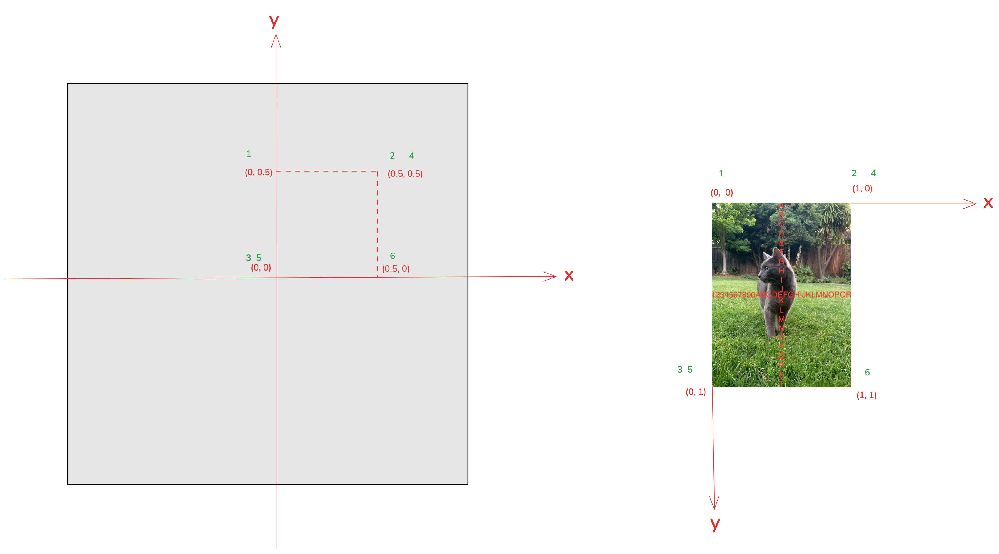
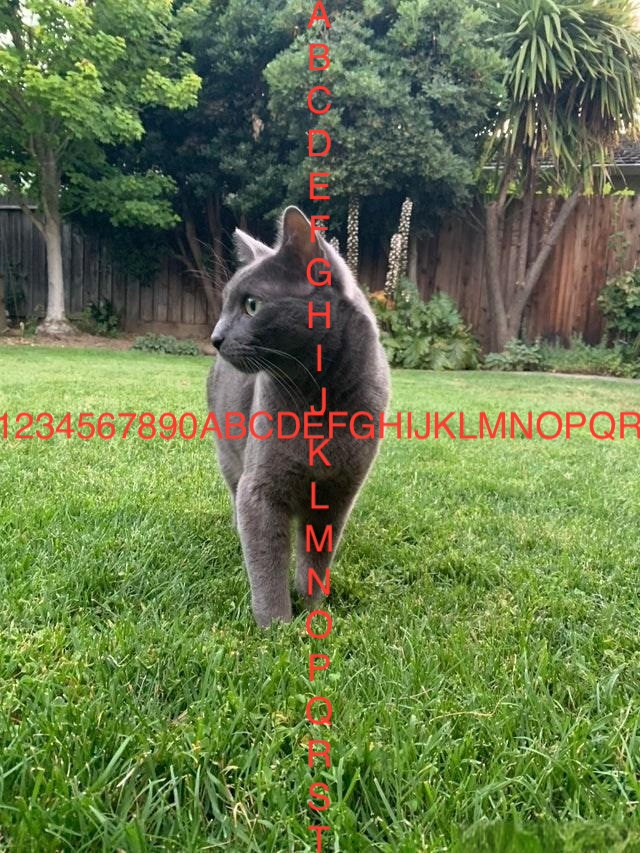
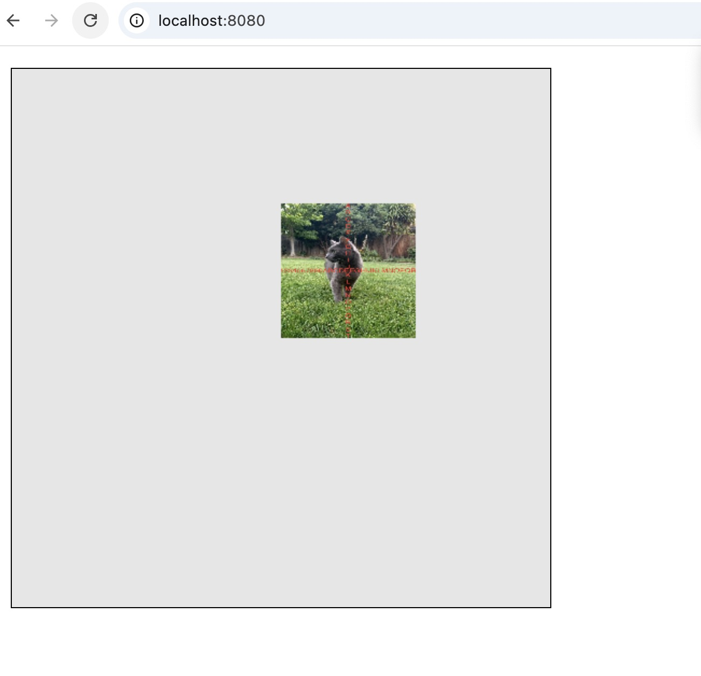

## WebGL 图像处理

在 WebGL 中绘制图片需要使用纹理。和 WebGL 渲染时需要裁剪空间坐标相似，渲染纹理时需要纹理坐标，而不是像素坐标。无论纹理是什么尺寸，纹理坐标范围始终是 0.0 到 1.0。

如下图所示，这里我们将右边猫的图片绘制到画布(0,0)到(0.5, 0.5)的区域



猫图片原图如下：



矩形的坐标数据为：

```js
const rectX = 0.5,
  rectY = 0.5;
let verticesInfo = [
  0.0,
  rectY,
  rectX,
  rectY,
  0,
  0,
  rectX,
  rectY,
  0,
  0,
  rectX,
  0,
];
```

对应的图片纹理坐标为：

```js
const x = 1.0,
  y = 1.0;
gl.bufferData(
  gl.ARRAY_BUFFER,
  new Float32Array([0.0, 0.0, x, 0.0, 0.0, y, x, 0.0, 0.0, y, x, y]),
  gl.STATIC_DRAW
);
```

注意，矩形的坐标点顺序必须和纹理坐标顺序一致，不然绘制的图像显示就会有问题。

结果如下：



完整代码如下：

```js
const main = (image) => {
  const canvas = document.getElementById("webgl");
  const gl = canvas.getContext("webgl");
  const vertexShaderSource1 = `
      attribute vec2 a_texCoord;
      attribute vec2 a_position;
      varying vec2 v_texCoord;
      void main(){
          gl_PointSize = 10.0;
          gl_Position = vec4(a_position, 0.0, 1.0);
          // 将纹理坐标传给片段着色器
          // GPU会在点之间进行插值
          v_texCoord = a_texCoord;
      }
    `;
  const fragmentShaderSource1 = `
      precision mediump float;
      uniform sampler2D u_image;
      // 从顶点着色器传入的纹理坐标
      varying vec2 v_texCoord;
      void main(){
        // 在纹理上寻找对应颜色值
        gl_FragColor = texture2D(u_image, v_texCoord);
      }
    `;
  const program1 = initShaders(gl, vertexShaderSource1, fragmentShaderSource1);
  const positionLocation1 = gl.getAttribLocation(program1, "a_position");
  const texCoordLocation = gl.getAttribLocation(program1, "a_texCoord");

  // 给矩形提供纹理坐标
  const texCoordBuffer = gl.createBuffer();
  gl.bindBuffer(gl.ARRAY_BUFFER, texCoordBuffer);
  const x = 1.0,
    y = 1.0;
  gl.bufferData(
    gl.ARRAY_BUFFER,
    new Float32Array([0.0, 0.0, x, 0.0, 0.0, y, x, 0.0, 0.0, y, x, y]),
    gl.STATIC_DRAW
  );
  gl.enableVertexAttribArray(texCoordLocation);
  gl.vertexAttribPointer(texCoordLocation, 2, gl.FLOAT, false, 0, 0);

  // 创建纹理
  var texture = gl.createTexture();
  gl.bindTexture(gl.TEXTURE_2D, texture);

  // // 设置参数，让我们可以绘制任何尺寸的图像
  gl.texParameteri(gl.TEXTURE_2D, gl.TEXTURE_WRAP_S, gl.CLAMP_TO_EDGE);
  gl.texParameteri(gl.TEXTURE_2D, gl.TEXTURE_WRAP_T, gl.CLAMP_TO_EDGE);
  gl.texParameteri(gl.TEXTURE_2D, gl.TEXTURE_MIN_FILTER, gl.NEAREST);
  gl.texParameteri(gl.TEXTURE_2D, gl.TEXTURE_MAG_FILTER, gl.NEAREST);

  // 将图像上传到纹理
  gl.texImage2D(gl.TEXTURE_2D, 0, gl.RGBA, gl.RGBA, gl.UNSIGNED_BYTE, image);

  const rectX = 0.5,
    rectY = 0.5;
  let verticesInfo = [
    0.0,
    rectY,
    rectX,
    rectY,
    0,
    0,
    rectX,
    rectY,
    0,
    0,
    rectX,
    0,
  ];
  verticesInfo = new Float32Array(verticesInfo);

  const vertexBuffer = gl.createBuffer();
  gl.bindBuffer(gl.ARRAY_BUFFER, vertexBuffer);
  gl.bufferData(gl.ARRAY_BUFFER, verticesInfo, gl.STATIC_DRAW);

  gl.vertexAttribPointer(positionLocation1, 2, gl.FLOAT, false, 8, 0);

  gl.clearColor(0, 0, 0, 0.1);

  gl.clear(gl.COLOR_BUFFER_BIT);

  gl.useProgram(program1);

  gl.enableVertexAttribArray(positionLocation1);

  gl.drawArrays(gl.TRIANGLES, 0, 6);
};

const image = new Image();
image.src = "./cat.jpeg"; // 必须在同一域名下

image.onload = function () {
  main(image);
};
```
