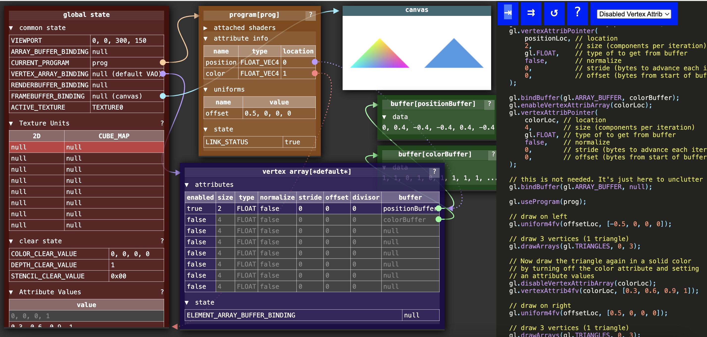

## WebGL在GPU上做了什么？
WebGL在GPU上的工作基本上分为两部分，第一部分是将顶点（或数据流）转换到裁剪空间坐标， 第二部分是基于第一部分的结果绘制像素点。


假设你正在画三角形，顶点着色器每完成三次顶点处理，WebGL就会用这三个顶点画一个三角形。 它计算出这三个顶点对应的像素后，就会光栅化这个三角形，“光栅化”其实就是“用像素画出来” 的花哨叫法。对于每一个像素，它会调用你的片段着色器询问你使用什么颜色。 你通过给片段着色器的一个特殊变量gl_FragColor设置一个颜色值，实现自定义像素颜色

>每个program支持的最大顶点属性可以通过gl.getParameter(gl.MAX_VERTEX_ATTRIBS)查看


>貌似没有gl.getVaryingLocation(program, "v_color")方法


## 顶点着色器
一个顶点着色器的工作是生成裁剪空间坐标值。每个顶点调用一次（顶点）着色器，每次调用都需要设置一个特殊的全局变量gl_Position， 该变量的值就是裁减空间坐标值。

顶点着色器需要的数据，可以通过以下三种方式获得。

- Attributes 属性 (从缓冲中获取的数据)
- Uniforms 全局变量 (在一次绘制中对所有顶点保持一致值)
- Textures 纹理 (从像素或纹理元素中获取的数据)


### uniforms全局变量
全局变量在一次绘制过程中传递给着色器的值都一样

要注意的是全局变量属于单个着色程序，如果多个着色程序有同名全局变量，需要找到每个全局变量并设置自己的值。 我们调用gl.uniform???的时候只是设置了当前程序的全局变量，当前程序是传递给gl.useProgram 的最后一个程序


## 片段着色器
一个片段着色器的工作是为当前光栅化的像素提供颜色值

每个像素都将调用一次片段着色器，每次调用需要从你设置的特殊全局变量gl_FragColor中获取颜色信息。

片段着色器所需的数据，可以通过以下三种方式获取
- Uniforms 全局变量 (values that stay the same for every pixel of a single draw call)
- Textures 纹理 (data from pixels/texels)
- Varyings 可变量 (data passed from the vertex shader and interpolated)

### Varyings可变量
可变量是一种顶点着色器给片段着色器传值的方式。为了使用可变量，要在两个着色器中定义同名的可变量。 给顶点着色器中可变量设置的值，会作为参考值进行内插，在绘制像素时传给片段着色器的可变量。

## gl.vertexAttribPointer
一个隐藏信息是gl.vertexAttribPointer是将属性绑定到当前的ARRAY_BUFFER。 换句话说就是属性绑定到了positionBuffer上。这也意味着现在利用绑定点随意将 
ARRAY_BUFFER绑定到其它数据上后，该属性依然从positionBuffer上读取数据。
```javascript
gl.vertexAttribPointer(
    positionAttributeLocation, size, type, normalize, stride, offset)
```


## attributes
在整个webgl中，顶点着色器的属性都是存在全局的vertex array中，这个数组能存放的属性数量可以通过`gl.getParameter(gl.MAX_VERTEX_ATTRIBS)`获取。





## 属性
在 WebGL 中，属性是顶点着色器的输入，从缓冲中获取数据。 当 gl.drawArrays 或 gl.drawElements 被调用时，WebGL 会多次执行用户提供的顶点着色器。 每次迭代时，属性定义了如何从它们绑定的缓冲中读取数据，并提供给顶点着色器内的属性。

如果用 JavaScript 实现，它们看起来可能像这样

```js
// 伪代码
const gl = {
  arrayBuffer: null,
  vertexArray: {
    attributes: [
      { enable: ?, type: ?, size: ?, normalize: ?, stride: ?, offset: ?, buffer: ?, divisor: 0, },
      { enable: ?, type: ?, size: ?, normalize: ?, stride: ?, offset: ?, buffer: ?, divisor: 0, },
      { enable: ?, type: ?, size: ?, normalize: ?, stride: ?, offset: ?, buffer: ?, divisor: 0, },
      { enable: ?, type: ?, size: ?, normalize: ?, stride: ?, offset: ?, buffer: ?, divisor: 0, },
      { enable: ?, type: ?, size: ?, normalize: ?, stride: ?, offset: ?, buffer: ?, divisor: 0, },
      { enable: ?, type: ?, size: ?, normalize: ?, stride: ?, offset: ?, buffer: ?, divisor: 0, },
      { enable: ?, type: ?, size: ?, normalize: ?, stride: ?, offset: ?, buffer: ?, divisor: 0, },
      { enable: ?, type: ?, size: ?, normalize: ?, stride: ?, offset: ?, buffer: ?, divisor: 0, },
    ],
    elementArrayBuffer: null,
  },
}
```

### gl.enableVertexAttribArray
```js
// 伪代码
gl.enableVertexAttribArray = function(location) {
  const attrib = gl.vertexArray.attributes[location];
  attrib.enable = true;
};
 
gl.disableVertexAttribArray = function(location) {
  const attrib = gl.vertexArray.attributes[location];
  attrib.enable = false;
};
```

### gl.vertexAttribPointer
gl.vertexAttribPointer 用来设置几乎所有其它属性设置。 它实现起来像这样：
```js
// 伪代码
gl.vertexAttribPointer = function(location, size, type, normalize, stride, offset) {
  const attrib = gl.vertexArray.attributes[location];
  attrib.size = size;
  attrib.type = type;
  attrib.normalize = normalize;
  attrib.stride = stride ? stride : sizeof(type) * size;
  attrib.offset = offset;
  attrib.buffer = gl.arrayBuffer;  // !!!! <-----
};
```
注意，当我们调用 gl.vertexAttribPointer 时，attrib.buffer 会被设置成当前 gl.arrayBuffer 的值。 上面伪代码中，通过调用 gl.bindBuffer(gl.ARRAY_BUFFER, someBuffer) 来设置 gl.arrayBuffer 的值。

```js
// 伪代码
gl.bindBuffer = function(target, buffer) {
  switch (target) {
    case ARRAY_BUFFER:
      gl.arrayBuffer = buffer;
      break;
    case ELEMENT_ARRAY_BUFFER;
      gl.vertexArray.elementArrayBuffer = buffer;
      break;
  ...
};
```

### 完整的属性状态
上面没有提到的是，每个属性都有默认值。没有提到是因为通常不这么使用。

```js
const gl = {
  arrayBuffer: null,
  attributeValues: [
    [0, 0, 0, 1],
    [0, 0, 0, 1],
    [0, 0, 0, 1],
    [0, 0, 0, 1],
    [0, 0, 0, 1],
    [0, 0, 0, 1],
    [0, 0, 0, 1],
    [0, 0, 0, 1],
 ],
  vertexArray: {
    attributes: [
      { enable: ?, type: ?, size: ?, normalize: ?, stride: ?, offset: ?, buffer: ?, divisor: 0, },
      { enable: ?, type: ?, size: ?, normalize: ?, stride: ?, offset: ?, buffer: ?, divisor: 0, },
      { enable: ?, type: ?, size: ?, normalize: ?, stride: ?, offset: ?, buffer: ?, divisor: 0, },
      { enable: ?, type: ?, size: ?, normalize: ?, stride: ?, offset: ?, buffer: ?, divisor: 0, },
      { enable: ?, type: ?, size: ?, normalize: ?, stride: ?, offset: ?, buffer: ?, divisor: 0, },
      { enable: ?, type: ?, size: ?, normalize: ?, stride: ?, offset: ?, buffer: ?, divisor: 0, },
      { enable: ?, type: ?, size: ?, normalize: ?, stride: ?, offset: ?, buffer: ?, divisor: 0, },
      { enable: ?, type: ?, size: ?, normalize: ?, stride: ?, offset: ?, buffer: ?, divisor: 0, },
    ],
    elementArrayBuffer: null,
  },
}
```
(需要细品这个enable的作用！！！！)
>可以通过各个 gl.vertexAttribXXX 函数来设置每个属性的值。当 enable 为 false 时，该值被使用。 
当 enable 为 true 时，属性从分配的缓冲取值。

举个例子：

```js
let vertexSource = `
    attribute vec2 a_position;
    void main(){
        gl_Position = vec4(a_position, 0.0, 1.0);
    }
`;
//...
const a_position = gl.getAttribLocation(program, 'a_position')
gl.vertexAttrib2f(a_position, -0.6, 0.0)
```

当我们调用`gl.vertexAttrib2f`时，类似这样：

```js
// 伪代码
gl.vertexAttrib2f = function(location, a, b) {
  const attrib = gl.attributeValues[location];
  attrib[0] = a;
  attrib[1] = b;
};
```
当顶点着色器运行时，如果属性`a_position`的enable为false,则顶点着色器会读取gl.attributeValues[a_position]的值。如果enable为true，属性从分配的缓冲取值